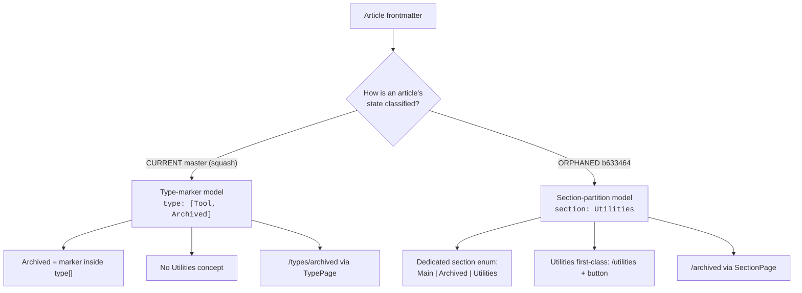

# Article-classification model: decision memo

Your `master` squash and the orphaned `b633464` lineage each carry a complete, deliberate way to classify articles. They disagree on one attribute - and that disagreement is why `/utilities` 404s. This memo lays out both so the direction can be chosen before Tier 3 work proceeds.

- Current master = `276106c` (= `origin/master`)
- Orphaned good-lineage tip = `b633464` (2026-07-07, reachable via reflog)
- Nothing has been committed.

## Current symptoms

| Status | Symptom |
|---|---|
| `404` | `/utilities` returns 404. The topbar `UtilitiesButton` was restored (Tier 1), but the page it links to only exists in one of the two models below. |
| `regressed` | DatabaseView shows hover previews. The old `popover` code suppressed link previews on `.database-row`; the squash dropped that guard. |
| `model-independent` | Both of the above are fixable regardless of which model wins - see the last section. The hard choice is only the classification attribute. |

## The disagreement

### Type-marker model (current master, from the squash)

- `Archived` is a **lifecycle marker inside the `type` array**; "Active" = the absence of it.
- **No `Utilities` concept at all** - it was dropped.
- Archive listing is `/types/archived` via `TypePage`.
- 49 articles already tagged this way.

### Section-partition model (b633464)

- A dedicated **`section`** attribute: `Main | Archived | Utilities` - a clean partition, every page in exactly one.
- **`Utilities` is first-class**: its own `/utilities` page + topbar button.
- Archive listing is `/archived` via `SectionPage`.
- This is the "one unified attribute" from the original recollection.

## Feature-by-feature

| Dimension | Type-marker (HEAD) | Section-partition (b633464) |
|---|---|---|
| Unifying attribute | `Archived` lives in the `type[]` array; no separate field | **Dedicated `section` enum - orthogonal to `type`** |
| Utilities | Does not exist | **First-class: `/utilities` + button** |
| Archive page | `/types/archived` (TypePage) | `/archived` (SectionPage) |
| DatabaseView filtering | **Richer: `__active__` sentinel, archive-context provenance across pages, filter/URL param sync, hide-pill suppression** | Polymorphic dropdown (type filter / section filter), no URL sync |
| Content state now | 264 articles conform (49 Archived) | Would need a `section` field on every article (migrate scripts exist) |
| Documented in AGENTS.md | Fully (more DB detail) | Fully |

Neither is "the damage." HEAD genuinely advanced the DatabaseView filtering while dropping the section/Utilities partition. b633464 has the cleaner attribute and Utilities but the simpler table.

## What each direction costs

### Direction 1 - Extend HEAD, add `Utilities` as a marker (lower risk)

Keep type-marker model, no mass migration, preserves HEAD's DB work.

Add `Utilities` as a second lifecycle marker (`type: [X, Utilities]`), point `UtilitiesButton` -> `/types/utilities`, tag the 13 utility articles, and extend the `__active__` filter so Utilities is excluded from main listings like Archived is.

- **+** No content migration - `type[]` stays; only 13 articles get a tag.
- **+** Keeps HEAD's richer DatabaseView (URL sync, provenance) intact.
- **+** `TypePage` already auto-generates `/types/utilities`.
- **-** No dedicated attribute - classification stays overloaded onto `type` (not the clean partition originally remembered).
- **-** The "Active = not archived" binary must grow to "not archived AND not utilities" - real filter-logic work in `DatabaseFilters` + the inline script.

### Direction 2 - Restore the `section` model (higher risk)

Dedicated attribute, mass content migration, reverts some HEAD DB work.

Bring back `sections.ts`, `sectionPage.tsx`, `collectionPage.ts`, `sectionOf` + section validation in `frontmatter.ts`; wire `quartz.config.ts` + `emitters/index.ts`; run the restored `migrate-*.mjs` to add a `section` field to every article (`type[]` -> `type` + `section`).

- **+** The clean partition - `section` orthogonal to `type`, mutual exclusivity structural.
- **+** `Utilities` is first-class again, exactly as originally designed.
- **-** Every one of ~264 articles is rewritten (migration) - a large, reviewable diff.
- **-** HEAD's DB advances (URL sync, archive provenance, `__active__` sentinel) are lost unless separately ported forward - the biggest hidden cost.
- **-** Touches the most files; highest chance of a broken hybrid.

## Recommendation

**Lean Direction 1, unless the dedicated attribute is the point.**

The deciding question is narrow: **do you want the clean `section` attribute itself, or just Utilities back?** If the goal is mainly `/utilities` working and the archive behavior continuing to improve, Direction 1 gets there with a 13-article tag and no migration, and keeps the DB filtering that would otherwise have to be rebuilt. Choose Direction 2 only if the orthogonal `section` partition - not just the Utilities page - is what actually matters; then the migration and the DB-feature port are worth it, and HEAD's `__active__`/URL-sync work should be ported onto the section model rather than lost.

## Regardless of the choice - can be done now

- **Kill dbview hover previews.** Re-add the `.database-row` / `data-no-popover` guard to `popover.inline.ts` (keeping HEAD's other additions).
- **Restore gutted component styling.** `pill.scss`, `darkmode.scss`, `articleTitle.scss` (+ their `.tsx` as coherent pairs) - HEAD trimmed these alongside the CSS.
- **Reconcile docs.** Bring `AGENTS.md` / `CLAUDE.md` in line with whichever model wins + the restored ITCSS section.

## The 13 Utilities articles (from b633464's old `section: Utilities`)

`fallout-4-console-codes`, `gog`, `hdd-tips`, `independent-vpn`, `mtg`, `music-resources`, `nas`, `obs-studio`, `prusa-mmu3-layer-shifts`, `prusaslicer`, `stl-thumbnails-on-windows`, `unigine-superposition`, `windows-update-errors`
