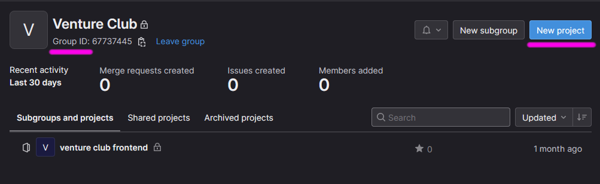
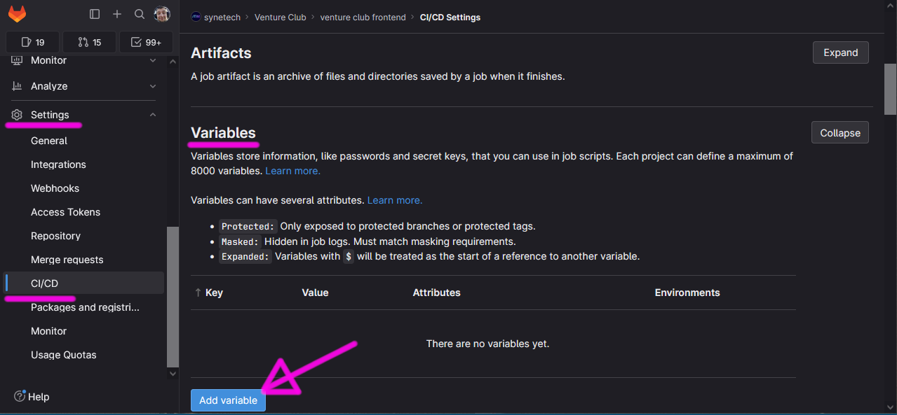

Požádej administrátora o založení skupinu v GitLabu.

Ti ji založí a dostaneš level “*Maintainer*”.

Můžeš do skupiny přidávat repozitáře.

Vytvoříš repo a založíš **.gitlab-ci.yml.**

Ten naplníš podle vzoru [Pipelines [CI/CD]](../Pipelines-%5BCI-CD%5D/index.md). Nepotřebné pipelines samozřejmě vynech.

V repozitáři v settings doplníš proměnné prostředí.

Pokud projekt zakládal někdo jiný a nedal ti práva “Maintainer”, do proměnných se nedostaneš. Vyřeš to buď s klukama zmíněnýma výše nebo garantem.
