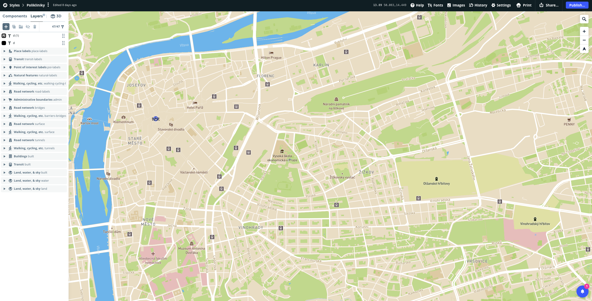

**Náš webový tým stanul před výzvou - vytvořit aplikaci postavenou na mapě. S integrací mapy, ať už Google Maps, Mapbox nebo jiné služby, jsme zatím měli jen málo zkušeností a proto tedy ta výzva. Jakou službu jsme vybrali? Byli jsme spokojeni s naší volbou a na jaké problémy jsme narazili?**

Aplikace spočívala v zobrazení značek na definovaných souřadnicích, jejich filtrování, shlukování do clusterů, museli jsme uživatele informovat o dostupnosti lokací, jejich vzdálenosti a jestli mají vlastně otevřeno.

Rozhodovali jsme se mezi implementací Google Maps a Mapbox. Nejdříve se tedy podíváme na jejich výhody a nevýhody.

# Mapbox vs. Google Maps

## Mapbox výhody

- Pužitelné offline díky vektorovým mapám
- Kompatibilní s moderními prohlížeči
- Snadno upravitelný vzhled map
- Všechny služby mají free tier
- Open-source, využívá dat: Landsat, Natural Earth, OpenAddress, OpenStreetMap a USGS
- Bohatá dokumentace

## Mapbox nevýhody

- Komplikované použití bez knihovny třetí strany (viz React wrappery níže)
- Místy slabé pokrytí, méně dat než Google Maps

## Google Maps výhody

- Veliká komunita vývojářů
- Nejlepší pokrytí
- Street View
- Nabízí nejen mapy. Protože je součástí Google ekosystému, zpřístupňují také další aplikace jako třeba Google Places a Google Businesses.

## Google Maps nevýhody

- Komplikovaný ceník, namísto free tier nabízí 200 dolarů měsíčně zdarma
- Aplikace při prvním načtení může na moment zamrznout
- Energeticky náročné
- Funkcionality offline omezené
- Proprietární software

Zdroj porovnání: [https://mapsvg.com/blog/mapbox-vs-google-maps](https://mapsvg.com/blog/mapbox-vs-google-maps)

# Mapbox Studio

Nabízí široké možnosti úpravy map - stylu, dat a dlaždic mapy. Studio je uživatelsky přístupné a není potřeba umět programovat. Uživatel si může například během několika desítek minut vytvořit svůj vlastní dataset, ten umístit na satelitní mapu, které doplní popisky třeba v japonštině.

## Styl

Stylem se rozumí možnosti zobrazení elementů na mapě i mapy samotné. V záložce Styles v Mapbox studiu si uživatel může vytvořit vlastní styl z předpřipravených polotovarů, nebo začít úplně od nuly, nebo si zkopírovat některý veřejný styl a ten si upravit.

Mezi věci, které lze upravit patří: barvy terénu, cest, značek apod.; jaké zobrazovat popisky, v jakém jazyce; jaké značky zobrazovat a jaké ne; jak mají vypadat cesty a hranice států nebo regionů; lze ovlivnit vlastnosti 3D zobrazení mapy.

Náhled na editaci stylu

## Dataset

Vizualizace dat je v Mapbox Studiu velmi jednoduchá. Uživatel si může do mapy přímo nakreslit body, čáry nebo mnohoúhelníky. Může data importovat z CSV nebo GeoJSON souborů a ta si dle libosti upravit. Každý záznam (bod, čára, mnohoúhelník) lze opatřit vlastnostmi, které pomůžou například s organizací dat. Vytvořená data se pak exportují přímo do sady dlaždic, které uživatel vloží do svého stylu mapy.

## Dlaždice

Neboli Tiles jsou vektorová či rastrová data, z nichž mapbox skládá mapu ve 22 přednastavených úrovních zoomu. V případě vektorových dat se mapa staví ze sady bodů čar a mnohoúhelníků, rastrová data jsou sestavená z pixelů jako obrázky. 

## Workflow

Každá Mapbox mapa, kterou návštěvníci webu, či uživatelé aplikace uvidí se skládá z výše probraných součástek. Nejdříve je třeba mít k dispozici sadu dlaždic, což je vlastně samotná mapa, kterou následně zaplníme svými daty, nakonec si můžeme velmi svobodně vybrat jak to celé bude vypadat.

# Navigace

Pro implementaci navigace na webovém prostředí nabízí mapbox několik API. Tyto API lze použít i pomocí SDK pro JS a mobilní platformy.

### [Directions API](https://docs.mapbox.com/api/navigation/directions/)

Tato služba nám dává k dispozici ideální cestu s ohledem na stav dopravy pro jízdu na kole, autem a nebo chůzi. (Bohužel žádná Mapbox API nenabízí informace pro veřejnou dopravu.) Kromě cesty samotné API vrací také informace o vzdálenosti mezi body, předpokládané době jízdy apod. Taky dovede produkovat instrukce tzv. turn-by-turn, informace o tom, kde a kdy zabočit. Jako vstup je možné této službě poslat až 25 pozic, tedy bodů na cestě. 

### [Map Matching API](https://docs.mapbox.com/api/navigation/map-matching/)

Využívá Directions API a vrací trasu, kterou lze zobrazit na mapě.

### [Isochrone API](https://docs.mapbox.com/api/navigation/isochrone/)

Vypočítá jaké body jsou v určené vzdálenosti od daného středového bodu. Např. lze takto zjistit, kam všude je možné dostat se do 5 minut, určit si sektory podle doby dojezdu. (Služba je zase limitována dopravními prostředky, tedy veřejná doprava není k dispozici, a maximální doba dojezdu je 60 minut.)

### [Optimization API](https://docs.mapbox.com/api/navigation/optimization/)

Tato služba řeší oblíbený algoritmický problém - [obchodní cestující](https://cs.wikipedia.org/wiki/Probl%C3%A9m_obchodn%C3%ADho_cestuj%C3%ADc%C3%ADho). Tedy zjišťuje optimální cestu s několika zastávkami. 

### [Matrix API](https://docs.mapbox.com/api/navigation/matrix/)

Přijímá matrici bodů a vypočítá nejkratší (nejrychlejší) trasy mezi všemi body. Maximálně matrice přijímá 25 bodů, ale pokud chceme vzít v potaz i stav dopravy, přijímá jen 10 bodů. 

# Implementace na projektu

## React wrappery

Mapbox nabízí vývojářům pro implementaci mapy do projektu knihovnu [Mapbox GL JS](https://github.com/mapbox/mapbox-gl-js), lze využít tuto knihovnu samotnou, ale pracujeme-li na projektu s Reactem, je možné si práci ulehčit a použít některou knihovnu, která obaluje Mapbox GL JS. Obsáhlé porovnání takových knihoven, z nichž některé jsou vhodné i pro Google Maps, naleznete [zde](https://blog.logrocket.com/react-map-library-comparison/). Pro Mapbox jsou relevantní především knihovny [react-map-gl](https://github.com/visgl/react-map-gl) a [react-mapbox-gl](https://github.com/alex3165/react-mapbox-gl). Obě knihovny jsou si velmi podobné. V podstatě dávají vývojáři do rukou sadu React komponent, zejména <Map />, které stačí předat potřebná nastavení (výška a šířka mapy, api token, styl mapy, zoom atp.), <Marker />, což je wrapper pro značky na mapě. Do Markeru lze zanořit další komponenty a plně tak kontrolovat, jak se značky na mapě budou zobrazovat.

My jsme se rozhodli pro react-map-gl. Jak plyne z odstavce výše, funkčně se knihovny příliš neliší, ale podstatně se liší úroveň jejich dokumentace. Jelikož react-map-gl vyvýjí Uber, je dokumentace této knihovny na lepší úrovni a vývojáři mají k dispozici i kvalitní demo projekty. 

# Problémy z vývoje a jejich řešení

### Gatsby vs. mapbox

Při vývoji jsme narazili na určitá omezení. Mapbox GL JS je distribuován jako ES6 bundle a to způsobuje problémy se současnou verzí Gatsby, při bundlování pomocí Webpacku. V dokumentaci Mapboxu lze nalézt [řešení,](https://docs.mapbox.com/mapbox-gl-js/guides/install/#transpiling) ale ta na našem Gatsby projektu bohužel nezafungovala. Pomohl však downgrade verze Mapbox GL JS. 

Problém se projevil i po zdánlivém vyřešení, když jsme předali zdrojový kód klientovi a ten se ho pokusil nasadit na svůj server. Chyba se projevila stejně, jako na našem vývojovém prostředí - místo mapy se zobrazovalo prázdné plátno s markery. Znovu pomohla úprava verze Mapbox GL.

### Markery vs. Layers

V našem projektu jsme potřebovali zobrazovat na mapě custom markery, které mají zvláštní design v závislosti na jejich stavu. Zároveň jsme potřebovali markery filtrovat. Rozhodli jsme se pro řešení pomocí reacrt-map-gl komponenty <Marker />, která na daných souřadnicích vykreslí libovolný HTML element. Díky tomu jsme mohli pohodlně filtrovat a měnit vzhled na základě stavu aplikace, ale ukázalo se, že takto vytvořené markery mají nedostatek. Nelze přes ně pohybovat mapou. Mapou lze pohybovat bez problému, pokud uživatel klikne nebo tapne kdekoliv jen ne na našem custom markeru. Jak už jsem zmiňoval, Mapbox vytváří mapy pomocí 3 zdrojů: stylu, dlaždic a vrstev. Pokud se na mapu markery dostanou tímto způsobem, jsou součástí mapy a lze přes ně pohybovat mapou. 

### Omezení API

Jak jsem zmiňoval v sekci *navigace* výše, Mapbox API nabízí služby pro jízdu autem, na kole a chůzi a dovede zohlednit aktuální situaci na cestách, ale už nedovede pracovat s MHD. Na našem projektu jsme nicméně tuto funkcionalitu potřebovali a proto jsme byli nuceni integrovat do naší aplikace další službu.

### Satelitní mapa

Jeden z poždavků klienta bylo tlačítko, které by podobně jako na Google Maps změnilo normální vzhled mapy na satelitní. Naše představa, že Mapbox GL JS potažmo react-map-gl bude mít nějaký hotový control element, který stačí v options vybrat, se ukázala naivní. Nic takového Mapbox nemá a je to v souladu s jeho architekturou. Satelitní vzhled je totiž jen jeden z mnoha (limity teoreticky nejsou) vzhledů, kterých pomocí mapboxu můžeme dosáhnout. Proto jsme si satelitní vzhled definovali jako zvláštní styl a v aplikaci implementovali vlastní tlačítko, které tyto styly jednoduše přepíná.

# Zvolili jsme dobře?

Přestože jsme při práci narazili na nějaké různě omezující problémy, je Mapboxu velmi kvalitní služba za přijatelnou cenu. Problémy vlastně vyvstaly jen na základě naší nepřipravenosti, Mapbox je totiž skvěle zdokumentován.

Nicméně příště bychom možná zvolili Google Maps, už jen pro srovnání, ale taky pro snad přívětivější a přístupnější vývojářský zážitek, větší komunitu a API pro MHD.
