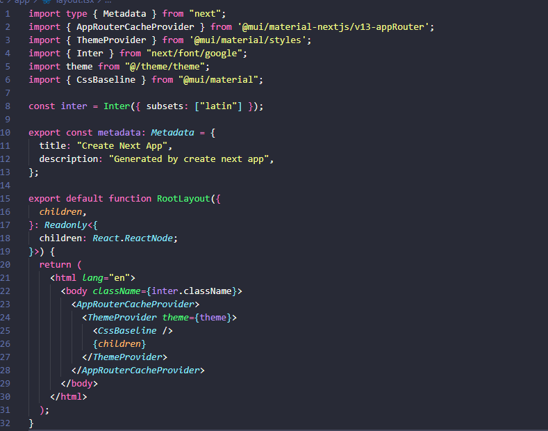

<aside>
💡 [https://mui.com/material-ui/getting-started/installation/](https://mui.com/material-ui/guides/nextjs/)

</aside>

<aside>
 Use emotion, not styled components

</aside>

## Installation

`npm install @mui/material @emotion/react @emotion/styled` 

`npm install @mui/material-nextjs @emotion/cache @emotion/server`

## Resources

`src/theme`

Here should be theme.ts with all customizations and the mirror of the palette (designColors.ts) from the design.

A good practice is to split the theme to:

- palette.ts
- typography.ts
- spacing.ts

In theme files include `“use client”` at the top of the file

## Baseline

Do not forget to set up a `MuiCssBaseline`.

Provider should be located in RootLayout (../app/layout)

Wrap the provider with `AppRouterCacheProvider` to prevent SSR style tags on each request

