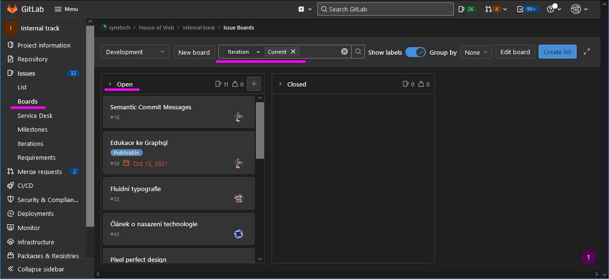

Board is used for planning all the work. It provides general overview for PM. You can find your issues here and colleagues issues as well.

A project can contain several boards. E.g. one for view over all the issues and another one for view over current sprint.

Board columns can be heavily customized (e.g. columns as “*WIP*” or “*testing*” can be added). It depends on project specificity. It is important to setup issue’s iteration properly to see issues in board. See our Internal Track board as an example.

