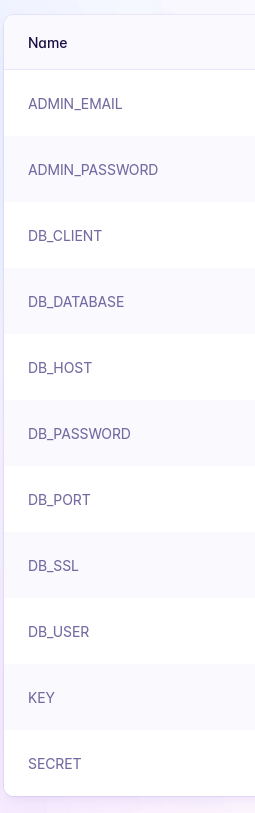

Install Fly CLI

[https://fly.io/docs/hands-on/install-flyctl/](https://fly.io/docs/hands-on/install-flyctl/)

Create account on Fly.io

Create Dockerfile in CMS root folder: [https://fly.io/docs/hands-on/install-flyctl/](https://fly.io/docs/hands-on/install-flyctl/)

```
# syntax=docker/dockerfile:1.4
FROM directus/directus:10.6.2
USER root
RUN corepack enable \
&& corepack prepare pnpm@8.7.6 --activate \
&& chown node:node /directus
EXPOSE 8055
USER node
CMD : \
&& node /directus/cli.js bootstrap \
&& node /directus/cli.js start;
```

Take these env variables from `.env` file in CMS root folder and paste them in [fly.io](http://fly.io) secrets [https://fly.io/apps/project-name/secrets](https://fly.io/apps/example-project-2/secrets) 



run `fly launch` from CMS root folder, maybe even `fly deploy` to env variables changes take effect

🥳
