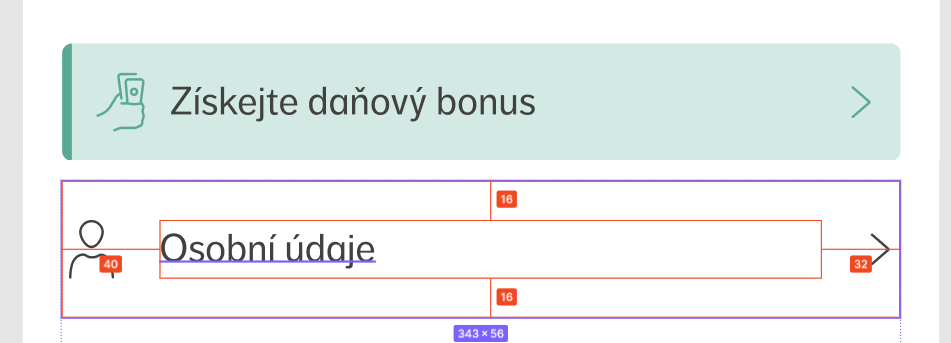

**Docs:** [https://www.youtube.com/c/Figmadesign](https://www.youtube.com/c/Figmadesign)

## The design

We expect from designer these reused values separately:

- color palette ([https://material.io/design/color/the-color-system.html](https://material.io/design/color/the-color-system.html))
- typography definitions (for different breakpoints or fluid), bare in mind the bottomMargin for each heading
- spacing definitions
- icon set (SVG), favicon
- breakpoints (probably based on a collaboration)
- shadow definitions (use default MUI elevations?)
- gradient definitions

## Best practices for designers

- developer is more effective in design systems based on Material Design.
- use 12-col grid layout if possible
- use only spacings from spacing definition
- don’t use colors with transparency (e.g. black with 0.5 opacity as grey)
- don’t use line-height to make bigger spacing around text
- don’t “crop” images by placing another layers above the image to hide unneeded parts of the image, crop the image itself instead of that
- create a list of components and re-use them
- CSS friendly elements
- use Figma version history / branches
- define disabled/error/placeholder states for form elements
- prepare loading skeletons (depends on a project budget)
- svg without padding
- use components with variants, not like this:

- place descriptions around Frames to describe behavior
- use real content from business (real input placeholders) Treba realne produkty s jejich obrazky, popisky, CENY.

## What we want to learn from designers

- How to effectively measure multiple layers selection
- How to make layers visible/invisible (eye feature) without edit rights

## Plugins

### Pixelay

Pixelay is a plugin which enables you to compare your web app with Figma side by side to deliver pixel perfect design.

**Docs:** [https://docs.hypermatic.com/pixelay/](https://docs.hypermatic.com/pixelay/)

**How to use:**

You must have the editors rights to be able to use the plugin.

Install the plugin: [https://docs.hypermatic.com/pixelay/#installing-the-plugin](https://docs.hypermatic.com/pixelay/#installing-the-plugin)

Run the plugin: [https://docs.hypermatic.com/pixelay/#running-the-plugin](https://docs.hypermatic.com/pixelay/#running-the-plugin)

Use the plugin: [https://docs.hypermatic.com/pixelay/usage.html#using-pixelay](https://docs.hypermatic.com/pixelay/usage.html#using-pixelay)

Note: Pixelay is paid plugin and you have only limited number of usage without acquiring the license key.

**Troubleshooting:**

***Testing pages hidden behind the login***

Pixelay can’t detect you are logged in if the web app uses *sessionStorage* to save auth tokens. You can use *localStorage* as a workaround.

[Plugins](Plugins/index.md)
