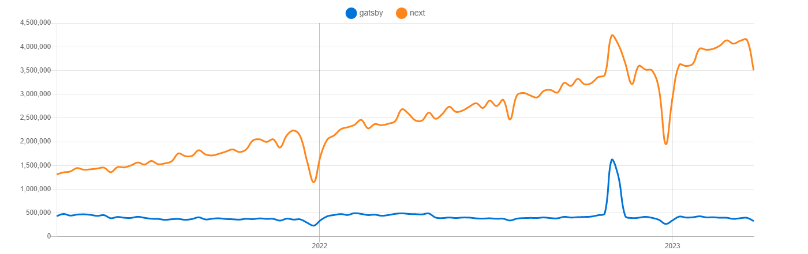

## **Úvod**

Co se týče tématu Next vs. Gatsby, oba frameworky mají své silné a slabé stránky, pokud jde o vytváření aplikací. Je důležité pečlivě zvážit požadavky aplikace a vybrat si možnost, která poskytuje nejvhodnější stack a zároveň splňuje naše ostatní požadavky.

## **Získávání dat**

Tohle je jeden z největších rozdílů, na který zde narazíme. U Next.js máme prakticky volnou ruku v implementaci API, ať už skrz REST, GraphQL etc. Next tohle neřeší.

S Gatsby je to trochu složitější, přestože podporuje získávání dat bez použití datové vrstvy GraphQL. Gatsby to nedoporučuje a tlačí na to, aby lidé používali jejich datovou vrstu. To znamená, že pokud se chcete dotazovat na data v Gatsby na svých stránkách nebo ve fázi sestavování, budete téměř jistě používat GraphQL.

Zde je to jednoduché *- pokud neplánujete používat GraphQL, doporučil bych použít Next.js. V opačném případě je lepší použít nástroj, který vám více vyhovuje nebo s ním máte více zkušeností.*

## **Pluginy a jejich využití**

Gatsby díky svým pluginům velmi usnadňuje tvorbu šablon a nových webových stránek. Pokud byste chtěli vytvořit např. blog pomocí MD, můžete jednoduše použít `gatsby-source-filesystem` pro předání všech příspěvků blogu do GraphQL a poté se na ně dotazovat. Platí to také např. pro Google Analytics, který je díky pluginu `plugin-google-analytics`  také velmi snadný nastavit.

Next.js pluginy vůbec nepodporuje a pokud si chcete udělat již zmiňovaný blog pomocí MD, musíte si data získat a transformovat sami (např. pomocí “remark” library).

*Pokud tedy preferujeme rychlejší cestu pro zhotovení projektu, v tomto případě bych zvolil Gatsby, právě díky jednoduchosti pluginů a jejich nastavení.*

## **React kompatibilita**

Oba frameworky jsou kompatibilní s React 18, zde není co dodat.

## **Způsoby renderování**

Oba frameworky podporují SSG (generování statických stránek), SSR (renderování na straně serveru) a CSR (renderování na straně klienta). Také podporují DSG (odložené statické generování) ovšem NextJs trochu jinak (pomocí ISR - Inkteremntální statická regenerace).

**ISR** - umožňuje používat statickou generaci na základě jednotlivých stránek, aniž by bylo nutné obnovovat celý web. Díky ISR si můžete zachovat výhody statické generace a zároveň škálovat až na miliony stránek.

Next.js ISR umí odložit generování stránky až do prvního požadavku a také stránku přegenerovat po uplynutí určitého času.

Problémem ISR je "aktualizace na vyžádání" a absence skutečného atomického buildu. Podívejme se na rychlý příklad. Řekněme, že máte domovskou stránku, která je statická, a stránky produktů, které používají **DSG** nebo **ISR**. Pokud se informace o produktech často mění, může se u ISR stát, že na domovské stránce (statické) bude napsáno, že je produkt k dispozici, ale po kliknutí na něj bude napsáno, že není k dispozici, nebo naopak.

**DSG** - funguje velice podobně ale build je uložen a používá se k dodávání dat pro jakoukoli odloženou stránku, dokud není build aktualizován. To znamená, že pokud je build nasazen v pondělí a odložená stránka je vyžádána až v pátek - sestaví se tato stránka za běhu v pátek s daty z pondělního nasazení.

Znamená to také, že DSG je více stabilní než ISR, protože čerpá data z datové vrstvy uložené v době sestavení v mezipaměti - nikoli z volání API na straně serveru.

## **Komunita**

S komunitou na tom je jednozačně lépe Next, což může znamenat i lepší řešení problémů, protože máte větší pravděpodobnost, že stejný problém byl již někým vyřešen etc.

## **Závěr**

Oba frameworky jsou si velmi podobné, ani s jednou volbou neuděláte chybu. Pokud máte s jedním znich již nějaké zkušenosti a nebo se s ním chcete naučit, preferoval bych onu volbu.

|  | **Gatsby** | **Next.js** |
| --- | --- | --- |
| **Technologie** | React | React |
| **Generování stránek (rozdíly)** | DSG | ISR |
| **SEO optimalizace** | Ano | Ano |
| **Typescript** | Ano | Ano |
| **Komunita (npm trends)** | 330 000 | 3 500 000 |
| **Vývoj** | Rychlý | Flexibilní |
| **Názorový** | Ano | Částečně |

---
