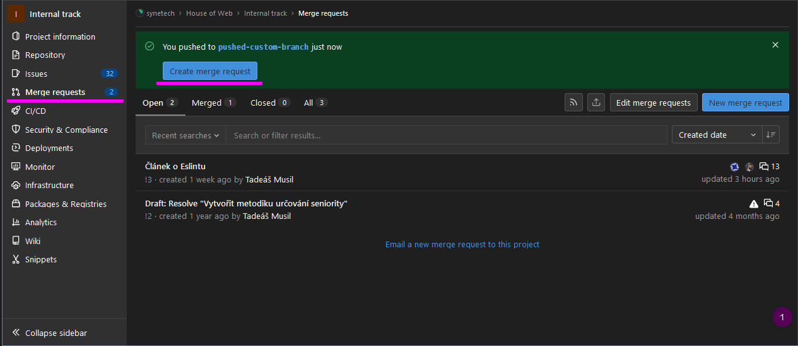
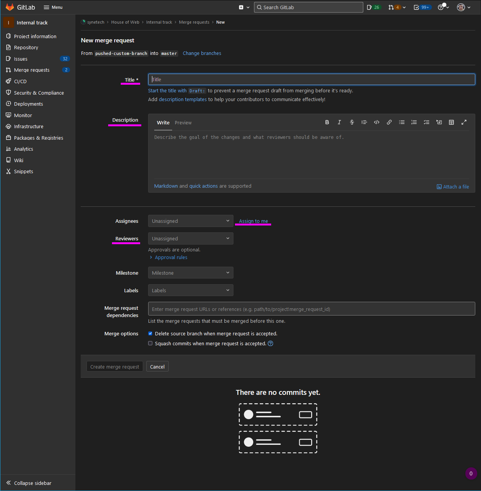
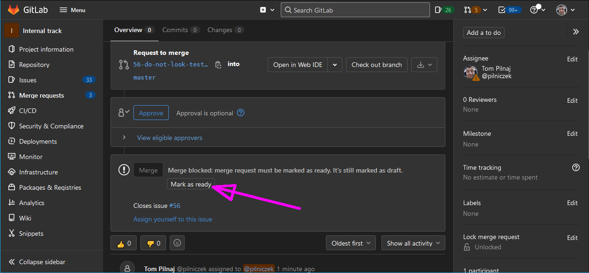

Merge Request can be created from an [issue](../Issue/index.md). Or after you push new branch you will see another option how to create a merge request.

You should fill title, description (with attached screenshots, describe testing if changes are not obvious, explain limitations of the solution, etc.), assignee (mostly yourself) and reviewers (at the beginning of the training your mentor, later project colleagues).

If you write `Closes #1` (issue ID) in the description the related issue will be closed after successful merge.

> After merge request is created, all changes are pushed and the issue is **marked as ready**, the **reviewer makes a code review before all the changes are merged**.
> 

