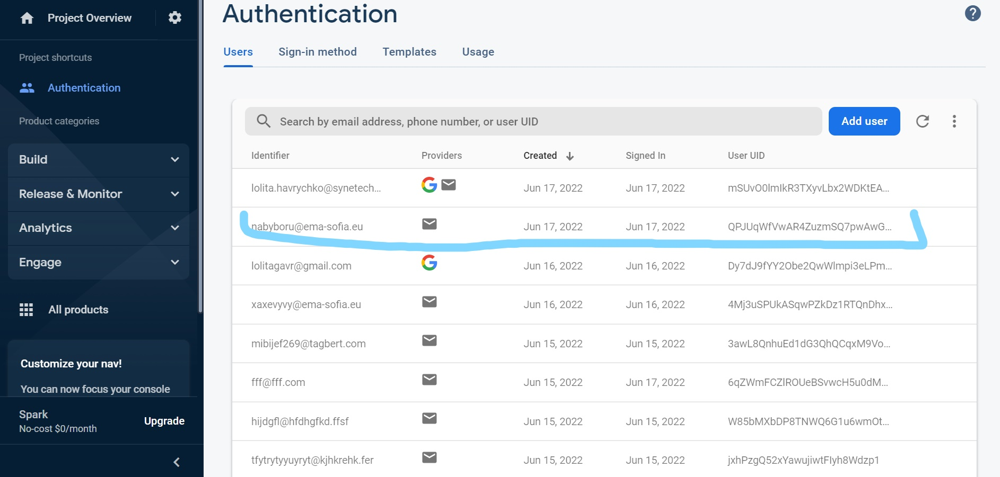
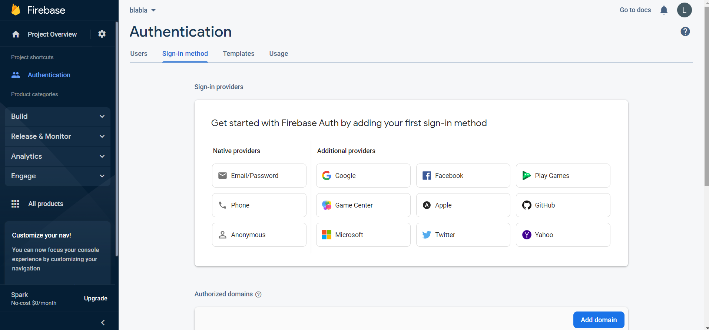

### OAuth: **an open authorization protocol (scheme) that provides a third party with limited access to the user's protected resources without transferring a login and password to (the third party)**

In 2010,  the OAuth 2.0 protocol has appeared, which latest version was published in October 2012

OAuth 2.0 - an authorization protocol that allows one service (application) to be granted access rights to user resources on another service. The protocol eliminates the need to trust the username and password to the application, and also allows you to issue a limited set of rights, and not both at once.

How OAuth 2.0 works : 

OAuth 2.0  is  based on the basic web technologies: HTTP requests, redirects, etc. Therefore, the use of OAuth is possible on any platform with access to the Internet and a browser: on websites, in mobile and desktop applications, browser plugins…

Difference between OAuth and OAuth 2.0:

**simplicity**

The new version does not have massive signature schemes, the number of requests required for authorization has been reduced.

The general scheme of how an application using OAuth works :
- obtaining authorization
- accessing protected resources

The result of authorization is an access token - a certain key (usually just a set of characters), which provides (us) an access  to protected resources. In the simplest case, resources are accessed via HTTPS, indicated in the headers or as one of the parameters of the received access token.

There are some different flows/methods.

## **Authorization Code Flow**

Because regular web apps are server-side apps where the source code is not publicly exposed, they can use the Authorization Code Flow, which exchanges an Authorization Code for a token.

## **Authorization Code Flow with Proof Key for Code Exchange (PKCE)**

During authentication, mobile and native applications can use the Authorization Code Flow, but they require additional security. Additionally, single-page apps have special challenges. To mitigate these, OAuth 2.0 provides a version of the Authorization Code Flow which makes use of a Proof Key for Code Exchange (PKCE).

## **Implicit Flow with Form Post**

As an alternative to the Authorization Code Flow, OAuth 2.0 provides the Implicit Flow, which is intended for Public Clients, or applications which are unable to securely store Client Secrets. While this is no longer considered as a best practice for requesting Access Tokens, when used with Form Post response mode, it does offer a streamlined workflow if the application needs only an ID token to perform user authentication.

## **Hybrid Flow**

Applications that are able to securely store Client Secrets may benefit from the use of the Hybrid Flow, which combines features of the Authorization Code Flow and Implicit Flow with Form Post to allow your application to have immediate access to an ID token while still providing for secure and safe retrieval of access and refresh tokens. This can be useful in situations where your application needs to immediately access information about the user, but must perform some processing before gaining access to protected resources for an extended period of time.

## **Client Credentials Flow**

With machine-to-machine (M2M) applications, such as CLIs, daemons, or services running on your back-end, the system authenticates and authorizes the app rather than a user. For this scenario, typical authentication schemes like username + password or social logins don't make sense. Instead, M2M apps use the Client Credentials Flow (defined in OAuth 2.0 RFC 6749, section 4.4).

## **Device Authorization Flow**

With input-constrained devices that connect to the internet, rather than authenticate the user directly, the device asks the user to go to a link on their computer or smartphone and authorize the device. This avoids a poor user experience for devices that do not have an easy way to enter text. To do this, device apps use the Device Authorization Flow (drafted in OAuth 2.0). For use with mobile/native applications.

## **Resource Owner Password Flow**

Though we do not recommend it, highly-trusted applications can use the Resource Owner Password Flow, which requests that users provide credentials (username and password), typically using an interactive form. The Resource Owner Password Flow should only be used when redirect-based flows (like the [**Authorization Code Flow**](https://auth0.com/docs/get-started/authentication-and-authorization-flow/authorization-code-flow)) cannot be used.

Difference from OpenID:

OAuth is an **authorization** protocol that allows you to grant  access rights to use a resource (for example, the API of a service). The availability of rights is determined by a token (unique identifier), which can be the same for different user accounts , or one user can have different tokens at different times. 

OpenID is an **authentication** tool using this system, you can make sure that the user is exactly who he claims to be. What actions can be performed by a user authenticated by OpenID is determined by the party conducting the authentication.

PKCE FLOW EXAMPLE : [https://www.oauth.com/oauth2-servers/server-side-apps/example-flow/](https://www.oauth.com/oauth2-servers/server-side-apps/example-flow/)

Flows: [https://auth0.com/docs/get-started/authentication-and-authorization-flow](https://auth0.com/docs/get-started/authentication-and-authorization-flow)

Which OAuth 2.0 Flow Should I Use? ****[https://auth0.com/docs/get-started/authentication-and-authorization-flow/which-oauth-2-0-flow-should-i-use#i-have-an-application-that-needs-to-talk-to-different-resource-servers](https://auth0.com/docs/get-started/authentication-and-authorization-flow/which-oauth-2-0-flow-should-i-use#i-have-an-application-that-needs-to-talk-to-different-resource-servers)

# FIREBASE **Authentication**

**Firebase can provide support for your application, including data storage, user authentication, static hosting, and more.**

## **Firebase Features :**

- Real-time database - Firebase maintains JSON data and all users connected to it receive live updates after every change.
- Authentication - We may use anonymous, password or other “social” authentication.
- Hosting. Applications can be deployed over a secure connection to Firebase servers.

## Benefits of Firebase:

- It is simple and user friendly. There is no need for complex configuration.
- Real-time data, which means that each change will automatically update the connected clients.
- Firebase has simple control panel.

## Firebase limits:

The free Firebase plan is limited to 50 connections and 100MB of storage.

### L**et's start** :

Step 1 : Create an account 

Step 2 : Click “get started “ [here](https://firebase.google.com/) and “add project “

Step 3 : “Google Analytics” - up to you :)

Step 3 .1 : Select which type of Authentication you want to use**.**

### Let's look at the following example (login and password ):

```
const email = "myemail@email.com";
const password = "mypassword";

firebase.auth().createUserWithEmailAndPassword(email, password).catch(function(error) {
   console.log(error.code);
   console.log(error.message);
});
```

We can check the Firebase Dashboard and see that the user has been created.



## Sign in

The login process is pretty much the same. We use 

```jsx
signInWithEmailAndPassword(email, password)
```

to login.

Example:

 

```
const email = "myemail@email.com";
const password = "mypassword";

firebase.auth().signInWithEmailAndPassword(email, password).catch(function(error) {
   console.log(error.code);
   console.log(error.message);
});
```

# Sign out

And finally, we can sign out using the 

```jsx
signOut()
```

 method.

Example:

```
firebase.auth().signOut().then(function() {
   console.log("Logged out!")
}, function(error) {
   console.log(error.code);
   console.log(error.message);
});
```

 

### **Firebase – Google Authentication**

 Select Google Authentication 



HTML example :

```
<button onclick = "googleSignin()">Google Signin</button>
<button onclick = "googleSignout()">Google Signout</button>
```

We will create the login and logout functions.

We will use the **signInWithPopup()** and **signOut()** methods.

```
const provider = new firebase.auth.GoogleAuthProvider();

function googleSignin() {
   firebase.auth()

   .signInWithPopup(provider).then(function(result) {
      const token = result.credential.accessToken;
      const user = result.user;

      console.log(token)
      console.log(user)
   }).catch(function(error) {
      const errorCode = error.code;
      const errorMessage = error.message;

      console.log(error.code)
      console.log(error.message)
   });
}

function googleSignout() {
   firebase.auth().signOut()

   .then(function() {
      console.log('Signout Succesfull')
   }, function(error) {
      console.log('Signout Failed')
   });
}
```

### Firebase - Anonymous Authentication

Select Anonymous Authentication 

We can use the signInAnonymously() method for this authentication.

Example:

```
firebase.auth().signInAnonymously()
.then(function() {
   console.log('Logged in as Anonymous!')

   }).catch(function(error) {
   const errorCode = error.code;
   const errorMessage = error.message;
   console.log(errorCode);
   console.log(errorMessage);
});
```

Firebase **Authentication** Video Tutorial 

[https://www.youtube.com/watch?v=PKwu15ldZ7k&t=2939s&ab_channel=WebDevSimplified](https://www.youtube.com/watch?v=PKwu15ldZ7k&t=2939s&ab_channel=WebDevSimplified) 

Firebase **Authentication Docs**

[https://firebase.google.com/docs/auth](https://firebase.google.com/docs/auth)

[https://firebase.google.com/docs/auth/web/start](https://firebase.google.com/docs/auth/web/start)

Project with Firebase Authentication 

[https://github.com/LitaHavr/Auth-Firebase](https://github.com/LitaHavr/Auth-Firebase)

