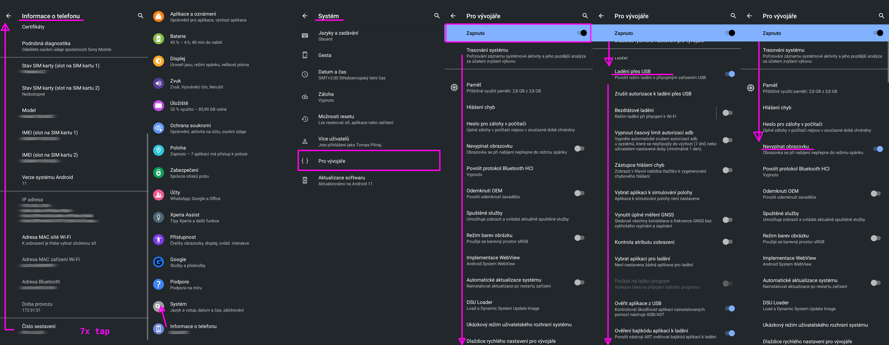
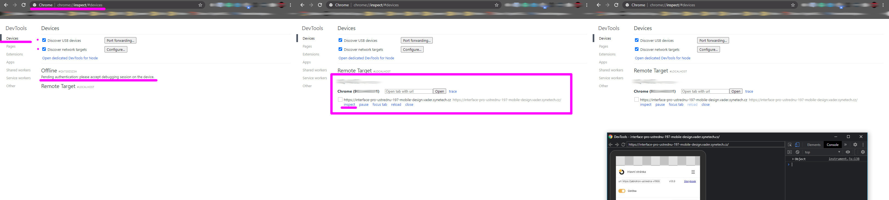
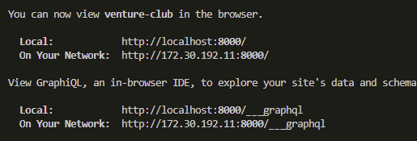

## Android pre-setup

1. Povolit na Androidu developer options: Settings > About Phone > 7x tapnout na Build Number
2. Povolit USB debugging: Settings > System > Advanced > Developer Options > USB debugging

## Windows

chrome://inspect/#devices

Resources:

- [https://developer.chrome.com/docs/devtools/remote-debugging/](https://developer.chrome.com/docs/devtools/remote-debugging/)
- [https://developer.chrome.com/docs/devtools/remote-debugging/local-server/](https://developer.chrome.com/docs/devtools/remote-debugging/local-server/)

### Přístup

Pokud nefunguje gatsbym poskytnutá IP adresa 172.22.156.74:8000 by default, jde to řešit třeba přes port forwarding v Chrome. [https://developer.chrome.com/docs/devtools/remote-debugging/local-server/](https://developer.chrome.com/docs/devtools/remote-debugging/local-server/)

### HTTP/1.1 404 Not Found

[https://stackoverflow.com/questions/51519636/google-chrome-developer-tools-android-debugging-returns-http-1-1-404-not-found](https://stackoverflow.com/questions/51519636/google-chrome-developer-tools-android-debugging-returns-http-1-1-404-not-found)

## Windows WSL

Recommended port forwarding Linux vs. Windows:

[https://medium.com/@Dylan.Wang/how-to-port-forwarding-from-windows-host-to-wsl2-6889a5a3631c](https://medium.com/@Dylan.Wang/how-to-port-forwarding-from-windows-host-to-wsl2-6889a5a3631c)

[https://jwstanly.com/blog/article/Port+Forwarding+WSL+2+to+Your+LAN/](https://jwstanly.com/blog/article/Port+Forwarding+WSL+2+to+Your+LAN/)

`./node_modules/.bin/gatsby develop --host=0.0.0.0`

example:

## Linux/Ubuntu

1. Přidat se do "plugdev" group `sudo usermod -aG plugdev $LOGNAME`
2. ./adb devices`sudo apt-get install android-sdk-platform-tools-common`
3. Stáhnout Android Debug Bridge (ADB) [https://developer.android.com/studio/releases/platform-tools](https://developer.android.com/studio/releases/platform-tools)
4. Spustit binárku `./adb devices`
5. Otevřít v Chromium URL chrome://inspect/#devices
6. Vybrat připojené zařízení ze seznamu zařízení a autorizovat ho na Androidu pro USB ladění ve vyskočeném modálu.
7. Otevřít Chrome na Androidu.
8. Na URL chrome://inspect/#devices kliknout na "Inspect" pro požadovaný tab, který je otevřený v Chrome na Androidu.

Zdroje:

- [https://developer.android.com/studio/debug/dev-options.html](https://developer.android.com/studio/debug/dev-options.html)
- [https://developer.android.com/studio/run/device](https://developer.android.com/studio/run/device)
- [https://raygun.com/blog/debug-android-chrome/](https://raygun.com/blog/debug-android-chrome/)

Závěr:

A) Testování na fyzicky připojeném zařízení oproti Lambdě apod. přináší full bitrate, čili nenastává žádné snížení kvality kvůli šetření přenášených dat.

B) Web lze ovládat přímo na mobilu ("dotykově").

C) Bohužel i přes fyzické připojení zařízení, přenášení obrazu mezi PC a Androidem rozhodně neprobíhá v 60fps ani s pár ms latencí.
