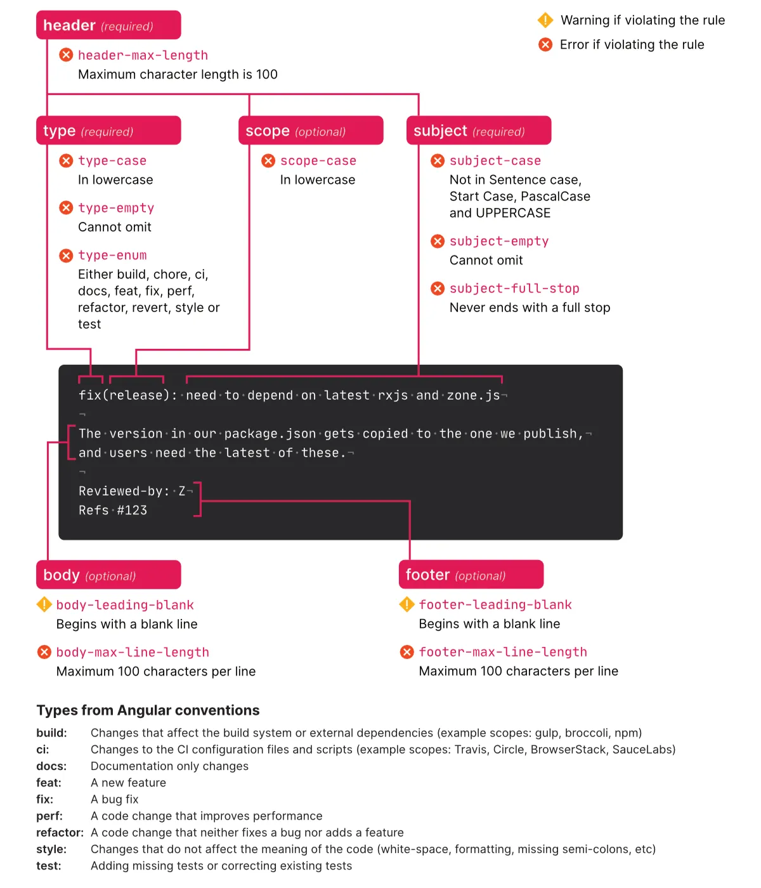
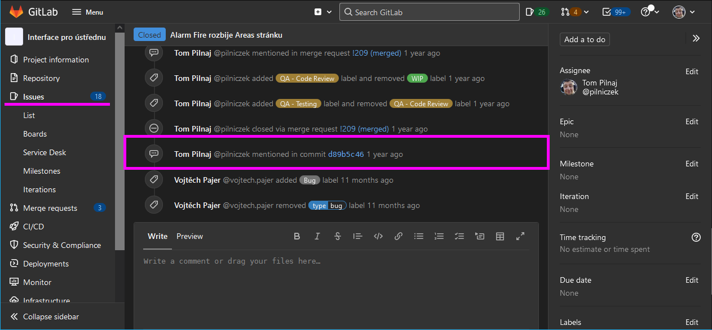

## Conventional commits

## Gitmoji

[gitmoji](https://gitmoji.dev/)

## GitLab related semantics

If you commit your work and push it like this: `git commit -m"bug #1 fix background image"`, `git push`, a special note will appear in the related issue.

That’s because the commit message contains `#1` (the issue ID).

This is not a “must-have” but it provides useful consequences.

