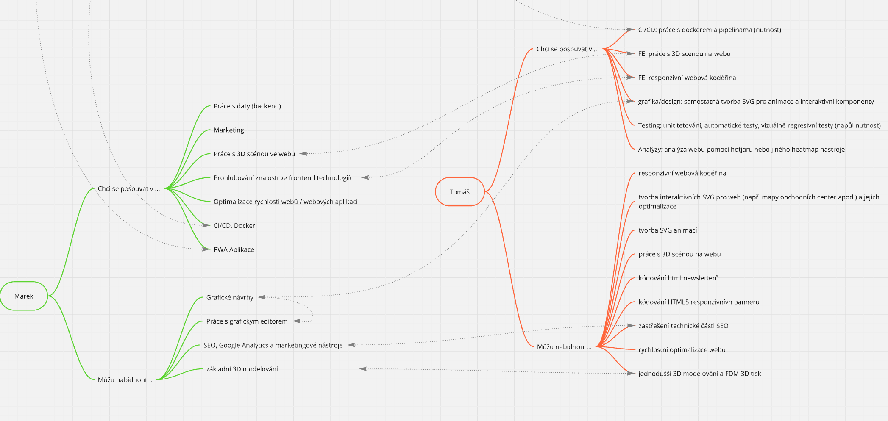

Vchází z hard skills tabulky a [soft skills](../Kompeten%C4%8Dn%C3%AD-tabulka/index.md) tabulky.

Roadmaps

[FE](https://roadmap.sh/frontend)
[BE](https://roadmap.sh/backend)
[TS](https://roadmap.sh/typescript)

## Set hard & soft skills

[https://miro.com/app/live-embed/uXjVJydtICo=/?embedMode=view_only_without_ui&moveToViewport=-5233%2C-918%2C11014%2C12648&embedId=276263430407](https://miro.com/app/live-embed/uXjVJydtICo=/?embedMode=view_only_without_ui&moveToViewport=-5233%2C-918%2C11014%2C12648&embedId=276263430407)

Set personal skills and traits 

- Jak na to?
