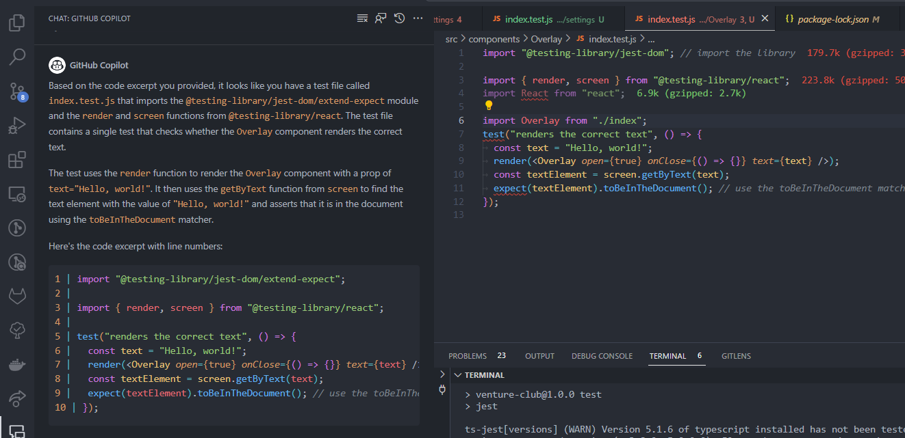
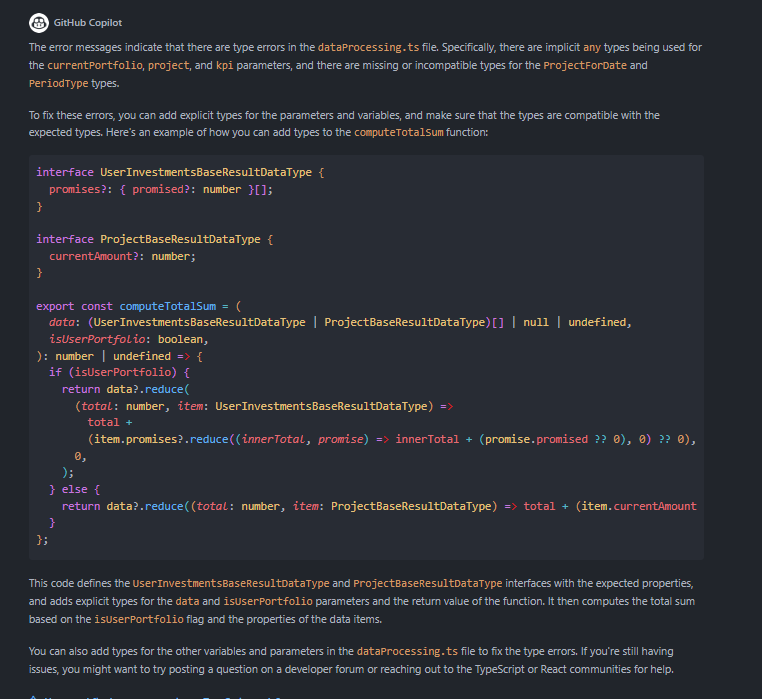
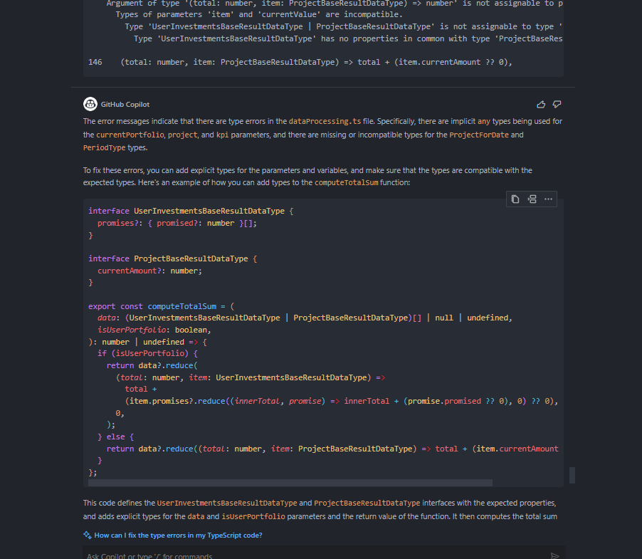

If u have no idea what is “unit testing” and have no expirience with this better watch [this](https://www.youtube.com/watch?v=OVNjsIto9xM&ab_channel=TraversyMedia) for better understanding of this “article”

Let’s start from the very begin.

This is what AI said :

“Unit testing is an essential practice in modern web development. It allows developers to ensure that individual pieces of code, or units, work as intended. When building applications with React, unit testing becomes even more critical because React applications are typically composed of many components. In this article, we will introduce you to the basics of unit testing in React, providing a foundation for you to start writing tests for your React applications.”

IRL we dont make and use unit tests in our projects. Maybe because our QA use cypress (or not?), but if unit test is one flower , cypress is a bouquet. 

But lets talk about unit testing more deeply:

Setup :

1) u need to install : 

```
    @babel/core
    @babel/preset-env
    @babel/preset-react
    @testing-library/jest-dom
    @testing-library/react
    @types/jest
    jest
    jest-dom
    ts-jest
```

2) add this to your `packge.json` :

```jsx
"scripts": {
"test": "jest"
},
```

3)create `jest.config.js` :

```jsx
module.exports = {
	preset: "ts-jest",
	testEnvironment: "jsdom",
	roots: ["src"], // Set the root directory for Jest to search
	transform: {
		"^.+\\.(ts|tsx)?$": "ts-jest",
		"^.+\\.(js|jsx)$": "babel-jest",
	},
	moduleNameMapper: {
		"\\.(css|less)$": "identity-obj-proxy",
	},
	moduleFileExtensions: ["ts", "tsx", "js", "jsx", "json", "node"],
};
```

4)create `babel.config.js` :

```jsx
module.exports = { presets: ["@babel/preset-env"] };
```

5) create `.babelrc:`

```json
{
  "presets": ["@babel/preset-env", "@babel/preset-react"]
}
```

IMPORTANT !!!. This settings works in react ts project ( and were made in collaboration with Copilot) ,so if u have expiriance with testing and setting up and/or have some comments,fill free to leave it 

Theory:

 Some basic functions which (some of them I used with Copilot suggestino, it is why this list is not “standart”) :

**`screen.getByText(text, options?, waitForOptions?)`**:

- This function is used to find an element in the rendered component that contains the specified text.
- It returns the first element that matches the text criteria.

**`screen.getByRole(role, options?, waitForOptions?)`**:

- This function is used to find an element by its ARIA role. ARIA roles are attributes used to define the accessibility roles of elements.
- It returns the first element that has the specified role.

**`screen.getByRole(role, options?, waitForOptions?)`**:

- This function is used to find an element by its ARIA role. ARIA roles are attributes used to define the accessibility roles of elements.
- It returns the first element that has the specified role.

**`screen.getByPlaceholderText(text, options?, waitForOptions?)`**:

- This function is used to find an input element by its placeholder text.
- It returns the first input element whose placeholder matches the specified text.

**`screen.getByTestId(id, options?, waitForOptions?)`**:

- This function is used to find an element by its **`data-testid`** attribute.
- It returns the first element with the specified **`data-testid`** value.

**`screen.getAllByText(text, options?, waitForOptions?)`**:

- This function is used to find all elements in the rendered component that contain the specified text.
- It returns an array of elements that match the text criteria.

**`expect(...)`**: 

This is the starting point of an assertion in Jest. You pass the value you want to make an assertion about within the parentheses.

**`.toBeInTheDocument()`**:

 This is an assertion method provided by Jest's DOM Testing Library (which React Testing Library builds upon). It checks whether the element you've selected is currently in the document (i.e., it's part of the rendered component). If the element is not in the document, this assertion will fail.

### Here is [docs](https://jestjs.io/docs/getting-started)

## Using copilot for writing tests:

1) for what and why i do not recommend using Copilot for wtiting test:

1.0)Imports: Copilot can really mess up with your imoprts 

Here is an one of examples how it can be suggested by Copilot and how it should  look like 



1.1) If your test fail copilot will not help u to understand and fix the broblem ( in my case copilot does not solve or fix problems/errors  but rather circumvents them)

It can u give u same suggestion for repetitive error (which does not work ) 

Or will give you a new one but if it will not work (still) it wil suggest the same one 

First try :



Second try :



1.2) Do not use Copilot for setting up your test :

Because of problems which I described above Copilot will just give u same or new but still not working suggestions for fixing your setup. Better google it for your better understanding and dont waste your time.

Using Copilot for writing tests can be a double-edged sword. While it can provide suggestions and generate code snippets to speed up the process, it's important to exercise caution. Copilot's suggestions may not always be accurate or align with best practices for unit testing. It's still crucial to have a solid understanding of unit testing concepts and to review and validate the generated code before using it in your projects.  -“*Notion AI*”

2)In which cases or when it will be suitable to use Copilot 

In my opinion Copilot can give u the “base” or some kind of scenario for testing. 

If u want to test page or function it can understand the difference in this cases .

U can use it as a base and add some function or change it instead of writing all this from scratch.

But be really careful, u can spend more time on fixing error from Copilot (especially if u are a beginner in this theme).

Stay tuned
