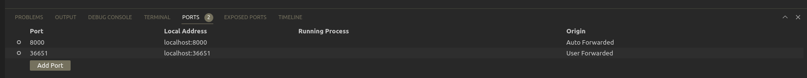

Už je to skoro 2 roky, co nám náš kolega z webového oddělení poslal do Slacku zprávu o nově vznikajícím cloud-based vývojovém prostředí GitPod. Tehdy jsme GitPodu nevěnovali moc pozornosti a jen si ho zběžně prohlédli, konec konců byl GitPod v té době stejně ještě v alpha verzi. Přihlásili jsme se nicméně k odběru newsletteru a po očku sledovali, kam se projekt postupně bude posouvat.

Za poslední dobu GitPod udělal velký pokrok, a tak jsme se mu nedávno rozhodli po čase opět trochu pověnovat. Pojďmě si ho tedy představit.

## Co je GitPod?

GitPod je vývojové prostředí kompletně v cloudu. To znamená, že nemáte v cloudu uložené pouze Vaše soubory, ale také uvnitř cloudu spouštíte Vaše “lokální” prostředí a dokonce můžete editovat Vaše soubory přímo pomocí webového IDE.

## Co jsme si od GitPodu slibovali?

GitPod se snaží řešit samozřejmě více problému spojených s vývojem. Nás zajímal ale hlavně kvůli následujícím dvěma věcem: 

**1)** **Eliminace “it works on my machine” problému**

Určitě jste se do této situace už někdy dostali. Něco naprogramujete, na první pohled se zdá, že všechno funguje, jak má, takže směle odevzdáte práci na review. Vaši větev si pak spustí kolega a Vy se nestačíte divit, když Vám práci odevzdá nazpět s poznámkou typu, že to ani nejde vybuidlit apod. Toto je běžný problém, který může nastat, pokud nemáte s ostatními vývojáři dostatečné jednotná vývojová prostředí. Při webovém vývoji tyto problémy mohou způsobovat např. různé verze Node nebo dokonce různé verze Gitu (ano už jsme se setkali i s tímto) a vlastně jakékoliv lokální “binárky”. Typicky se dějí tyto problémy po přechodu na nový HW/OS.

GitPod toto řeší velice jednoduše. Namísto toho, aby každý vývojář pracoval ve svém lokálním prostředí, pracují všichni vývojáři v jednotném prostředí umístěném v cloudu, čímž pádem je eliminován jakýkoliv prostor pro odlišnosti mezi prostředími jednotlivých vývojářů.

**2) Jednodušší switchování kontextu**

Tohle určitě taktéž všichni dobře znáte. Představte si, že pracujete na nějaké featuře, když Vás v tu chvíli najednou někdo přeruší a požádá o code review. Množství manuální práce, kterou musí vývojář v tomto scénáři udělat, je nekomfortně velké. Vývojář musí udělat zhruba toto:

- zazálohovat si svoji práci např. pomocí nějakého “WIP” commitu, apod.,
- pullnout si nové změny,
- přepnout se do nové větve,
- přeinstalovat dependence,
- znova vybuildit aplikaci,
- případně ještě vyčistit cache atd.

A aby toho nebylo málo, to stejné musí udělat při přechodu zpět na svoji původní větev a to bere opravdu spoustu času. Naštěstí GitPod má pro tyto situace řešení.

GitPod totiž spouští každou větev v separátrním prostředí, přepínáte se potom tedy pouze mezi těmito prostředími namísto toho, abyste neustále překonfigurovávali jedno prostředí do zrovna požadovaného stavu.

## Splnil gitpod naše očekávání?

Ano i ne. GitPod je v některým aspektech opravdu úžasný (viz body výše). Ovšem i tak má stále některé mouchy, které nás ve výsledku přesvědčili na něj momentálně ještě nepřecházet.

## “Mouchy” na GitPodu

**1) Vysoká cena**

Pricing model GitPodu je založený na počtu hodin, který v něm strávíte, respektive na počtu hodin, během kterých máte aktivní nějaký workspace. Workspace je defaultně vypínán po hodině neaktivity, ale můžete ho naštěstí vypnout i manuálně. Tohle je opravdu potřeba držet v hlavě, pokud nechcete platit zbytečně hodiny navíc, během kterých GitPod nepoužíváte.

Je potřeba také zmínit, že pricing model není lineární a cena začíná rapidně narůstat až pokud využíváte GitPod víc jak 25 hodin týdně a chcete pracovat v týmu ([https://www.gitpod.io/pricing](https://www.gitpod.io/pricing)). Ve webovém oddělení jsme uvažovali využívat plán pro 3 členy a 35 hodin týdně, což by vyšlo podle současného pricingu na 54€ za jednoho za měsíc a to není málo. Pokud bychom porovnali cenu např. s placeným IDE Webstorm, jehož cena je 16$ za měsíc, je to opravdu rozdíl. Ano, vím, Webstorm je oproti GitPodu pouze IDE, ale i tak.

**2) Desktopové IDE stále v betě**

GitPod používá jako defaultní IDE webovou verzi VSCode, která se jmenuje VS Code Browser. Toto IDE pracuje bez větších problémů, ale protože běží přímo v prohlížeči inherentně trpí jedním nedostatkem:

- Většina klávesových zkratek známých z desktopových IDE vyvolává prohlížečové akce namísto akcí IDE.

Vývojáři z GitPodu naštěstí na tyto problémy mysleli a pokud nechcete používat webové IDE, máte možnost GitPod používat i ve Vašem oblíbeném IDE. Má to ale jeden háček. Podívejte se na screenshot níže:

GitPod - podpora jednotlivých IDE

V současné době totiž neexistuje jediné IDE, které by momentálně nebylo v betě. I tak jsme se rozhodli tuto možnost otestovat. Netestovali jsme sice podrobně všechna IDE, ale zkusili jsme si alespoň VS Code Desktop, nejpoužívanější IDE pro vývoj webu.

**3) VS Code Desktop BETA**

Při používání GitPodu ve VS Code musíte počítat s tím, že Vás bude čekat zezačátku trochu manuální konfigurace uvnitř IDE. Kromě faktu, že budete muset nainstalovat GitPod plugin, což je logické, Váš čekají další problémy:

a) GitPod neumí synchroznizovat settings Vašeho IDE přes GitHub, protože Microsoft k tomuto neumožňuje přístup třetím stranám ([https://www.gitpod.io/docs/references/ides-and-editors/settings-sync#gitpod-vs-microsoft-settings-sync](https://www.gitpod.io/docs/references/ides-and-editors/settings-sync#gitpod-vs-microsoft-settings-sync)). Kvůli této limitaci budete muset nastavit synchronizaci settings přes GitPod servery namísto defaultních GitHub serverů.

b) Pokaždé když spustíte nové GitPod prostředí, musíte znovu nainstalovat všechny pluginy. To je víceméně defaultní chování, když si uvědomíte, že všechny pluginy v kontextu GitPodu “sídlí” někde na vzdáleném SSH GitPod hostu. A protože adresa hostu není pokaždé stejná, je vlastně logické, že pluginy musíte pořád dokola reinstalovat. Existuje naštěstí způsob, jak se tomuto vyvarovat a to tím, že řeknete VSCodu, aby na jakémkoliv SSH hostu nainstaloval všechny pluginy, které si přejete: [https://code.visualstudio.com/docs/remote/ssh#_managing-extensions](https://code.visualstudio.com/docs/remote/ssh#_managing-extensions). Škoda však, že tento link není k nalezení nikde v GitPod dokumentaci. Alespoň my jsme ho nikde nenašli. 

Bohužel problémy nekončí pouze u počáteční konfigurace. Při testování jsme totiž velice rychle zjistili, proč je VS Code Desktop stále ještě v betě. Brzy jsme totiž čelili dalšími problému. Jakmile si spustíte lokální prostředí v terminálu (např. `npm start`), očekávali byste, že dostanete na výstupu adresu, na které lokální prostředí běží nebo byste tuto adresu čekali alespoň v “Ports” tabu. Bohužel v případě VS Code desktop žádnou takovou adresu nedostanete, respektive dostanete adresu špatnou. Ve VS Code Browser se toto chová správně, ve VS Code Desktop bohužel ne. Tato funkce je však v kontextu toho, že GitPod spouští “localhost” pokaždé na jiné URL opravdu klíčová. Podívejte se na obrázek níže a udělejte si sami závěr:

VS Code Desktop BETA “Ports” panel - nesprávná URL adresa

VS Code Browser “Ports” panel - správná URL adresa

Poznámka: Během psaní článku VS Code Desktop již vyšel z bety. Bohužel výše popisovaný problém stále trvá.

## Závěr

Zamyslete se, jak moc nepříjemné jsou pro Vás problémy popisované výše a rozhodněte se sami, zda chcete GitPod používat či nikoliv. Pokud pro Vás nejsou až tak klíčové, potom dejte GitPodu šanci. GitPod má bezpochyby spoustu výhod, ze kterých můžete benefitovat. Pro nás by bylo zatím používání GitPodu na denní bázi až příliš nekomfortní. Samozřejmě se ale budeme těšit na novinky a snad i opravy, se kterými GitPod v budoucnu přijde a už teď se těšíme, že si jej v tu dobu opět vyzkoušíme.
