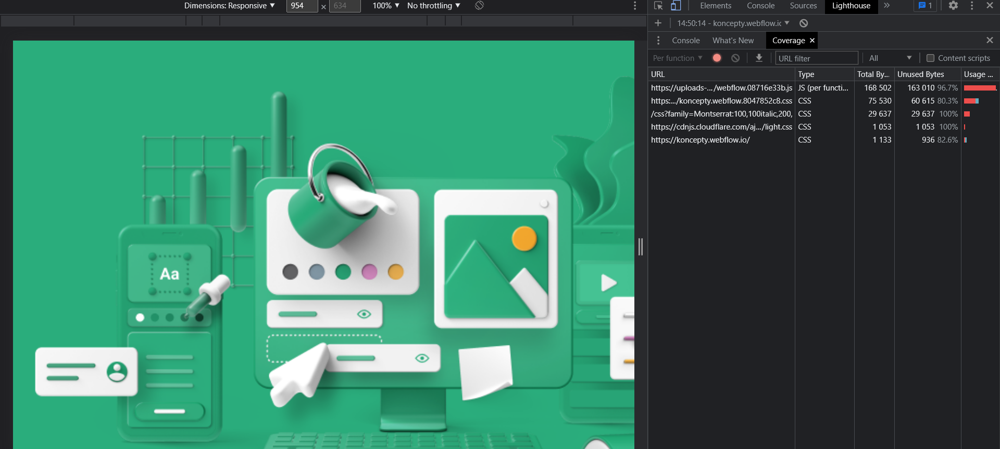
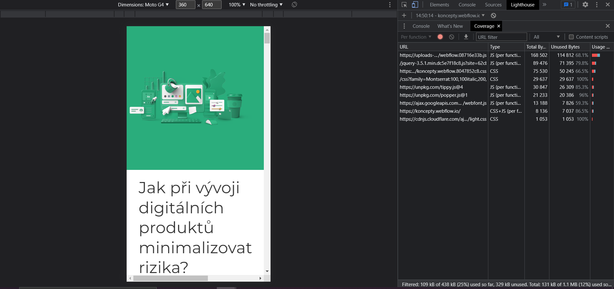
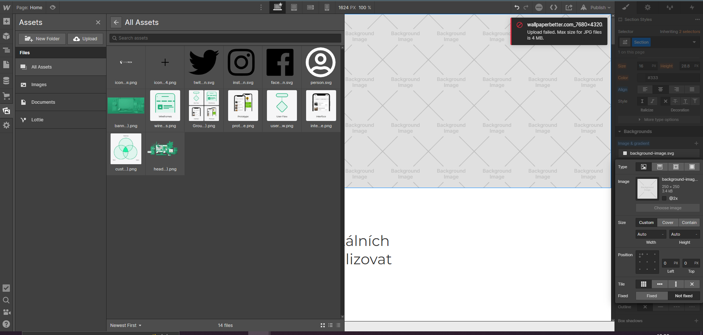

1.WebFlow web lighthouse 

Desktop version 

[lighthouse_desktop.pdf](download.pdf)

Mobile version 

[lighthouse_mobile.pdf](lighthouse_mobile.pdf)

In case [https://koncepty.webflow.io/](https://koncepty.webflow.io/)  performance 98% on desktop and 94 % on mobile

BUT : percent of unused js code on desktop :

on mobile :

1. Img in Webflow

Max size for images in Webflow 4MB 

The maximum file size is **4MB for images and 10MB for documents**.

4.Custom code

You can put custom code only inside  tag `<scrtipt>` for js or `<style>` in html file  for css. It will not add prefix or obfuscate

AND:

The custom code sections in Site and Page settings only support **HTML**, **CSS**, and **JS.** You can’t integrate server-side languages (such as Perl, PHP, Python, or Ruby) in any code section.

article :

[https://university.webflow.com/lesson/custom-code-in-the-head-and-body-tags](https://university.webflow.com/lesson/custom-code-in-the-head-and-body-tags)

1. Track google event analytics

There will be some issues but there is cool article about this these issues and how to solve them .

article:

[https://medium.com/@grahammcnicoll/automatically-track-click-events-from-webflow-in-google-analytics-15fbe6834df5](https://medium.com/@grahammcnicoll/automatically-track-click-events-from-webflow-in-google-analytics-15fbe6834df5)

article + video :

[https://webflow.com/blog/integrating-google-tag-manager-with-google-analytics-in-webflow](https://webflow.com/blog/integrating-google-tag-manager-with-google-analytics-in-webflow)

[**Bindings for using Formik with Material-UI**](Bindings-for-using-Formik-with-Material-UI/index.md)
