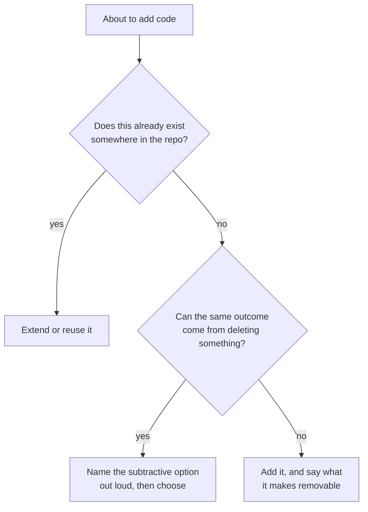

Two folk ideas describe software work well enough that everyone repeats them. The first is the dead horse: "when you discover you are riding a dead horse, the best strategy is to dismount", followed by the list of things organisations do instead - buy a stronger whip, change riders, form a committee, promote the horse. The second is Michelangelo's, the statue already finished inside the marble block, waiting for the superfluous stone to come off.

Both map onto code. We build things that should not exist, and we improve code by adding more of it. This page is what survives when the two ideas are checked against the research rather than against intuition, because the evidence turns out to be lopsided: the psychology is solid, the famous numbers are not, and the part everyone assumes is obvious - that deleting is safe and good - is the weakest link of all.

## The statue in the block

Michelangelo's own term was _via di levare_, "by way of taking away". In a 1547 letter to Benedetto Varchi he split art in two: sculpture works _per forza di levare_, by force of removal, and painting works _per via di porre_, by way of putting on. He ranked removal higher precisely because it has no undo. Every cut is permanent.

The popular phrasing - "the statue is already complete within the marble block, I just chisel away the superfluous material" - is a Victorian paraphrase rather than anything he is documented as writing. The _levare_ / _porre_ distinction is the real part, and it is the useful part: it names the asymmetry between adding and removing, which is exactly where software goes wrong.

## What holds up: people do not look for subtraction

The strongest finding in this whole area is a psychological one. Adams, Converse, Hales and Klotz ran [eight experiments on subtractive change](https://sites.olemiss.edu/scilab/publications/people-systematically-overlook-subtractive-changes) (Nature 592:258-261, 2021) and found that people "systematically default to searching for additive changes, and consequently overlook subtractive transformations". Participants missed advantageous removals more often when the task did not cue them to consider subtraction, when they had a single opportunity rather than several, and when they were under higher cognitive load.

That last manipulation matters. Cognitive load hurting subtraction means this is a search failure, not a preference: subtractive options are not being rejected, they are never generated in the first place. Which is a fair description of a developer under deadline pressure reaching for another conditional.

It replicates. A [preregistered replication and extension](https://api.semanticscholar.org/graph/v1/paper/DOI:10.1002/jocb.1535?fields=title,authors,year,venue,abstract) (Fillon, Girandola, Bonnardel and Souchet, _The Journal of Creative Behavior_, 2025, N = 477) reproduced the effect: participants reported 1155 additive ideas against 297 subtractive ones. Cueing them with "remember that you can add things or take them away" raised the share who produced at least one subtractive idea, overall OR = 2.52.

It is also not a universal constant. [A study across age, culture and task](https://pmc.ncbi.nlm.nih.gov/articles/PMC10784580/) (Juvrud, Myers and Nyström, _Scientific Reports_ 14:1086, 2024) found no subtraction neglect in the Lego task, no difference at all in a grid symmetry task, _t_(52) = -0.453, _p_ = 0.653, and concluded the bias "is not as generalizable as originally presented". Read the two together and you get a real, moderate, movable bias rather than a law of nature.

The honest caveat: every experiment above uses Lego bricks, grids, essays, itineraries and recipes. None of them used code, professional engineers, or any setting where deleting the wrong thing takes down production. Applying this to a codebase is a reasonable analogy, not a measured finding.

## What does not hold up: the numbers everyone quotes

The dead horse half of the story is where the citations fall apart.

The famous one is "64% of features are rarely or never used" (45% never, 19% rarely). Mike Cohn traced it: the source was [a keynote by Jim Johnson at XP 2002](https://www.mountaingoatsoftware.com/blog/are-64-of-features-really-rarely-or-never-used), chairman of the Standish Group, and "the results Jim Johnson presented at XP 2002 and that have been repeated so often were based on a study of four internal applications". Four applications, all internal, no commercial products. It has been quoted as a universal property of software for two decades.

The publisher's wider methodology fares no better. Eveleens and Verhoef applied the Standish definitions to [5,457 forecasts of 1,211 real-world projects](https://research.vu.nl/en/publications/the-rise-and-fall-of-the-chaos-report-figures/) (IEEE Software 27(1):30-36, 2010) and reported that "the Standish figures didn't reflect the reality of the case studies at all". The mechanism is worth knowing, because it is a nice trap: the measure is one-sided, scoring only overruns and never underruns, so it tracks the _direction_ of an organisation's estimation bias rather than how its projects went. In their data the worst estimator in the sample scored the highest Standish success rate.

Separately, Jørgensen and Moløkken-Østvold went looking for the definition behind the equally famous 189% cost overrun and [could not find one](https://cms.simula.no/sites/default/files/publications/Jorgensen.2006.4.pdf) (_Information and Software Technology_ 48(4):297-301, 2006). Three mutually inconsistent descriptions exist, two of them inside a single document, and of 50 web pages citing the figure, half read it one way and 40% another.

Nothing here proves that unused features are rare. It means there is no defensible public number for how much shipped functionality goes unused, and the most-quoted one should be cited as "widely repeated, origin unverified" or not at all.

## Escalation is real, but the mechanism is not sunk cost

The part of the dead horse story that does have a peer-reviewed number is escalation. Keil, Mann and Rai surveyed IS audit and control professionals and estimated that [between 30% and 40% of IS projects](https://api.crossref.org/works/10.2307/3250950) show some degree of escalation (_MIS Quarterly_ 24(4):631-647, 2000). Treat it as indicative: one survey, no replication found, respondents structurally over-exposed to troubled projects, and "some degree of escalation" is a much weaker statement than "doomed project kept alive".

The more interesting result is in the same paper. Four theories were tested against the data, and the winner was not sunk cost. The completion effect, the pull of finishing something that is nearly done, "provided the best classification of projects, correctly classifying over 70% of both escalated and non-escalated projects". Self-justification was significant too, so this qualifies the sunk cost framing rather than replacing it. But it moves the diagnosis: teams do not keep riding mostly because of what they already spent, they keep riding because the end looks close. Proximity to completion is not obviously irrational, which is what makes it hard to argue against in a planning meeting.

Worth noting that the single most-cited paper in this area, the Denver International Airport baggage system, is [a qualitative case study](https://api.crossref.org/works/10.2307/3250968) (Montealegre and Keil, _MIS Quarterly_ 24(3):417-447, 2000) that quantifies nothing, and its actual contribution runs the other way: it models successful _de-escalation_ in four phases, from problem recognition to implementing an exit strategy. Citing it for a failure rate is a misattribution.

## Deleting is not free

The weakest assumption in the whole Michelangelo framing is that removal is the safe direction. It is not.

[Hyrum's Law](https://www.hyrumslaw.com/) states that "with a sufficient number of users of an API, it does not matter what you promise in the contract: all observable behaviors of your system will be depended on by somebody". Chesterton's fence says the same thing about your own codebase: do not remove the fence until you know why it was put there. Both describe deletion as an operation with unbounded blast radius, which no Lego experiment has.

There is a measured version. [Coverage-based debloating](https://arxiv.org/abs/2008.08401) (Soto-Valero, Durieux, Harrand and Baudry, _ACM TOSEM_) removed 68.3% of library bytecode and 20.3% of dependencies across 211 library versions. That is the headline everyone repeats. The other half of the result is the one to carry into a code review: "81.5% of the clients, with at least one test that uses the library, successfully compile and pass their test suite when the original library is replaced by its debloated version". Automated, coverage-guided, test-verified removal still broke roughly one client in five.

So "delete more code" is not a rule that follows from the evidence. What follows is that deletion is skilled, risky work with a known failure rate, and it should be treated like any other change with a blast radius rather than as free housekeeping.

## What to actually do

The intervention the research supports is small and cheap: a cue. The bias is a failure to generate the subtractive option, and the thing that measurably fixes generation is being asked. That is one line in a review template or one question before opening a new file.

Expectations should stay calibrated. Even cued, the replication's participants produced 1155 additive to 297 subtractive ideas, with the cue effect at φ = 0.18 to 0.24. A checklist item is a small-to-moderate nudge, not a fix. And a naive "smaller is safer" rule does not save you either: the size-defect literature is contested, with El Emam and others arguing the classic "keep modules small" U-curve is an artifact of plotting size against its own reciprocal.

The defensible position is narrower than either folk idea, and more useful than both:

- Additive bias is real, replicated, and probably operating on you right now. Cue for it.
- The famous numbers about unused features are not evidence. Stop citing them.
- Projects get kept alive because the end looks close, not mainly because of what was spent. Argue against the completion effect, not the sunk cost.
- Removal is the permanent cut. Michelangelo was right about that part, and it is the part the paraphrase leaves out.

Related: [[code-review]], [[cognitive-biases]], [[code-copy-paste]]
