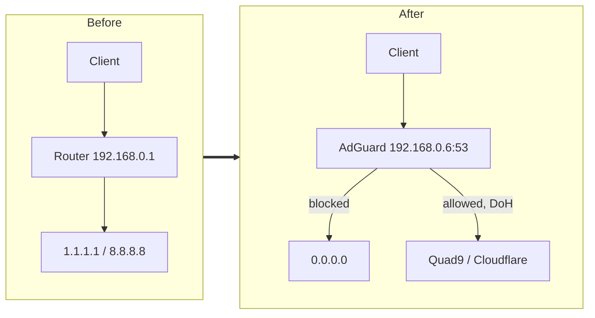

Network-wide ad and tracker filtering from the Raspberry Pi that already runs Umbrel, with the router handing every client a single DNS server. Written after a first setup where the wizard refused to start, the DNS port silently inherited the wrong value, and reverse lookups stalled for two seconds each. The steps below are the order that works; the traps section is why each one is where it is.

The device in this setup is a Pi 4B at `192.168.0.6`, behind an Archer AX5400 at `192.168.0.1` - the same router as [[tp-link-vpn-client-nordvpn|TP-Link VPN client with NordVPN]], which matters at the end.

## How the query path changes



The router leaves the DNS path entirely. It only announces who the resolver is, through DHCP.

## Order of operations

Nothing here is reversible in a hurry, so the sequence matters: AdGuard must answer correctly before the router sends clients to it. Point DHCP at a resolver that is not yet working and the whole LAN loses name resolution at once.

1. Free the ports on the Pi
2. Run the wizard
3. Configure upstreams, blocklists
4. Prove it answers, from a client, by explicit IP
5. Only then change router DHCP
6. Re-check from a renewed client

## 1. Ports on the Pi

The Umbrel app runs with `network_mode: host`, so AdGuard binds host ports directly, and anything already listening wins. Two collisions are normal:

- **Port 80** is the Umbrel dashboard. The wizard reports `validating ports: listen tcp 0.0.0.0:80: bind: address already in use` and will not continue until the admin port is changed.
- **Port 53** may be held by `systemd-resolved`. Check with `sudo ss -tulpn | grep :53`.

Free 53 if the stub listener is there:

```bash
sudo mkdir -p /etc/systemd/resolved.conf.d
printf '[Resolve]\nDNSStubListener=no\n' | sudo tee /etc/systemd/resolved.conf.d/adguard.conf
sudo ln -sf /run/systemd/resolve/resolv.conf /etc/resolv.conf
sudo systemctl restart systemd-resolved
```

## 2. The wizard

**The admin port must be 8095.** Not 3000, not a port picked from what looks free. The Umbrel app's [docker-compose.yml](https://raw.githubusercontent.com/getumbrel/umbrel-apps/master/adguard-home/docker-compose.yml) starts the container with `--web-addr 0.0.0.0:8095`, chosen to avoid a clash with Thunderhub, and that is the port the wizard itself is being served on. Any other value and the UI moves somewhere Umbrel does not expect.

Confirm from the Pi rather than guessing:

```bash
grep -i port ~/umbrel/app-data/adguard-home/umbrel-app.yml
```

On this app the file says so in plain words: set the Port of the Admin Web Interface to 8095.

| Wizard field    | Value                                  |
| --------------- | -------------------------------------- |
| Admin interface | All interfaces                         |
| Admin port      | `8095`                                 |
| DNS interface   | the LAN NIC, here `end0 - 192.168.0.6` |
| DNS port        | `53`                                   |

Two things the wizard gets wrong on its own:

- **The DNS port copies the admin port.** After typing `8095` above, the DNS Port field shows `8095` too. Set it back to `53` - nothing on the network queries anything else.
- **"All interfaces" for DNS also binds `127.0.0.1` and the Docker bridges.** The loopback binding is the one that collides with `systemd-resolved`. Pick the single LAN interface.

The red line about not being able to configure a static IP is expected and harmless. AdGuard cannot write host network config from inside a container. Do the reservation on the router instead.

## 3. Upstreams and lists

Nastavení → Nastavení DNS:

```
https://dns.quad9.net/dns-query
https://dns.cloudflare.com/dns-query
```

Mode `Paralelní dotazy`, bootstrap `9.9.9.9` and `1.1.1.1`, then `Otestovat upstreamy` before applying. The `Záložní DNS servery` field on the same page is the failover that keeps filtering - unlike a second entry in the router's DHCP, which does not.

Filtry → Seznamy blokování DNS, on top of the default AdGuard DNS filter:

- [OISD big](https://oisd.nl/), `https://big.oisd.nl` - ads, phishing, malvertising, malware, telemetry, explicitly not torrent sites, adult content or gambling
- [Hagezi Multi PRO](https://github.com/hagezi/dns-blocklists), `https://raw.githubusercontent.com/hagezi/dns-blocklists/main/adblock/pro.txt` - roughly 222 600 entries

Stop at two. Hagezi's own guidance is that its tiers "build on each other, so pick exactly one of them", and OISD overlaps both. More lists buy false positives, not coverage.

Expect around 90% of ads to disappear and no more. The rest is first-party - YouTube, Facebook and Instagram serve ads from the same domain as the content, so no DNS rule can separate them. That last slice belongs to a browser extension, not to another blocklist.

## 4. Prove it works before touching the router

From a client, by explicit IP:

```
nslookup google.com 192.168.0.6
```

An answer here means the resolver is live. No answer means stop - changing DHCP now would take the LAN offline.

## 5. Router DHCP

Advanced → Network → DHCP Server:

- `Primary DNS`: `192.168.0.6`
- `Secondary DNS`: **empty**
- Address Reservation: bind the Pi's MAC to `192.168.0.6`, since that address sits inside the DHCP pool

**Secondary DNS is not a failover field.** Windows and Android treat both entries as usable and query whichever answers first, so a public resolver there leaks past the filter every day, not only during an outage. The honest trade is: empty field means the Pi is a hard dependency for DNS; a public secondary means permanent partial leakage. Filtering setups take the first.

Then, on the client:

```
ipconfig /release
ipconfig /renew
ipconfig /flushdns
ipconfig /all | findstr /i "DNS Servers"
nslookup doubleclick.net
```

`DNS Servers` must list `192.168.0.6` alone, and `doubleclick.net` must come back `0.0.0.0`. Other devices pick the new server up on lease renewal - 120 minutes by default - or immediately on a Wi-Fi off/on toggle.

## Reverse lookups

Out of the box every `nslookup` prints `Server: UnKnown` and stalls two seconds first. Both come from a failed PTR query for the resolver's own address.

The instinct is to fill `Soukromé reverzní DNS servery` with the router address. That made it worse here: the Archer does not answer PTR for its DHCP leases, so AdGuard forwarded the query and waited for a timeout that never resolved. Emptying the field removed the stall - AdGuard then answers private PTR itself, instantly, with `NXDOMAIN`.

The second instinct, hosts-syntax lines in `Vlastní pravidla filtrování`, gives forward resolution only. AdGuard's [hosts blocklist docs](https://github.com/AdguardTeam/Adguardhome/wiki/Hosts-Blocklists) state that modifiers "don't work with `/etc/hosts`-style rules", and PTR generation is a modifier. So `192.168.0.6 umbrel.lan` makes `nslookup umbrel.lan` work and changes nothing about the reverse direction.

The rule that does work is adblock syntax with `$dnsrewrite`, per the [DNS filtering syntax reference](https://adguard-dns.io/kb/general/dns-filtering-syntax/), which notes the address "MUST be in reverse order":

```
||6.0.168.192.in-addr.arpa^$dnsrewrite=NOERROR;PTR;umbrel.lan.
```

Both halves are worth having together - the hosts line for typing `umbrel.lan`, the rewrite for clean reverse lookups:

```
192.168.0.1 router.lan
192.168.0.6 umbrel.lan
||1.0.168.192.in-addr.arpa^$dnsrewrite=NOERROR;PTR;router.lan.
||6.0.168.192.in-addr.arpa^$dnsrewrite=NOERROR;PTR;umbrel.lan.
```

Note the trailing dot on the target name and the reversed octets. This is cosmetic; skip it if the two-second delay does not bother you.

The structural alternative is letting AdGuard run DHCP, which gives it every lease and therefore PTR and named clients for free. The cost is that the Pi becomes a dependency for getting an IP at all, not just for resolving names.

## Bypass paths that DHCP does not close

Pointing DHCP at AdGuard covers devices that ask the OS resolver. Three things do not.

- **Browser DoH.** Chrome, Edge, Firefox, Opera and Brave carry their own DNS-over-HTTPS client and talk straight to Cloudflare or Google over 443, invisible to both the resolver and any port 53 firewall rule. Check by browsing an ad-heavy site and looking for the queries in Protokol dotazů; an empty log means the browser is bypassing. Turn it off at `chrome://settings/security` or `about:preferences#privacy`.
- **Firefox, network-wide.** Firefox asks for the canary domain `use-application-dns.net` at startup and disables its automatic DoH if the answer is negative, which [Technitium's write-up](https://blog.technitium.com/2020/07/how-to-disable-firefox-dns-over-https.html) describes as an `NXDOMAIN` or an empty `NOERROR`. Blocking `||use-application-dns.net^` covers every Firefox on the LAN at once. The limit is documented and worth knowing: the canary "only applies to users who have DoH enabled as the default option", not to anyone who switched it on deliberately.
- **Hardcoded resolvers.** Smart TVs and Chromecasts query `8.8.8.8` directly. Only a firewall rule blocking outbound 53 to anything but the Pi stops that, and consumer TP-Link firmware generally cannot express it.

IPv6 is a fourth path in waiting. With IPv6 off on the router nothing is advertised and `ipconfig /all` shows a single DNS server; enable it later and clients will take an IPv6 resolver from the router and route around AdGuard.

## Interaction with the router VPN client

The DHCP DNS fields are the same ones [[tp-link-vpn-client-nordvpn|the NordVPN setup]] sets to public resolvers to stop tunnelled devices losing name resolution. Only one value can be in the field. With AdGuard in place it is `192.168.0.6`, which is reachable from inside the tunnel because it is on the LAN - but any DNS-based split behaviour that relied on a public resolver there needs rechecking after this change.

## Backup and daily use

One file holds the entire configuration - password hash, upstreams, lists, custom rules:

```bash
sudo cp ~/umbrel/app-data/adguard-home/data/AdGuardHome.yaml ~/AdGuardHome.yaml.bak
```

Operationally there is one loop: something breaks, Protokol dotazů, find the domain, `Odblokovat`. Worth raising the query log retention from 24 hours to 7 days first, or the evidence is gone before the complaint arrives.

Two standing caveats. The Pi down means the LAN has no DNS at all, which is the price of an empty secondary. And Umbrel app updates restart the container, dropping resolution for a few seconds - usually invisible, occasionally the reason a device looks offline right after an update.

Related: [[nas]], [[mdns]]
