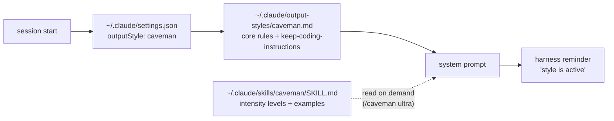

A globally installed skill does **not** run in every session. Skills are _model-invoked_: Claude reads the one-line `description` from every `SKILL.md`, and loads the body only when it judges the description relevant to the current prompt (or when you type `/skill-name`). That is exactly right for a task skill and exactly wrong for a **communication style**, which must hold for the whole session including the very first reply.

Claude Code has a separate layer for this: **output styles**. An output style is injected into the system prompt at session start, and the harness itself re-reminds the model that the style is active - persistence is a runtime property, not something the model has to remember.

Worked example below: making the [Caveman](https://skills.sh/juliusbrussee/caveman/caveman) skill (see [[skills|SKILLS]]) the default voice everywhere, without losing Claude Code's coding behaviour.

## Why not just tell it in AGENTS.md

Four mechanisms can carry a style. The first three land it in conversation context, where it competes with everything else in the transcript; only the last one lands it in the system prompt.

| Mechanism           | Runs every session | Reinforced by harness | Lands in          | Notes                                                          |
| ------------------- | ------------------ | --------------------- | ----------------- | -------------------------------------------------------------- |
| Skill (default)     | No                 | No                    | Conversation      | Fires only on description match or `/caveman`                  |
| Rule in `AGENTS.md` | Yes                | No                    | Conversation      | One shared file for Windows + WSL; can fade in long sessions   |
| `SessionStart` hook | Yes                | No                    | Conversation      | Deterministic trigger, still just context; skipped by `--bare` |
| **Output style**    | **Yes**            | **Yes**               | **System prompt** | Per-OS config; no tool call at session start                   |

The two context-injection rows also cost a `Skill` tool call if the injected rule merely points at `SKILL.md` rather than restating the rules inline.

The output style wins on the two things that matter for a persistent voice: it is in the system prompt rather than in conversation context, and the harness periodically re-asserts it. Verified against Claude Code 2.1.210, whose binary carries the settings key (`outputStyle` - "Controls the output style for assistant responses"), the `output-styles/` directory loader, the `keep-coding-instructions` frontmatter flag, and the reminder string `"… output style is active. Remember to follow the specific guidelines for this style."`

## Load path



## Step 1 - the output style file

Create `~/.claude/output-styles/caveman.md` (the directory does not exist by default):

```yaml
---
name: caveman
description: Ultra-compressed output. Full technical accuracy, no filler.
keep-coding-instructions: true
---
```

`keep-coding-instructions: true` is the load-bearing line. Without it, a non-default output style **replaces** Claude Code's default coding instructions instead of sitting alongside them - you get the voice and lose the coding agent. With it, both are in the system prompt.

`name` defaults to the filename, `description` is what shows in the `/output-style` picker. Two further frontmatter keys (`force-for-plugin`, and plugin-scoped `outputStyles` paths) are meaningful only for plugin-bundled styles - ignored for user styles.

## Step 2 - flip it on globally

Add one top-level key to `~/.claude/settings.json`, next to `theme` / `statusLine`:

```json
{
  "outputStyle": "caveman"
}
```

Edit surgically. A long-lived settings file is mostly a `permissions.allow` array (mine holds 443 entries) - a reformat or reorder there is a real diff nobody wants to review.

## Step 3 - decide what gets duplicated

The style file and the skill now describe the same thing, so pick a split and write it down. What worked:

- **In the output style** - the always-true core: persistence (off only on "stop caveman"), the drop-lists (articles, filler, pleasantries, hedging), the never-drop list (`not` / `never` / `no` / `only` / `except`, numbers, units, error strings), language preservation, no self-reference, auto-clarity exemptions, and boundaries.
- **In `SKILL.md` only** - the intensity table (`lite` / `full` / `ultra` / `wenyan-*`) and the per-level examples. Those are needed only when you actually switch level, and they are the bulk of the tokens.
- **A `## Mirror` section at the bottom of `SKILL.md`** naming the style file and the settings key, so the next edit touches both.

Two rules from the skill deserve calling out, because they are what keeps an always-on style survivable:

- **Auto-clarity** - drop the compression for security warnings, irreversible-action confirmations, multi-step sequences where fragment order could be misread, and anywhere compression itself creates ambiguity.
- **Boundaries** - anything persisted outside the chat (code, comments, commit messages, docs, PR/MR text, memory files, messages to third parties) is written in normal prose. Without this, your commit history turns into caveman.

## Verification

The style loads at session start, so the session you edited from will _not_ show it. Test in a fresh one, and never mention caveman in the prompt - if the prompt hints at it, you have tested nothing.

```bash
# 1. settings still valid, permissions untouched
python3 -c "import json; d=json.load(open('$HOME/.claude/settings.json')); \
  print(d['outputStyle'], len(d['permissions']['allow']))"

# 2. fresh session, no mention of the style
claude -p "why does a React component re-render when I pass an inline object prop?"
```

What to look for:

- **Voice** - fragments, no articles, no pleasantries, while `Object.is` and `useMemo` survive verbatim. Compression of style, not of substance.
- **Coding layer intact** - give a fresh session a trivial file edit. It must still reach for Read/Edit normally and still honour `AGENTS.md`. This is the check that `keep-coding-instructions` actually took.
- **Boundaries** - ask for a commit message. Normal prose, not caveman.
- **Picker** - `/output-style` shows `caveman` as selected.

## Caveats

- **Turning it off has two scopes.** "stop caveman" ends it for the current session only; the next session has it back. Permanent off is `/output-style default`.
- **Windows and WSL do not share this.** `~/.claude/settings.json` and `~/.claude/output-styles/` are per-OS. Only `AGENTS.md` is shared, via symlink - see [[global-agents-md-windows-wsl|Global AGENTS.md across Windows and WSL]]. Parity means copying the style file and adding the settings key on the other side too (and installing the skill there, if you want the intensity levels).
- **`--bare` is a different world.** It skips hooks, plugin sync, auto-memory and `CLAUDE.md` auto-discovery, and expects context to be handed in explicitly (`--system-prompt`, `--append-system-prompt`, `--settings`). If you script against it, pass the style in yourself rather than assuming the global setting applies.
- **Project scope exists too.** A repo-local `.claude/output-styles/` plus `outputStyle` in project settings gives a per-repo voice, which is the better home for a house writing style than a global one.

---

Related: [[skills|SKILLS]] · [[global-agents-md-windows-wsl|Global AGENTS.md across Windows and WSL]] · [[claude-code-workflow-tips|Claude Code workflow tips]]
