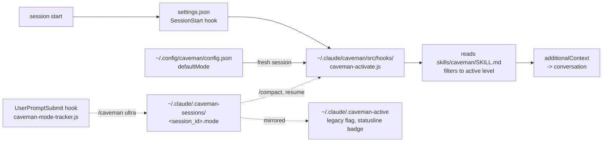

A globally installed skill does **not** run in every session: only its description is always in context, and the body loads on invocation, per the [skill content lifecycle](https://code.claude.com/docs/en/skills#skill-content-lifecycle). That is exactly right for a task skill and exactly wrong for a **communication style**, which must hold for the whole session including the very first reply.

Two mechanisms can carry it instead. This page picked the output style first, then reversed to a `SessionStart` hook. Both the reasoning and the reversal are recorded, because the reversal was driven by evidence rather than taste.

Worked example: making the [Caveman](https://skills.sh/juliusbrussee/caveman/caveman) skill (see [[skills|SKILLS]]) the default voice on WSL.

## The four candidates

| Mechanism           | Runs every session | Reinforced by harness | Lands in      | Notes                                                          |
| ------------------- | ------------------ | --------------------- | ------------- | -------------------------------------------------------------- |
| Skill (default)     | No                 | No                    | Conversation  | Fires only on description match or `/caveman`                  |
| Rule in `AGENTS.md` | Yes                | No                    | Conversation  | One file for every agent tool; can fade in long sessions       |
| `SessionStart` hook | Yes                | No                    | Conversation  | Deterministic trigger, still just context; skipped by `--bare` |
| Output style        | Yes                | Yes                   | System prompt | One settings key; no tool call at session start                |

On that table the output style wins outright, and it is what this setup used: `~/.claude/output-styles/caveman.md` plus `"outputStyle": "caveman"` in `settings.json`. It worked, and the `keep-coding-instructions: true` frontmatter kept the coding agent intact alongside the voice.

## Why it lost anyway

Three findings, in the order they landed:

1. **Anthropic is moving off the mechanism.** The official marketplace ships `explanatory-output-style`, and that plugin contains no style file at all. Its README opens: _"This plugin recreates the **deprecated** Explanatory output style as a SessionStart hook"_, and the handler injects the instructions as `additionalContext`. Both built-in styles migrated the same way.
2. **Upstream caveman never used a style.** `JuliusBrussee/caveman` is itself a plugin, and its `plugin.json` wires `SessionStart` + `UserPromptSubmit` hooks. There is no output style anywhere in that repo, so the style file here was authored content with no upstream - a distillation that had to be kept in sync by hand, with a `## Mirror` note in `SKILL.md` as the reminder.
3. **The hook reads `SKILL.md` at runtime.** `caveman-activate.js` resolves the skill file through a candidate list and emits the full ruleset filtered to the active intensity level. Its own comment explains why the full text rather than a summary: _"models drifted back to verbose mid-conversation, especially after context compression pruned it away."_ So the duplication problem the style file created does not exist here - there is one source of truth, and it is upstream's.

The deciding measurement was cost. `claude plugin details` reports the inventory of any plugin:

| Route                      | Always-on tokens                             |
| -------------------------- | -------------------------------------------- |
| Output style (what we had) | ~899 style + ~150 skill description ≈ 1,050  |
| Full upstream plugin       | ~2,813 skills+agents + ~1,045 hook ≈ 3,858   |
| **Hooks, no plugin**       | ~1,045 hook + ~150 skill description ≈ 1,195 |

The plugin's 2,813 tokens are its 25 bundled skills and 5 agents, none of which are wanted. Wiring only the two hooks costs about what the style file cost, and `install.js` confirms the two paths are alternatives rather than partners: hooks are written into `settings.json` only when a plugin install did not happen, because otherwise _"two CAVEMAN MODE blocks"_ fire per event.

## The setup

Clone upstream into the config home:

```bash
git clone https://github.com/JuliusBrussee/caveman ~/.claude/caveman
```

Then two hooks in `~/.claude/settings.json`:

```json
{
  "hooks": {
    "SessionStart": [
      {
        "hooks": [
          {
            "type": "command",
            "command": "\"node\" \"/home/[USER]/.claude/caveman/src/hooks/caveman-activate.js\"",
            "timeout": 5,
            "statusMessage": "Loading caveman mode..."
          }
        ]
      }
    ],
    "UserPromptSubmit": [
      {
        "hooks": [
          {
            "type": "command",
            "command": "\"node\" \"/home/[USER]/.claude/caveman/src/hooks/caveman-mode-tracker.js\"",
            "timeout": 5,
            "statusMessage": "Tracking caveman mode..."
          }
        ]
      }
    ]
  }
}
```

`npm run env:bootstrap` writes both entries and reports `already` on a second run - see [[claude-code-environment|Claude Code environment]]. Do **not** use upstream's `bin/install.js` for this: it installs the plugin (the 2,813 tokens), copies six scripts into `~/.claude/hooks/` instead of leaving them in a pullable clone, and merges a `statusLine` of its own into `settings.json`.

## Load path


```mermaid
flowchart LR
  A["session start"] --> B["settings.json<br/>SessionStart hook"]
  B --> C["~/.claude/caveman/src/hooks/<br/>caveman-activate.js"]
  C --> D["reads skills/caveman/SKILL.md<br/>filters to active level"]
  D --> E["additionalContext<br/>-> conversation"]
  CFG["~/.config/caveman/config.json<br/>defaultMode"] -- "fresh session" --> C
  F["UserPromptSubmit hook<br/>caveman-mode-tracker.js"] -. "/caveman ultra" .-> G["~/.claude/.caveman-sessions/<br/>&lt;session_id&gt;.mode"]
  G -. "/compact, resume" .-> C
  G -. "mirrored" .-> M["~/.claude/.caveman-active<br/>legacy flag, statusline badge"]
```

A fresh session never inherits the last level. It starts from `defaultMode` in `~/.config/caveman/config.json` (here `{"defaultMode":"ultra"}`), overridable per repo by `.caveman/config.json` or globally by `CAVEMAN_DEFAULT_MODE`; with none set, upstream's default is `full`. `/caveman <level>` changes only the current session: the tracker stores it per session id, and the activate hook reads it back only on `/compact` or resume. `~/.claude/.caveman-active` is a mirror of the latest write across all sessions, useful for the statusline and nothing else.

So `/caveman off` lasts until the session ends. The permanent off-switch - what `/output-style default` used to be - is `"defaultMode": "off"` in the config file.

## Verification

Hooks fire at session start, so the session you configured from will _not_ show the change. Test in a fresh one, and never mention caveman in the prompt - if the prompt hints at it, you have tested nothing.

```bash
# fresh session, no mention of the style
claude -p "why does a React component re-render when I pass an inline object prop?"
```

What to look for:

- **Voice** - fragments, no articles, no pleasantries, while `Object.is` and `useMemo` survive verbatim. Compression of style, not of substance.
- **Coding layer intact** - give a fresh session a trivial file edit. It must still reach for Read/Edit normally and still honour `AGENTS.md`.
- **Boundaries** - ask for a commit message. Normal prose, not caveman.
## Caveats

- **Context, not system prompt.** This is the concession the reversal accepts: the rules now sit in conversation context, where a heavy compaction can prune them. Upstream mitigates it by injecting the full ruleset rather than a summary, and the `UserPromptSubmit` hook re-asserts the active level.
- **[`--bare`](https://code.claude.com/docs/en/cli-reference) skips hooks entirely.** With the output style, a scripted `--bare` run still inherited the voice from settings; now it does not. Pass the rules in yourself with `--append-system-prompt` if a scripted run needs them.
- **Two node processes per session** plus one per prompt, each with a 5-second timeout.
- **Updating means `git pull`** in `~/.claude/caveman`. Nothing is vendored, so nothing goes stale silently - but nothing updates by itself either.
- **The `## Mirror` note in `SKILL.md` is obsolete.** It pointed at a style file that no longer exists. Since the hook reads `SKILL.md` directly, an upstream `skills update` overwriting that file is now harmless.

---

Related: [[skills|SKILLS]] · [[global-agents-md|Global AGENTS.md]] · [[claude-code-workflow-tips|Claude Code workflow tips]]
