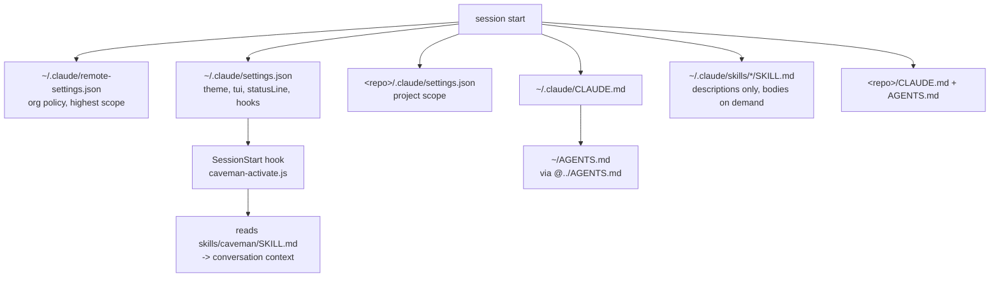

The hub page for a working Claude Code setup across Windows and WSL: which files exist, which of them are shared and which are per-OS, what loads in what order, and what a fresh machine needs. The individual topics have their own pages and are linked rather than repeated - the value here is the inventory and the order.

## Inventory

`[USER]` stands for the account name, which differs between the two sides.

| What                        | Windows                                                                      | WSL                                         | Shared?            |
| --------------------------- | ---------------------------------------------------------------------------- | ------------------------------------------- | ------------------ |
| Canonical agent preferences | `C:\Users\[USER]\AGENTS.md` (real file)                                      | `~/AGENTS.md` (symlink to the Windows file) | **yes**, one file  |
| Claude pointer to it        | `~/.claude/CLAUDE.md` holding `@../AGENTS.md`                                | same content, separate file                 | no                 |
| Settings                    | `~/.claude/settings.json`                                                    | `~/.claude/settings.json`                   | no                 |
| Caveman hook program        | `~/.claude/caveman/` (clone of `JuliusBrussee/caveman`)                      | same path, symlink to the Windows directory | **yes**, one copy  |
| Global skills               | `~/.claude/skills/` (real dirs)                                              | same path, symlink to the Windows directory | **yes**, one copy  |
| Skills CLI store and lock   | `~/.agents/skills/`, `~/.agents/.skill-lock.json`                            | `~/.agents` symlinked to the Windows one    | **yes**, one copy  |
| Org-pushed policy           | `~/.claude/remote-settings.json`                                             | same path                                   | synced per machine |
| Statusline program          | `~/.claude/statusline/` (clone)                                              | same path, symlink to the Windows directory | **yes**, one copy  |
| Per-repo scope              | `<repo>/.claude/settings.json`, `<repo>/.claude/skills/`, `<repo>/CLAUDE.md` | same                                        | per repo           |

Almost everything is shared, by one mechanism: the preferences file, the skill directories and the two program clones all live on the Windows side, with a symlink to each from WSL.

The test for whether a file can be shared is whether its content is free of OS-specific paths. `AGENTS.md`, the skills, their lock file and both clones all pass; **`settings.json` is the one that does not.** Its `additionalDirectories` holds WSL paths, and its `statusLine` and hook commands need `/home/[USER]/...` on one side and `C:/Users/[USER]/...` on the other, so symlinking it would break one of the two. That leaves `settings.json` as the only file to keep in step by hand - which is where the caveman hooks are wired, twice.

Sharing skills as a unit is deliberate. `~/.claude/skills/` is what Claude Code reads, while `~/.agents/` holds the CLI's own store and `.skill-lock.json`; linking only the first would let an install from WSL populate the shared directory while recording it in a lock the Windows side never sees, so `skills list` and `skills update` would disagree about what is installed.

## Load order



Two properties of that graph matter in practice. Everything except the settings files lands in **conversation context**, including the caveman rules the `SessionStart` hook injects - which is a deliberate trade against the output style that used to occupy the system prompt, and the reasoning is in [[always-on-output-style|Always-on caveman]]. Skills are loaded differently again: only their one-line descriptions are read at startup, and a body arrives when the description matches or you type the name.

## Rebuilding it

```bash
npm run env:bootstrap
```

Apply-only and idempotent. It creates what is missing, leaves every existing value alone, and prints one line per item, so a second run reports `already` for everything. What it covers:

- `~/AGENTS.md` - symlinks it to the Windows canonical file on WSL, checks it exists on Windows.
- `~/.claude/CLAUDE.md` - the `@../AGENTS.md` pointer.
- `~/.claude/settings.json` - adds `theme`, `tui` and `statusLine` if absent, deriving the statusline path from `HOME`.
- `~/.claude/skills`, `~/.agents`, `~/.claude/statusline` and `~/.claude/caveman` - symlinks each to its Windows counterpart on WSL. Skills run before any install, so they land in the shared copy; the two clones are only linked, never created, and their absence is reported with the repo to clone.
- The two caveman hooks in `settings.json` - `SessionStart` and `UserPromptSubmit`, pointing into the shared clone. This is what makes the voice always-on; see [[always-on-output-style|Always-on caveman]].
- Global skills, from the pinned manifest `scripts/claude-env.skills.json`. Because the directory is shared, a machine that already has them installed from the other OS reports `already` for every one.

Flags: `--win-user=<name>` when the Windows profile cannot be auto-detected from WSL, and `--skip-skills`.

Running it on Windows means running it as a Windows process, so that `HOME` resolves to the Windows profile. If the repo lives on ext4, copy `claude-env.mjs` and `claude-env.skills.json` into a Windows directory and run `node claude-env.mjs` there - the script resolves the manifest relative to itself, so those two files are all it needs.

It deliberately does **not** write permission rules. Those need decisions rather than defaults, and the traps that make them silently ineffective are in [[claude-code-permissions|Claude Code permission rules]].

### Manual steps it does not cover

In rough order for a fresh machine:

1. WSL itself, and Git - [[wsl-windows-setup|WSL and Windows setup]], [[install-git|Install Git]]
2. Node via nvm - [[nvm|NVM]]
3. Git config: line endings and commit signing - [[autocrlf|Safe line endings]], [[gpg-sign-commits|Sign commits with GPG]]
4. SSH keys - [[ssh|SSH]]
5. VSCode settings, extensions and snippets - [[vscode-settings|VSCode settings]], [[vscode-extensions|VSCode extensions]], [[vscode-setup-notes|VSCode setup notes]]
6. Claude Code itself, then `npm run env:bootstrap`
7. Statusline program, cloned to `~/.claude/statusline/` on the Windows side - [[claude-statusline|Claude statusline]]
8. Caveman, cloned to `~/.claude/caveman/` on the Windows side, then `npm run env:bootstrap` again to wire the hooks - [[always-on-output-style|Always-on caveman]]

## Sharp edges

- **The skills CLI has an engine floor.** `skills@1.5.22` requires node `>= 22.20.0`. On an older 22.x the bootstrap reports the skip rather than failing halfway, and the skills have to be installed after upgrading node.
- **A shared clone still means two settings values.** Both `~/.claude/statusline/` and `~/.claude/caveman/` are one copy, yet each `settings.json` has to name them in that OS's own terms (`/home/[USER]/...` against `C:/Users/[USER]/...`), because a command string is a path. A WSL-only machine needs no special case: the directories are simply real there.
- **Neither clone updates itself.** `git pull` in `~/.claude/statusline` and `~/.claude/caveman` is the update mechanism; the bootstrap only links them.
- **`--bare` has no caveman.** It skips hooks, and the voice is now a hook rather than a settings key, so a scripted `--bare` run answers in normal prose unless the rules are passed in explicitly.
- **Org policy can appear without you doing anything.** Rules synced into `~/.claude/remote-settings.json` outrank your own settings, and a local edit there is overwritten on the next sync.
- **The session you configure from does not see the change.** Settings and hooks load at session start. Verify in a fresh session, and do not mention the expected behaviour in the prompt or you have tested nothing.
- **A skill can be a directory or a symlink.** Older CLI versions installed into `~/.agents/skills/<name>` and symlinked that into `~/.claude/skills/`; current ones copy the files in directly. Both layouts can coexist on one machine, so anything that inspects the skills directory has to count symlinks as installed - otherwise it reinstalls what is already there.
- **A skill that never appears in the model's list may be working as designed.** `disable-model-invocation: true` in a `SKILL.md` makes it slash-command only, which is why `grill-with-docs` and `thermo-nuclear-code-quality-review` are absent from the descriptions the model sees.
- **The node floor bites the WSL side hardest.** Skills now install into a shared directory, so whichever OS has a new enough node can do the installing for both.
- **`skills remove` is the way to uninstall.** Deleting the directory by hand leaves the entry behind in `~/.agents/.skill-lock.json`, which then misreports what is installed.
- **`--bare` skips most of this.** No hooks, no plugin sync, no `CLAUDE.md` auto-discovery. Scripted invocations have to pass context in explicitly.

## Everything tagged

Every page in this cluster carries the `Configuration` tag, so [/tags/Configuration](../tags/Configuration/index.md) is the live index - agent config, editor config, OS and toolchain config in one list. The tag deliberately excludes git-knob pages such as rebase and force-push behaviour: those describe how a tool behaves, not how this machine is set up.

---

Related: [[global-agents-md-windows-wsl|Global AGENTS.md across Windows and WSL]] · [[claude-code-permissions|Claude Code permission rules]] · [[skills|SKILLS]] · [[claude-code-workflow-tips|Claude Code workflow tips]]
