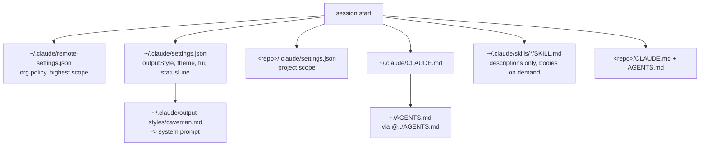

The hub page for a working Claude Code setup across Windows and WSL: which files exist, which of them are shared and which are per-OS, what loads in what order, and what a fresh machine needs. The individual topics have their own pages and are linked rather than repeated - the value here is the inventory and the order.

## Inventory

`[USER]` stands for the account name, which differs between the two sides.

| What                        | Windows                                                                      | WSL                                         | Shared?            |
| --------------------------- | ---------------------------------------------------------------------------- | ------------------------------------------- | ------------------ |
| Canonical agent preferences | `C:\Users\[USER]\AGENTS.md` (real file)                                      | `~/AGENTS.md` (symlink to the Windows file) | **yes**, one file  |
| Claude pointer to it        | `~/.claude/CLAUDE.md` holding `@../AGENTS.md`                                | same content, separate file                 | no                 |
| Settings                    | `~/.claude/settings.json`                                                    | `~/.claude/settings.json`                   | no                 |
| Output style                | `~/.claude/output-styles/caveman.md`                                         | same path                                   | no                 |
| Global skills               | `~/.claude/skills/`                                                          | same path                                   | no                 |
| Org-pushed policy           | `~/.claude/remote-settings.json`                                             | same path                                   | synced per machine |
| Statusline program          | `C:\Users\[USER]\Documents\Claude\Projects\claude-statusline\`               | reached over `/mnt/c/...`                   | **yes**, one copy  |
| Per-repo scope              | `<repo>/.claude/settings.json`, `<repo>/.agents/skills/`, `<repo>/CLAUDE.md` | same                                        | per repo           |

Only two things are genuinely shared: the preferences file, via symlink, and the statusline program, because WSL can execute it straight off `/mnt/c`. Everything else is duplicated per OS, which is the single biggest source of "it behaves differently on the other side".

**`settings.json` cannot be shared the same way.** Its contents are path-bearing: `additionalDirectories` holds WSL paths, and the `statusLine` command needs `/mnt/c/...` on one side and `C:\...` on the other. Symlinking it would break one of the two.

## Load order



Two properties of that graph matter in practice. The output style lands in the **system prompt** and is re-asserted by the harness, which is why it holds for a whole session where a rule in `AGENTS.md` can fade - the reasoning is in [[always-on-output-style|Always-on output style]]. Skills are the opposite: only their one-line descriptions are loaded, and a body is read when the description matches or you type the name.

## Rebuilding it

```bash
npm run env:bootstrap
```

Apply-only and idempotent. It creates what is missing, leaves every existing value alone, and prints one line per item, so a second run reports `already` for everything. What it covers:

- `~/AGENTS.md` - symlinks it to the Windows canonical file on WSL, checks it exists on Windows.
- `~/.claude/CLAUDE.md` - the `@../AGENTS.md` pointer.
- `~/.claude/output-styles/caveman.md` - the style file.
- `~/.claude/settings.json` - adds `outputStyle`, `theme`, `tui` and `statusLine` if absent, detecting the statusline path per platform.
- Global skills, from the pinned manifest `scripts/claude-env.skills.json`.

Flags: `--win-user=<name>` when the Windows profile cannot be auto-detected from WSL, and `--skip-skills`.

It deliberately does **not** write permission rules. Those need decisions rather than defaults, and the traps that make them silently ineffective are in [[claude-code-permissions|Claude Code permission rules]].

### Manual steps it does not cover

In rough order for a fresh machine:

1. WSL itself, and Git - [[wsl-windows-setup|WSL and Windows setup]], [[install-git|Install Git]]
2. Node via nvm - [[nvm|NVM]]
3. Git config: line endings and commit signing - [[autocrlf|Safe line endings]], [[gpg-sign-commits|Sign commits with GPG]]
4. SSH keys - [[ssh|SSH]]
5. VSCode settings, extensions and snippets - [[vscode-settings|VSCode settings]], [[vscode-extensions|VSCode extensions]], [[vscode-setup-notes|VSCode setup notes]]
6. Claude Code itself, then `npm run env:bootstrap`
7. Statusline program, cloned to the Windows side - [[claude-statusline|Claude statusline]]

## Sharp edges

- **The skills CLI has an engine floor.** `skills@1.5.22` requires node `>= 22.20.0`. On an older 22.x the bootstrap reports the skip rather than failing halfway, and the skills have to be installed after upgrading node.
- **The statusline path is Windows-side even in WSL.** One clone serves both, so a WSL-only machine has no statusline unless the program is relocated and the settings key adjusted.
- **Org policy can appear without you doing anything.** Rules synced into `~/.claude/remote-settings.json` outrank your own settings, and a local edit there is overwritten on the next sync.
- **The session you configure from does not see the change.** Settings and output styles load at session start. Verify in a fresh session, and do not mention the expected behaviour in the prompt or you have tested nothing.
- **`--bare` skips most of this.** No hooks, no plugin sync, no `CLAUDE.md` auto-discovery. Scripted invocations have to pass context in explicitly.

## Everything tagged

Every page in this cluster carries the `Configuration` tag, so [/tags/Configuration](../tags/Configuration/index.md) is the live index - agent config, editor config, OS and toolchain config in one list. The tag deliberately excludes git-knob pages such as rebase and force-push behaviour; the reasoning is recorded in `docs/adr/0001-configuration-tag-for-environment-pages.md`.

---

Related: [[global-agents-md-windows-wsl|Global AGENTS.md across Windows and WSL]] · [[claude-code-permissions|Claude Code permission rules]] · [[skills|SKILLS]] · [[claude-code-workflow-tips|Claude Code workflow tips]]
