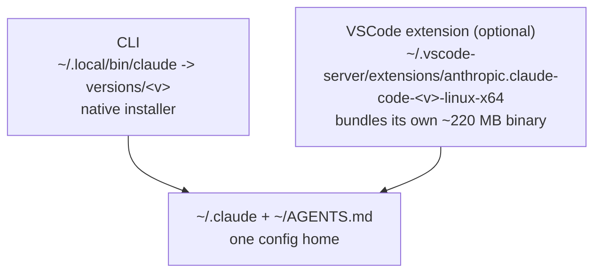
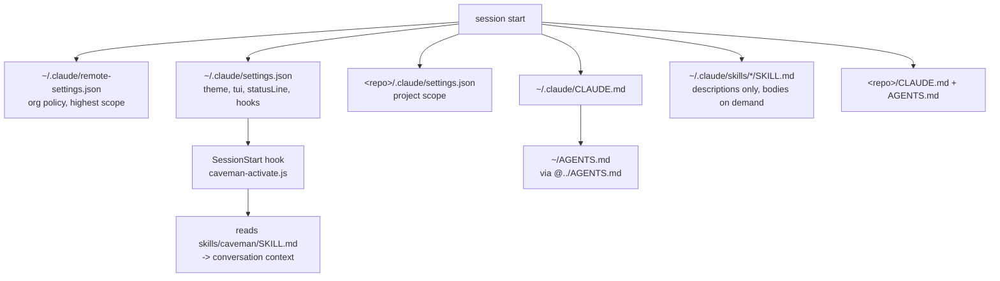

The hub page for a working Claude Code setup: which files exist, what loads in what order, and what a fresh machine needs. The individual topics have their own pages and are linked rather than repeated - the value here is the inventory and the order.

## Why WSL

Claude Code runs in WSL, and that is the only recommended setup. Two reasons.

**The sandbox needs it.** The [sandboxed Bash tool](https://code.claude.com/docs/en/sandboxing#get-started) runs on WSL2, so every session is covered, with no surface running on permission rules alone.

**Projects belong on the Linux filesystem.** The [working across file systems guide](https://learn.microsoft.com/en-us/windows/wsl/filesystems) says "We recommend against working across operating systems with your files, unless you have a specific reason for doing so", and names the Linux root directory as where WSL project files belong. A repo under `/mnt/c` is slow, has no inotify, and produces permission noise, so clone it into `~` instead.

Open folders in VSCode through Remote-WSL. That is what makes the integrated terminal a WSL shell with `claude` on `PATH`.

## Inventory

`[USER]` stands for the Linux account name. Every path below is under `/home/[USER]` and every one of them is a real file or directory.

| What                      | Path                                                                         | Notes                                               |
| ------------------------- | ---------------------------------------------------------------------------- | --------------------------------------------------- |
| Agent preferences         | `~/AGENTS.md`                                                                | see [[global-agents-md\|Global AGENTS.md]]          |
| Claude pointer to it      | `~/.claude/CLAUDE.md` holding `@../AGENTS.md`                                | one-line import                                     |
| Settings                  | `~/.claude/settings.json`                                                    | hooks, statusLine, sandbox, permissions, plugins    |
| Caveman hook program      | `~/.claude/caveman/`                                                         | clone of `JuliusBrussee/caveman`                    |
| Global skills             | `~/.claude/skills/`                                                          | what Claude Code reads                              |
| Skills CLI store and lock | `~/.agents/skills/`, `~/.agents/.skill-lock.json`                            | what the `skills` CLI reads                         |
| Statusline program        | `~/.claude/statusline/`                                                      | clone, see [[claude-statusline\|Claude statusline]] |
| Org-pushed policy         | `~/.claude/remote-settings.json`                                             | synced, outranks your own settings                  |
| Plugin marketplace cache  | `~/.claude/plugins/`                                                         | per-install cache                                   |
| Claude Code binary        | `~/.local/bin/claude` -> `~/.local/share/claude/versions/<v>`                | native install                                      |
| VSCode extension          | `~/.vscode-server/extensions/anthropic.claude-code-<v>-linux-x64/`           | optional, bundles its own binary                    |
| Per-repo scope            | `<repo>/.claude/settings.json`, `<repo>/.claude/skills/`, `<repo>/CLAUDE.md` | per repo                                            |

The [`.claude` directory guide](https://code.claude.com/docs/en/claude-directory) explains what Claude Code itself keeps in `~/.claude`. Two entries here are a pair rather than one thing. `~/.claude/skills/` is what Claude Code reads; `~/.agents/` is the CLI's own store and lock. An install writes both, so restoring one without the other leaves `skills list` disagreeing with what is on disk.

## Installs


```mermaid
flowchart TD
  CLI["CLI<br/>~/.local/bin/claude -> versions/&lt;v&gt;<br/>native installer"]
  EXT["VSCode extension (optional)<br/>~/.vscode-server/extensions/anthropic.claude-code-&lt;v&gt;-linux-x64<br/>bundles its own ~220 MB binary"]
  CFG["~/.claude + ~/AGENTS.md<br/>one config home"]
  CLI --> CFG
  EXT --> CFG
```

The extension does not use the CLI install: it ships its own binary at `resources/native-binary/claude` and updates on the VSCode extension cycle. At a matching version the two are the same file - 2.1.267 in both places checksums identically - so the split costs nothing until the tracks diverge, which they can, because a native install with `autoUpdates: false` and a marketplace extension update on their own schedules. Pointing the extension at the CLI binary instead is an [extension setting](https://code.claude.com/docs/en/vs-code#extension-settings).

Both read the same config home, so a settings or skills change lands in both at once - including the sandbox block. An extension session is sandboxed on exactly the terms the user settings set, because the sandbox resolves from `~/.claude/settings.json` and the working directory rather than from whatever launched the process.

VSCode keeps previous extension versions on disk after an update, marking the old directory in `.obsolete` and deleting it on the next restart, so pruning by hand is how the space comes back in the same sitting.

### The extension reinstalls itself

Removing the extension does not keep it removed: a `claude` startup in a VSCode integrated terminal installs it again, within seconds. The [uninstall section](https://code.claude.com/docs/en/vs-code#uninstall-the-extension) of the extension docs names the switches that stop it. Keybinding-driven sessions do not need the extension either way: they open a terminal and type `claude`.

### Which install method

Use the [native installer](https://code.claude.com/docs/en/setup#install-claude-code), the only method that auto-updates, then verify with `claude doctor`.

### Which launcher runs which binary

| Launcher                                 | Binary it runs                             |
| ---------------------------------------- | ------------------------------------------ |
| the VSCode extension's own chat panel    | the extension's `resources/native-binary/` |
| `ctrl+alt+c`, a `runCommands` keybinding | CLI on `PATH`                              |
| `ctrl+alt+w`, `claudeWorktreeTabs.open`  | CLI on `PATH`                              |
| `claude` typed in any terminal           | CLI on `PATH`                              |

Without the extension, every launcher is a terminal typing `claude`, so all of them run the one CLI. The keybindings are plain VSCode: `ctrl+alt+c` chains `workbench.action.createTerminalEditor` and a `sendSequence` of `claude\r` via `runCommands`, and `ctrl+alt+w` is contributed by the worktree-tabs extension, whose `claudeWorktreeTabs.command` setting defaults to `claude` and is typed into each editor tab it opens. Neither needs a path, because the terminal is already a WSL shell.

Both land in the **editor area** rather than the bottom panel, which is what makes a session a full-height tab you can split and drag like a file. Two settings decide that. `terminal.integrated.defaultLocation` - which the [VSCode terminal docs](https://code.visualstudio.com/docs/terminal/basics) describe as changing "the default `view` or `editor` area terminal location" - is set to `editor` globally, so every terminal opens as a tab, including the ones the auto-run rules start. The keybinding does not rely on it: `workbench.action.createTerminalEditor` is the command behind "Terminal: Create New Terminal in Editor Area", so it opens a tab whichever way the default is set. Where the extension's own chat can live is covered in [Choose where Claude lives](https://code.claude.com/docs/en/vs-code#choose-where-claude-lives).

The auto-run terminals - now a `git sync` freshen only, with the Claude session left to the keybinding - are set up in [[vscode-autorun-claude-on-open|Run tools when workspace opened]].

### The npm install failure mode

A broken npm install is silent: when the per-platform binary is missing, the [install troubleshooting guide](https://code.claude.com/docs/en/troubleshoot-install#native-binary-not-found-after-npm-install) describes the placeholder left behind. The auto-updater still reports success in that state - `~/.claude/.last-update-result.json` records `"path":"npm-global","outcome":"success"` for a version that cannot launch, because the wrapper package did update. Only `claude doctor` or the file size tells you. Migrating to the native installer is the fix, not repairing the placeholder.

## Sandbox

[The sandboxed Bash tool](https://code.claude.com/docs/en/sandboxing) sits above the permission rules rather than replacing them: rules refuse tool calls, the sandbox constrains the processes a permitted call starts, which is the gap named in [[claude-code-permissions|Claude Code permission rules]]. Install the dependencies from [Set up Linux and WSL2](https://code.claude.com/docs/en/sandboxing#set-up-linux-and-wsl2), then turn it on in `~/.claude/settings.json`.

### Making it a hard gate

`"enabled": true` alone is a preference, not a guarantee. The block used here closes both ways out:

```json
{
  "sandbox": {
    "enabled": true,
    "failIfUnavailable": true,
    "allowUnsandboxedCommands": false
  }
}
```

[`failIfUnavailable`](https://code.claude.com/docs/en/settings-reference#sandbox-failifunavailable) turns a missing `bubblewrap` from a warning into a startup error, and [`allowUnsandboxedCommands`](https://code.claude.com/docs/en/settings-reference#sandbox-allowunsandboxedcommands) set to `false` closes the [unsandboxed retry escape hatch](https://code.claude.com/docs/en/sandboxing#the-unsandboxed-retry-escape-hatch). The cost is that a genuinely blocked command now fails instead of prompting; widening the allowed domains in `/sandbox`, or excluding one specific command, is the way back rather than turning the key off.

Neither key reaches the `!` shell prompt in an ordinary interactive session - [[claude-code-permissions|Claude Code permission rules]] covers where that stops holding.

### Where a project can undo it

Project settings outrank user settings in the [settings precedence](https://code.claude.com/docs/en/settings#settings-precedence), and `sandbox.enabled` is not restricted to trusted sources. A repo shipping `"sandbox": {"enabled": false}` in its project settings therefore outranks the user-scope block above, and `failIfUnavailable` goes quiet with it, because it only fires while the sandbox is enabled.

The only file above a project is the managed one - `/etc/claude-code/managed-settings.json` on Linux and WSL, root-owned, holding the same three keys:

```bash
sudo install -D -m 644 -o root -g root managed-settings.json /etc/claude-code/managed-settings.json
```

Root ownership is the whole mechanism: a file your user cannot rewrite is a file a session running as your user cannot rewrite either. Loosening it afterwards needs `sudo` again.

That is the theory. On a machine whose Claude account belongs to an organization, it does not work, and the failure is silent.

### When the managed file is skipped

Only one managed source is used by default - see [How Claude Code combines managed sources](https://code.claude.com/docs/en/managed-settings#how-claude-code-combines-managed-sources) - and server-managed settings from claude.ai rank above the local file. So on an account whose organization publishes anything at all through [server-managed settings](https://code.claude.com/docs/en/server-managed-settings), the local file is never read.

Measured on this machine, with the file in place and valid: a `claude -p` run carrying `--settings` that sets `"sandbox": {"enabled": false}` reported an unsandboxed Bash tool, while the same run without the flag reported a strict one. Flag scope beat the managed file because the managed file was not in play - `claude doctor` reports `Organization policy: Loaded from api.anthropic.com`, and that source won the tier.

The three keys that make the hard gate are not on the list of [keys read from every admin source](https://code.claude.com/docs/en/managed-settings#keys-read-from-every-admin-source), so a lower-ranked source cannot contribute them. The fix is administrator-side: the organization adds the sandbox block to its server-managed settings. [Read the source in /status](https://code.claude.com/docs/en/managed-settings#read-the-source-in-status) rather than off the filesystem - a file at the right path with the right owner proves nothing on its own.

## Load order


```mermaid
flowchart TD
  S["session start"] --> P["~/.claude/remote-settings.json<br/>org policy, highest scope"]
  S --> U["~/.claude/settings.json<br/>theme, tui, statusLine, hooks"]
  S --> PR["&lt;repo&gt;/.claude/settings.json<br/>project scope"]
  U --> HK["SessionStart hook<br/>caveman-activate.js"]
  HK --> CTX["reads skills/caveman/SKILL.md<br/>-> conversation context"]
  S --> CM["~/.claude/CLAUDE.md"]
  CM --> AG["~/AGENTS.md<br/>via @../AGENTS.md"]
  S --> SK["~/.claude/skills/*/SKILL.md<br/>descriptions only, bodies on demand"]
  S --> RC["&lt;repo&gt;/CLAUDE.md + AGENTS.md"]
```

Two properties of that graph matter in practice. Everything except the settings files lands in **conversation context**, including the caveman rules the `SessionStart` hook injects - which is a deliberate trade against the output style that used to occupy the system prompt, and the reasoning is in [[always-on-output-style|Always-on caveman]]. Skills load lazily, per the [skill content lifecycle](https://code.claude.com/docs/en/skills#skill-content-lifecycle).

## Rebuilding it

```bash
npm run env:bootstrap
```

Apply-only and idempotent. It creates what is missing, leaves every existing value alone, and prints one line per item, so a second run reports `already` for everything. What it covers:

- `~/AGENTS.md` - reports it if absent; the text to restore is in [[global-agents-md|Global AGENTS.md]].
- `~/.claude/CLAUDE.md` - the `@../AGENTS.md` pointer.
- `~/.claude/settings.json` - adds `theme`, `tui` and `statusLine` if absent, deriving the statusline path from `HOME`.
- `~/.claude/skills` and `~/.agents` - creates both. The two clones are only checked, never created, and their absence is reported with the repo to clone.
- The two caveman hooks in `settings.json` - `SessionStart` and `UserPromptSubmit`. This is what makes the voice always-on; see [[always-on-output-style|Always-on caveman]].
- Global skills, from the pinned manifest `scripts/claude-env.skills.json`.

Flag: `--skip-skills`.

It deliberately does **not** write permission rules. Those need decisions rather than defaults, and the traps that make them silently ineffective are in [[claude-code-permissions|Claude Code permission rules]].

### Manual steps it does not cover

In rough order for a fresh machine:

1. WSL itself, and Git - [[wsl-windows-setup|WSL and Windows setup]], [[install-git|Install Git]]
2. Node via nvm - [[nvm|NVM]]
3. Git config: line endings and commit signing - [[autocrlf|Safe line endings]], [[gpg-sign-commits|Sign commits with GPG]]
4. SSH keys - [[ssh|SSH]]
5. VSCode settings, extensions and snippets - [[vscode-settings|VSCode settings]], [[vscode-extensions|VSCode extensions]], [[vscode-setup-notes|VSCode setup notes]]
6. Claude Code itself, native installer, see [Installs](#installs), then `npm run env:bootstrap`
7. Statusline program, cloned to `~/.claude/statusline/` - [[claude-statusline|Claude statusline]]
8. Caveman, cloned to `~/.claude/caveman/`, then `npm run env:bootstrap` again to wire the hooks - [[always-on-output-style|Always-on caveman]]
9. Sandbox dependencies and `sandbox.enabled`, see [Sandbox](#sandbox)
10. The secrets deny block in `settings.json` - [[claude-code-permissions|Claude Code permission rules]]

## Sharp edges

- **The skills CLI has an engine floor.** [`skills`](https://github.com/vercel-labs/skills) at 1.5.22 requires node `>= 22.20.0`. On an older 22.x the bootstrap reports the skip rather than failing halfway, and the skills have to be installed after upgrading node.
- **The skills CLI reads stdin.** Installing the manifest in a shell loop needs `</dev/null` on the command, or the first install swallows the rest of the list and the loop exits after one skill.
- **Neither clone updates itself.** `git pull` in `~/.claude/statusline` and `~/.claude/caveman` is the update mechanism; the bootstrap only checks they exist.
- **`--bare` has no caveman.** [`--bare`](https://code.claude.com/docs/en/cli-reference) skips hooks, and the voice is a hook, so a scripted `--bare` run answers in normal prose unless the rules are passed in explicitly.
- **`permissions.allow` grows on its own** from in-session approvals, into the hundreds within months. It is noise to prune, not a list to curate; only `deny` is worth writing by hand.
- **Narrowing `additionalDirectories` takes effect immediately.** Removing a path from it stops recursive deletes there being permitted mid-session, which is worth knowing before using a session to clean up the very tree it is losing access to.
- **Org policy can appear without you doing anything.** [Server-managed settings](https://code.claude.com/docs/en/server-managed-settings#fetch-and-caching-behavior) cache into `~/.claude/remote-settings.json`, and a local edit there is overwritten on the next sync.
- **The session you configure from does not see the change.** Settings and hooks load at session start. Verify in a fresh session, and do not mention the expected behaviour in the prompt or you have tested nothing.
- **A skill can be a directory or a symlink.** Older CLI versions installed into `~/.agents/skills/<name>` and symlinked that into `~/.claude/skills/`; current ones copy the files in directly. Both layouts can coexist, so anything that inspects the skills directory has to count symlinks as installed - otherwise it reinstalls what is already there.
- **A skill that never appears in the model's list may be working as designed.** [`disable-model-invocation`](https://code.claude.com/docs/en/skills#control-who-invokes-a-skill) is why `grill-with-docs` and `thermo-nuclear-code-quality-review` are absent from the descriptions the model sees.
- **`skills remove` is the way to uninstall.** Deleting the directory by hand leaves the entry behind in `~/.agents/.skill-lock.json`, which then misreports what is installed.
- **Editor automation does not belong in `~/.claude/`.** A script there that generates VSCode configuration is a second place to maintain, and a generated `keybindings.json` entry outranks the binding an extension contributes, silently shadowing it. That logic belongs in the extension.

## Everything tagged

Every page in this cluster carries the `Configuration` tag, so [/tags/Configuration](../tags/Configuration/index.md) is the live index - agent config, editor config, OS and toolchain config in one list. The tag deliberately excludes git-knob pages such as rebase and force-push behaviour: those describe how a tool behaves, not how this machine is set up.

---

Related: [[global-agents-md|Global AGENTS.md]] · [[claude-code-permissions|Claude Code permission rules]] · [[skills|SKILLS]] · [[claude-code-workflow-tips|Claude Code workflow tips]] · [[claude-statusline|Claude statusline]]
