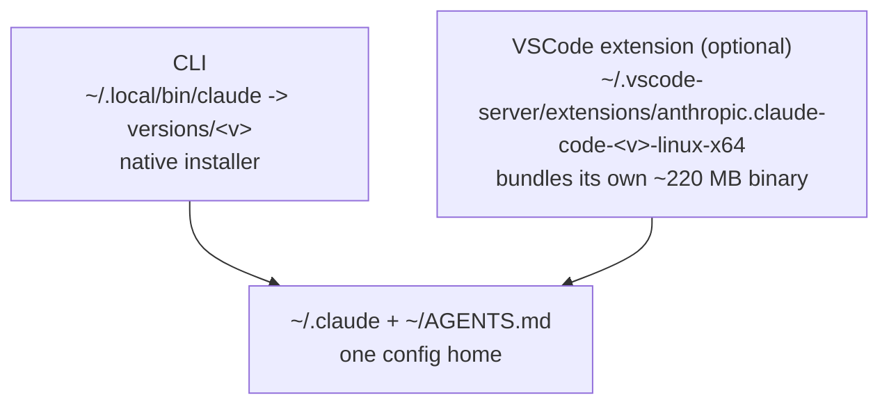
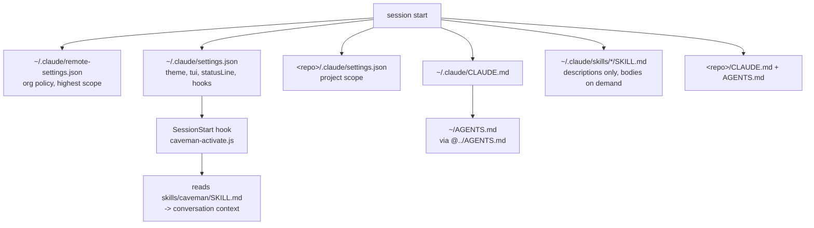

The hub page for a working Claude Code setup: which files exist, what loads in what order, and what a fresh machine needs. The individual topics have their own pages and are linked rather than repeated - the value here is the inventory and the order.

Everything lives in WSL. There is no Windows install and no file shared across the boundary; the migration that removed it, and what breaks on the way, is in [[claude-code-wsl-only-setup|Claude Code on WSL only]].

## Inventory

`[USER]` stands for the Linux account name. Every path below is under `/home/[USER]` and every one of them is a real file or directory.

| What                      | Path                                                                         | Notes                                               |
| ------------------------- | ---------------------------------------------------------------------------- | --------------------------------------------------- |
| Agent preferences         | `~/AGENTS.md`                                                                | the one source of rules, read by every agent tool   |
| Claude pointer to it      | `~/.claude/CLAUDE.md` holding `@../AGENTS.md`                                | import rather than symlink, see below               |
| Settings                  | `~/.claude/settings.json`                                                    | hooks, statusLine, sandbox, permissions, plugins    |
| Caveman hook program      | `~/.claude/caveman/`                                                         | clone of `JuliusBrussee/caveman`                    |
| Global skills             | `~/.claude/skills/`                                                          | what Claude Code reads                              |
| Skills CLI store and lock | `~/.agents/skills/`, `~/.agents/.skill-lock.json`                            | what the `skills` CLI reads                         |
| Statusline program        | `~/.claude/statusline/`                                                      | clone, see [[claude-statusline\|Claude statusline]] |
| Org-pushed policy         | `~/.claude/remote-settings.json`                                             | synced, outranks your own settings                  |
| Plugin marketplace cache  | `~/.claude/plugins/`                                                         | per-install cache                                   |
| Claude Code binary        | `~/.local/bin/claude` -> `~/.local/share/claude/versions/<v>`                | native install                                      |
| VSCode extension          | `~/.vscode-server/extensions/anthropic.claude-code-<v>-linux-x64/`           | optional, bundles its own binary                    |
| Per-repo scope            | `<repo>/.claude/settings.json`, `<repo>/.claude/skills/`, `<repo>/CLAUDE.md` | per repo                                            |

Two entries are a pair rather than one thing. `~/.claude/skills/` is what Claude Code reads; `~/.agents/` is the CLI's own store and lock. An install writes both, so restoring one without the other leaves `skills list` disagreeing with what is on disk.

`~/.claude/CLAUDE.md` stays a one-line `@../AGENTS.md` import rather than a symlink to `~/AGENTS.md`, even though symlinks cost nothing on Linux. The [memory docs](https://code.claude.com/docs/en/memory) note that Cowork sessions on the desktop skip a `~/.claude/CLAUDE.md` that is itself a symlink, and follow the import instead.

Nothing here needs keeping in step with a second copy. `settings.json` used to be the one file that could not be shared across two config homes, because its `statusLine` and hook commands carry absolute paths; with one home that constraint is gone.

## Installs


```mermaid
flowchart TD
  CLI["CLI<br/>~/.local/bin/claude -> versions/&lt;v&gt;<br/>native installer"]
  EXT["VSCode extension (optional)<br/>~/.vscode-server/extensions/anthropic.claude-code-&lt;v&gt;-linux-x64<br/>bundles its own ~220 MB binary"]
  CFG["~/.claude + ~/AGENTS.md<br/>one config home"]
  CLI --> CFG
  EXT --> CFG
```

The extension does not use the CLI install: it ships its own binary at `resources/native-binary/claude` and updates on the VSCode extension cycle. At a matching version the two are the same file - 2.1.267 in both places checksums identically - so the split costs nothing until the tracks diverge, which they can, because a native install with `autoUpdates: false` and a marketplace extension update on their own schedules. `claudeCode.claudeProcessWrapper` is the key that points the extension at a separately installed binary instead; the [VSCode extension docs](https://code.claude.com/docs/en/vs-code) note that in a wrapped setup conversations also start in Manual mode unless `claudeCode.initialPermissionMode` says otherwise.

Both read the same config home, so a settings or skills change lands in both at once - including the sandbox block. An extension session is sandboxed on exactly the terms the user settings set, because the sandbox resolves from `~/.claude/settings.json` and the working directory rather than from whatever launched the process.

VSCode keeps previous extension versions on disk after an update, marking the old directory in `.obsolete` and deleting it on the next restart, so pruning by hand is how the space comes back in the same sitting.

### The extension reinstalls itself

Removing the extension does not keep it removed. A `claude` startup inside a VSCode integrated terminal detects the editor, finds no extension, and installs one - the timestamps line up to the second: a session started at 14:47:17 and the extension directory was written at 14:47:21. On a Remote-WSL window that install lands on the WSL side, which is where it belongs.

The point of it is pairing rather than convenience. The extension runs a local server and writes a lockfile the CLI connects to, and that connection is what `/ide` needs, along with diffs as editor tabs, selection and open-file context, and editor diagnostics. Without the extension there is nothing to pair with.

`CLAUDE_CODE_IDE_SKIP_AUTO_INSTALL` is the kill switch, for a setup that wants the terminal CLI and no IDE integration at all. Keybinding-driven sessions do not need the extension either way: they open a terminal and type `claude`.

### Which install method

Use the native installer. Per the [install guide](https://code.claude.com/docs/en/setup) it is the only method that auto-updates - Homebrew, WinGet and the apt/dnf/apk repositories all need a manual upgrade - and it removes any dependency on Node or a Node version manager.

```bash
curl -fsSL https://claude.ai/install.sh | bash
```

Verify with `claude doctor`, which prints install health and settings validation without starting a session.

The cost of having no Windows install: a repo that must live on the Windows drive has no local CLI. Reaching it through `/mnt/c` is slow, has no inotify, and produces permission noise. Electron projects whose `node_modules/electron/dist` sits there are the usual case.

### Which launcher runs which binary

| Launcher                                 | Binary it runs                             |
| ---------------------------------------- | ------------------------------------------ |
| the VSCode extension's own chat panel    | the extension's `resources/native-binary/` |
| `ctrl+alt+c`, a `runCommands` keybinding | CLI on `PATH`                              |
| `ctrl+alt+w`, `claudeWorktreeTabs.open`  | CLI on `PATH`                              |
| `claude` typed in any terminal           | CLI on `PATH`                              |

Without the extension, every launcher is a terminal typing `claude`, so all of them run the one CLI. The keybindings are plain VSCode: `ctrl+alt+c` chains `workbench.action.createTerminalEditor` and a `sendSequence` of `claude\r` via `runCommands`, and `ctrl+alt+w` is contributed by the worktree-tabs extension, whose `claudeWorktreeTabs.command` setting defaults to `claude` and is typed into each editor tab it opens. Neither needs a path, because the terminal is already a WSL shell.

Both land in the **editor area** rather than the bottom panel, which is what makes a session a full-height tab you can split and drag like a file. Two settings decide that. `terminal.integrated.defaultLocation` - which the [VSCode terminal docs](https://code.visualstudio.com/docs/terminal/basics) describe as changing "the default `view` or `editor` area terminal location" - is set to `editor` globally, so every terminal opens as a tab, including the ones the auto-run rules start. The keybinding does not rely on it: `workbench.action.createTerminalEditor` is the command behind "Terminal: Create New Terminal in Editor Area", so it opens a tab whichever way the default is set. `claudeCode.preferredLocation`, the extension's own key, accepts only `sidebar` or `panel` and does not reach the editor area at all - the extension's own chat lives in one of those two, and its `Claude Code: Open in New Tab` command (`claude-vscode.editor.open`) is the editor-area route.

The auto-run terminals - now a `git sync` freshen only, with the Claude session left to the keybinding - are set up in [[vscode-autorun-claude-on-open|Run tools when workspace opened]].

Opening a folder through Remote-WSL rather than as a plain Windows window is what puts a session on this side at all. A plain Windows window has no Claude Code to run, and its integrated terminal is PowerShell.

### The npm install failure mode

Worth knowing because it is silent. The npm package is a wrapper: the real binary arrives as a per-platform optional dependency such as `@anthropic-ai/claude-code-linux-x64`, and a postinstall step links it into `bin/claude`. When that optional dependency is not installed, the package leaves a few-hundred-byte shell-script placeholder there instead - a state the [install troubleshooting guide](https://code.claude.com/docs/en/troubleshoot-install) documents.

The auto-updater reports success in that state: `~/.claude/.last-update-result.json` records `"path":"npm-global","outcome":"success"` for a version that cannot launch, because the wrapper package did update. Only `claude doctor` or the file size tells you. Migrating to the native installer is the fix, not repairing the placeholder.

## Sandbox

[The sandboxed Bash tool](https://code.claude.com/docs/en/sandboxing) is OS-enforced isolation of the filesystem and network for every Bash command and its child processes. It sits above the permission rules rather than replacing them: rules refuse tool calls, the sandbox constrains the processes a permitted call starts, which is the gap named in [[claude-code-permissions|Claude Code permission rules]].

"The sandbox is built into Claude Code and runs on macOS, Linux, and WSL2. Native Windows is not supported." Being WSL-only means every session is covered, with no second surface running on permission rules alone.

Setup:

```bash
sudo apt-get install bubblewrap socat
npm install -g @anthropic-ai/sandbox-runtime
```

`bubblewrap` enforces filesystem isolation through unprivileged user namespaces, `socat` relays network traffic through the sandbox proxy, and `@anthropic-ai/sandbox-runtime` adds the optional seccomp BPF filter that blocks Unix domain socket creation at the syscall level. Ripgrep is already bundled in the native binary. Then in `~/.claude/settings.json`:

```json
{
  "sandbox": {
    "enabled": true
  }
}
```

`/sandbox` shows a Dependencies tab listing whatever is still missing, and the tab disappears once everything is present. The check runs at startup, so restart after installing.

Defaults worth knowing. Sandboxed commands may write to the working directory, the session temp directory, and everything in `permissions.additionalDirectories`. A new network domain prompts on first use. Commands that cannot run sandboxed fall back to the normal permission flow and are labelled `Bash command (unsandboxed)` in the prompt.

### Making it a hard gate

`"enabled": true` alone is a preference, not a guarantee. Two defaults leave a way out, and both are one key each.

```json
{
  "sandbox": {
    "enabled": true,
    "failIfUnavailable": true,
    "allowUnsandboxedCommands": false
  }
}
```

`failIfUnavailable` makes Claude Code "refuse to start when the sandbox can't, instead of running unsandboxed", in the words of the [settings reference](https://code.claude.com/docs/en/settings-reference) - without it a missing `bubblewrap` is a warning and every command then runs unsandboxed. `allowUnsandboxedCommands: false` closes the [unsandboxed retry escape hatch](https://code.claude.com/docs/en/sandboxing), the path by which Claude reruns a blocked command with `dangerouslyDisableSandbox`; the `/sandbox` **Overrides** tab calls the result **Strict sandbox mode**.

The cost is that a genuinely blocked command now fails instead of prompting. Widening the allowed domains in `/sandbox`, or naming a specific command in `sandbox.excludedCommands`, is the way back rather than turning the key off.

Neither key reaches the `!` shell prompt in an ordinary interactive session - commands you type there are yours, not the agent's, and [[claude-code-permissions|Claude Code permission rules]] covers where that stops holding.

### Where a project can undo it

`sandbox.enabled` is not restricted to trusted sources, and the precedence ladder puts managed settings first, then `--settings`, then `.claude/settings.local.json`, then `.claude/settings.json`, then user settings ([settings precedence](https://code.claude.com/docs/en/settings)). A repo shipping `"sandbox": {"enabled": false}` in its project settings therefore outranks the user-scope block above, and `failIfUnavailable` goes quiet with it, because it only fires while the sandbox is enabled.

The only file above a project is the managed one - `/etc/claude-code/managed-settings.json` on Linux and WSL, root-owned, holding the same three keys:

```bash
sudo install -D -m 644 -o root -g root managed-settings.json /etc/claude-code/managed-settings.json
```

Root ownership is the whole mechanism: a file your user cannot rewrite is a file a session running as your user cannot rewrite either. Loosening it afterwards needs `sudo` again.

That is the theory. On a machine whose Claude account belongs to an organization, it does not work, and the failure is silent.

### When the managed file is skipped

The managed tier holds four sources, and by default only one of them is used. The [managed settings docs](https://code.claude.com/docs/en/managed-settings) rank them - server-managed settings fetched from claude.ai, then an MDM or OS-level policy, then `managed-settings.json` and its drop-ins, then the Windows `HKCU` registry - and describe the default `managedSourcesBehavior` as `"first-wins"`: "Claude Code uses the highest-ranked source that delivers at least one policy key and ignores the rest rather than merging them". A **policy key** there means any key other than the two control keys, so a single `permissions.deny` entry pushed by an organization is enough to claim the tier.

So on an account whose organization publishes anything at all through [server-managed settings](https://code.claude.com/docs/en/server-managed-settings), the local file is never read. Measured on this machine, with the file in place and valid: a `claude -p` run carrying `--settings` that sets `"sandbox": {"enabled": false}` reported an unsandboxed Bash tool, while the same run without the flag reported a strict one. Flag scope beat the managed file because the managed file was not in play - `claude doctor` reports `Organization policy: Loaded from api.anthropic.com`, and that source won the tier.

A short list of keys escapes this and is read from every admin source, and it is worth knowing which sandbox keys are on it: `filesystem.disabled`, `network.strictAllowlist`, `bwrapPath`, `socatPath`, `ripgrep`, and the two allowlist locks `network.allowManagedDomainsOnly` and `filesystem.allowManagedReadPathsOnly`. `enabled`, `failIfUnavailable` and `allowUnsandboxedCommands` are **not** on it. The three keys that make the hard gate are exactly the three a lower-ranked source cannot contribute.

Two ways out, both administrator-side. The organization adds the sandbox block to its server-managed settings in the [claude.ai admin console](https://code.claude.com/docs/en/server-managed-settings), or it sets `managedSourcesBehavior: "merge"` there, which makes every admin source contribute and locks take the strictest value. `managedSourcesBehavior` is honored only from the highest-priority source present, so it is not a key a developer can set for themselves.

Read the truth off `/status` rather than off the filesystem: its `Setting sources` line names the source Claude Code selected - `(remote)`, `(plist)`, `(HKLM)`, `(file)`, `(drop-ins)` - and the ones it skipped. `claude doctor` adds a `Managed settings (remote)` line reporting the fetch outcome. A file sitting at the right path with the right owner proves nothing on its own.

Worth keeping in proportion: the docs call server-managed settings "a client-side control, not a security boundary", and note that a shell export selecting a third-party provider, or a non-default `ANTHROPIC_BASE_URL`, skips the fetch entirely - at which point the local file becomes the selected source after all. The lock is a guardrail against a careless repo, not against a determined user on their own machine.

On Ubuntu 24.04 and later the AppArmor policy can block bubblewrap from creating user namespaces. Check with `sysctl kernel.apparmor_restrict_unprivileged_userns`: `0` or a `No such file or directory` error means nothing to do, `1` means an AppArmor profile for `bwrap` is needed. Under WSL2 the key is typically absent.

## Load order


```mermaid
flowchart TD
  S["session start"] --> P["~/.claude/remote-settings.json<br/>org policy, highest scope"]
  S --> U["~/.claude/settings.json<br/>theme, tui, statusLine, hooks"]
  S --> PR["&lt;repo&gt;/.claude/settings.json<br/>project scope"]
  U --> HK["SessionStart hook<br/>caveman-activate.js"]
  HK --> CTX["reads skills/caveman/SKILL.md<br/>-> conversation context"]
  S --> CM["~/.claude/CLAUDE.md"]
  CM --> AG["~/AGENTS.md<br/>via @../AGENTS.md"]
  S --> SK["~/.claude/skills/*/SKILL.md<br/>descriptions only, bodies on demand"]
  S --> RC["&lt;repo&gt;/CLAUDE.md + AGENTS.md"]
```

Two properties of that graph matter in practice. Everything except the settings files lands in **conversation context**, including the caveman rules the `SessionStart` hook injects - which is a deliberate trade against the output style that used to occupy the system prompt, and the reasoning is in [[always-on-output-style|Always-on caveman]]. Skills are loaded differently again: the [skills reference](https://code.claude.com/docs/en/skills) calls it lazy loading - only the name and description are read at startup, and the body arrives when the description matches or you type the name - which is why long reference material inside a skill costs almost nothing until it is used.

## Rebuilding it

```bash
npm run env:bootstrap
```

Apply-only and idempotent. It creates what is missing, leaves every existing value alone, and prints one line per item, so a second run reports `already` for everything. What it covers:

- `~/AGENTS.md` - writes it if absent.
- `~/.claude/CLAUDE.md` - the `@../AGENTS.md` pointer.
- `~/.claude/settings.json` - adds `theme`, `tui` and `statusLine` if absent, deriving the statusline path from `HOME`.
- `~/.claude/skills` and `~/.agents` - creates both. The two clones are only checked, never created, and their absence is reported with the repo to clone.
- The two caveman hooks in `settings.json` - `SessionStart` and `UserPromptSubmit`. This is what makes the voice always-on; see [[always-on-output-style|Always-on caveman]].
- Global skills, from the pinned manifest `scripts/claude-env.skills.json`.

Flag: `--skip-skills`.

It deliberately does **not** write permission rules. Those need decisions rather than defaults, and the traps that make them silently ineffective are in [[claude-code-permissions|Claude Code permission rules]].

### Manual steps it does not cover

In rough order for a fresh machine:

1. WSL itself, and Git - [[wsl-windows-setup|WSL and Windows setup]], [[install-git|Install Git]]
2. Node via nvm - [[nvm|NVM]]
3. Git config: line endings and commit signing - [[autocrlf|Safe line endings]], [[gpg-sign-commits|Sign commits with GPG]]
4. SSH keys - [[ssh|SSH]]
5. VSCode settings, extensions and snippets - [[vscode-settings|VSCode settings]], [[vscode-extensions|VSCode extensions]], [[vscode-setup-notes|VSCode setup notes]]
6. Claude Code itself, native installer, see [Installs](#installs), then `npm run env:bootstrap`
7. Statusline program, cloned to `~/.claude/statusline/` - [[claude-statusline|Claude statusline]]
8. Caveman, cloned to `~/.claude/caveman/`, then `npm run env:bootstrap` again to wire the hooks - [[always-on-output-style|Always-on caveman]]
9. Sandbox dependencies and `sandbox.enabled`, see [Sandbox](#sandbox)
10. The secrets deny block in `settings.json` - [[claude-code-permissions|Claude Code permission rules]]

## Sharp edges

- **The skills CLI has an engine floor.** [`skills`](https://github.com/vercel-labs/skills) at 1.5.22 requires node `>= 22.20.0`. On an older 22.x the bootstrap reports the skip rather than failing halfway, and the skills have to be installed after upgrading node.
- **The skills CLI reads stdin.** Installing the manifest in a shell loop needs `</dev/null` on the command, or the first install swallows the rest of the list and the loop exits after one skill.
- **Neither clone updates itself.** `git pull` in `~/.claude/statusline` and `~/.claude/caveman` is the update mechanism; the bootstrap only checks they exist.
- **`--bare` has no caveman.** It skips hooks, and the voice is a hook rather than a settings key, so a scripted `--bare` run answers in normal prose unless the rules are passed in explicitly.
- **`permissions.allow` grows on its own** from in-session approvals, into the hundreds within months. It is noise to prune, not a list to curate; only `deny` is worth writing by hand.
- **Narrowing `additionalDirectories` takes effect immediately.** Removing a path from it stops recursive deletes there being permitted mid-session, which is worth knowing before using a session to clean up the very tree it is losing access to.
- **Org policy can appear without you doing anything.** Rules synced into `~/.claude/remote-settings.json` outrank your own settings, and a local edit there is overwritten on the next sync.
- **The session you configure from does not see the change.** Settings and hooks load at session start. Verify in a fresh session, and do not mention the expected behaviour in the prompt or you have tested nothing.
- **A skill can be a directory or a symlink.** Older CLI versions installed into `~/.agents/skills/<name>` and symlinked that into `~/.claude/skills/`; current ones copy the files in directly. Both layouts can coexist, so anything that inspects the skills directory has to count symlinks as installed - otherwise it reinstalls what is already there.
- **A skill that never appears in the model's list may be working as designed.** `disable-model-invocation: true` in a `SKILL.md` makes it slash-command only, which is why `grill-with-docs` and `thermo-nuclear-code-quality-review` are absent from the descriptions the model sees.
- **`skills remove` is the way to uninstall.** Deleting the directory by hand leaves the entry behind in `~/.agents/.skill-lock.json`, which then misreports what is installed.
- **`--bare` skips most of this.** No hooks, no plugin sync, no `CLAUDE.md` auto-discovery. Scripted invocations have to pass context in explicitly.
- **Editor automation does not belong in `~/.claude/`.** A script there that generates VSCode configuration is a second place to maintain, and a generated `keybindings.json` entry outranks the binding an extension contributes, silently shadowing it. That logic belongs in the extension.

## Everything tagged

Every page in this cluster carries the `Configuration` tag, so [/tags/Configuration](../tags/Configuration/index.md) is the live index - agent config, editor config, OS and toolchain config in one list. The tag deliberately excludes git-knob pages such as rebase and force-push behaviour: those describe how a tool behaves, not how this machine is set up.

---

Related: [[claude-code-wsl-only-setup|Claude Code on WSL only]] · [[claude-code-permissions|Claude Code permission rules]] · [[skills|SKILLS]] · [[claude-code-workflow-tips|Claude Code workflow tips]] · [[claude-statusline|Claude statusline]]
