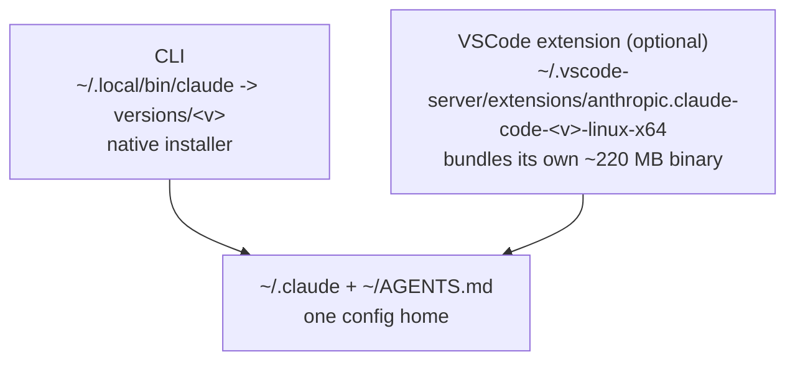
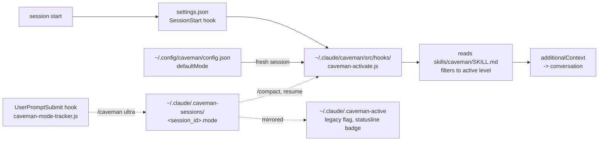
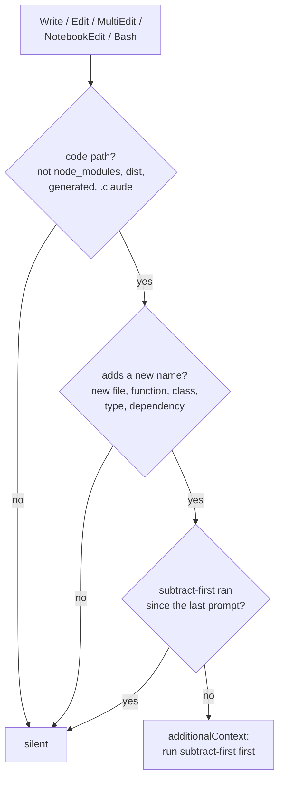
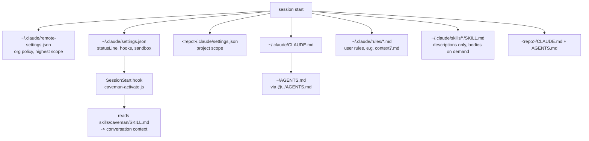

The whole Claude Code setup on one page: what exists, the order to rebuild it on a fresh machine, and each piece with its config and the reasoning behind it. The catalogues stay separate - [[skills|SKILLS]] for skills, [[claude-code-workflow-tips|Claude Code workflow tips]] for commands and MCP servers.

## Rebuild order

1. WSL itself, and Git - [[wsl-windows-setup|WSL and Windows setup]], [[install-git|Install Git]]
2. Node via nvm - [[nvm|NVM]]
3. Git config: line endings and commit signing - [[autocrlf|Safe line endings]], [[gpg-sign-commits|Sign commits with GPG]]
4. SSH keys - [[ssh|SSH]]
5. VSCode settings, extensions and snippets - [[vscode-settings|VSCode setup]], [[vscode-extensions|VSCode Extensions]]
6. Claude Code, native installer - [Installs](#installs)
7. Clone the statusline and caveman programs - [Statusline](#statusline), [Always-on caveman](#always-on-caveman)
8. Clone this repo and run `npm run env:bootstrap` - [Bootstrap](#bootstrap)
9. Restore `~/AGENTS.md` from the backup - [Global AGENTS.md](#global-agentsmd)
10. Sandbox dependencies and the hard-gate block - [Sandbox](#sandbox)
11. The Windows toast hook - [Windows toast when a turn finishes](#windows-toast-when-a-turn-finishes)
12. Context7 MCP, `npx ctx7 setup --claude --mcp` - [[claude-code-workflow-tips#Context7 MCP|Claude Code workflow tips]]

Then verify in a fresh session - see [Sharp edges](#sharp-edges).

## Why WSL

**The sandbox needs it.** The [sandboxed Bash tool](https://code.claude.com/docs/en/sandboxing#get-started) runs on WSL2, so every session is covered, with no surface running on permission rules alone.

**Projects belong on the Linux filesystem.** The [working across file systems guide](https://learn.microsoft.com/en-us/windows/wsl/filesystems) says "We recommend against working across operating systems with your files, unless you have a specific reason for doing so". A repo under `/mnt/c` is slow, has no inotify and produces permission noise, so clone into `~`.

Open folders in VSCode through Remote-WSL; that makes the integrated terminal a WSL shell with `claude` on `PATH`.

## Inventory

`[USER]` is the Linux account name; every path is under `/home/[USER]`.

| What                      | Path                                                                         | Notes                                            |
| ------------------------- | ---------------------------------------------------------------------------- | ------------------------------------------------ |
| Agent preferences         | `~/AGENTS.md`                                                                | see [Global AGENTS.md](#global-agentsmd)         |
| Claude pointer to it      | `~/.claude/CLAUDE.md` holding `@../AGENTS.md`                                | one-line import                                  |
| Settings                  | `~/.claude/settings.json`                                                    | hooks, statusLine, sandbox, permissions, plugins |
| Caveman hook program      | `~/.claude/caveman/`                                                         | clone of `JuliusBrussee/caveman`                 |
| Subtract-first hook       | `<this repo>/scripts/hooks/subtract-first-gate.mjs`                          | run from the checkout, not copied                |
| Toast hook scripts        | `~/.claude/hooks/notify-stop.sh`, `~/.claude/hooks/toast.ps1`                | written by hand                                  |
| Global skills             | `~/.claude/skills/`                                                          | what Claude Code reads                           |
| Skills CLI store and lock | `~/.agents/skills/`, `~/.agents/.skill-lock.json`                            | what the `skills` CLI reads                      |
| Statusline program        | `~/.claude/statusline/`                                                      | clone, see [Statusline](#statusline)             |
| Org-pushed policy         | `~/.claude/remote-settings.json`                                             | synced, outranks your own settings               |
| Plugin marketplace cache  | `~/.claude/plugins/`                                                         | per-install cache                                |
| User-scope MCP servers    | `~/.claude.json`                                                             | holds the Context7 API key, keep it private      |
| User rules                | `~/.claude/rules/*.md`                                                       | always loaded; `context7.md` written by `ctx7`   |
| Claude Code binary        | `~/.local/bin/claude` -> `~/.local/share/claude/versions/<v>`                | native install                                   |
| VSCode extension          | `~/.vscode-server/extensions/anthropic.claude-code-<v>-linux-x64/`           | optional, bundles its own binary                 |
| Per-repo scope            | `<repo>/.claude/settings.json`, `<repo>/.claude/skills/`, `<repo>/CLAUDE.md` | per repo                                         |

The [`.claude` directory guide](https://code.claude.com/docs/en/claude-directory) explains what Claude Code keeps in `~/.claude`. `~/.claude/skills/` and `~/.agents/` are a pair: an install writes both, so restoring one without the other leaves `skills list` disagreeing with the disk.

## Installs


```mermaid
flowchart TD
  CLI["CLI<br/>~/.local/bin/claude -> versions/&lt;v&gt;<br/>native installer"]
  EXT["VSCode extension (optional)<br/>~/.vscode-server/extensions/anthropic.claude-code-&lt;v&gt;-linux-x64<br/>bundles its own ~220 MB binary"]
  CFG["~/.claude + ~/AGENTS.md<br/>one config home"]
  CLI --> CFG
  EXT --> CFG
```

Use the [native installer](https://code.claude.com/docs/en/setup#install-claude-code), the only method that auto-updates, then check with `claude doctor`.

The extension ships its own binary at `resources/native-binary/claude` and updates on the VSCode cycle. At a matching version it is the same file (2.1.267 checksums identically in both places), but the tracks can diverge. Pointing the extension at the CLI binary is an [extension setting](https://code.claude.com/docs/en/vs-code#extension-settings). Both read the same config home, sandbox block included, because the sandbox resolves from `~/.claude/settings.json` and the working directory, not from the launcher. VSCode keeps old extension versions until the next restart (marked in `.obsolete`); prune by hand to get the space back at once.

- **The extension reinstalls itself.** A `claude` startup in a VSCode terminal reinstalls it within seconds; the [uninstall section](https://code.claude.com/docs/en/vs-code#uninstall-the-extension) names the switches that stop it. Keybinding-driven sessions don't need it.
- **A broken npm install is silent.** When the per-platform binary is missing, the [install troubleshooting guide](https://code.claude.com/docs/en/troubleshoot-install#native-binary-not-found-after-npm-install) describes the placeholder left behind, and the auto-updater still records `"outcome":"success"` in `~/.claude/.last-update-result.json`. Only `claude doctor` or the file size tells. Migrate to the native installer rather than repairing it.

### Which launcher runs which binary

| Launcher                                 | Binary it runs                             |
| ---------------------------------------- | ------------------------------------------ |
| the VSCode extension's own chat panel    | the extension's `resources/native-binary/` |
| `ctrl+alt+c`, a `runCommands` keybinding | CLI on `PATH`                              |
| `ctrl+alt+w`, `claudeWorktreeTabs.open`  | CLI on `PATH`                              |
| `claude` typed in any terminal           | CLI on `PATH`                              |

`ctrl+alt+c` chains `workbench.action.createTerminalEditor` and a `sendSequence` of `claude\r`; `ctrl+alt+w` comes from the worktree-tabs extension, whose `claudeWorktreeTabs.command` defaults to `claude`. Both open in the **editor area**, so a session is a full-height tab. `terminal.integrated.defaultLocation` is `editor` globally - the [VSCode terminal docs](https://code.visualstudio.com/docs/terminal/basics) describe it as changing "the default `view` or `editor` area terminal location" - but the keybinding does not rely on it. Where the extension's own chat can live: [Choose where Claude lives](https://code.claude.com/docs/en/vs-code#choose-where-claude-lives). Auto-run on open is in [[vscode-settings#Auto-run on open|VSCode setup]].

## Bootstrap

```bash
npm run env:bootstrap
```

Runs `scripts/claude-env.mjs`. Apply-only and idempotent: it creates what is missing, leaves existing values alone, and prints one line per item, so a second run reports `already` everywhere. Flag: `--skip-skills`.

- `~/AGENTS.md` - reported if absent; restore it from [Global AGENTS.md](#global-agentsmd).
- `~/.claude/CLAUDE.md` - the `@../AGENTS.md` pointer.
- `~/.claude/settings.json` - `statusLine` if absent, the path derived from `HOME`.
- `~/.claude/skills` and `~/.agents` - created. The statusline and caveman clones are only checked, and reported with the repo to clone.
- Hooks - the two caveman hooks and the subtract-first `PreToolUse` hook, each skipped with a hint while its script is missing.
- Global skills, from the pinned manifest `scripts/claude-env.skills.json`.

It writes no permission rules, and the toast hook is manual.

## Global AGENTS.md

`~/AGENTS.md` holds the rules every agent tool reads; Claude Code reaches it through the `~/.claude/CLAUDE.md` pointer. The backup of its text:

```text
# Global preferences

Canonical file: `~/AGENTS.md` on WSL (edit only here). Claude Code reaches it through
`~/.claude/CLAUDE.md`, which holds a single `@../AGENTS.md` import. Other agent tools read this
file directly.

## Git

- Read-only git (status/diff/log/show/blame/branch --list/remote -v) may be run freely, anywhere.
- "Inside a worktree" = a linked git worktree (`git rev-parse --git-dir` differs from `--git-common-dir`); they live under `.claude/worktrees/<flat>/`. The main checkout ("root") is NOT a worktree.
- **Outside a worktree (root):** state-changing git (add/commit/push/pull/fetch/reset/rebase/merge/restore/checkout/stash/tag/config) MUST NOT run unless I explicitly ask for it in the current turn. Ambient phrases ("ship it", "we're done") do not count.
- **Inside a worktree:** `git add`, `git commit`, and `git push` of the worktree's own current branch may run without asking. Everything else (reset/rebase/merge/restore/checkout/stash/tag/config/pull/fetch), plus any force-push or pushing/deleting a branch that isn't this worktree's own, still needs an explicit ask.
- When writing commit messages, NEVER auto-add your agent name as co-author (anywhere).

## Writing

- Never publish PII (names/phones/emails of me or anyone) or development secrets (API keys, tokens, passwords, connection strings, private keys). If found while editing, pause and ask - never silently redact.
- Keep personal identifiers (name, username, email, IDs, IP addresses, hostnames, MAC addresses) and secrets out of docs/READMEs; use generic examples or env-var references.
- Write IP addresses as placeholders (`<device-ip>`, `<router-ip>`, `192.168.x.y`), the same way as `<user>` in paths.
- Say each idea exactly once; cut restated content.
- Never use em dash "—", use dash "-" instead
- Use Mermaid charts to explain complex ideas in md files.
- Prepend a human emoji 🙋 to anything that needs my attention after you act: decisions to make, caveats to know, or follow-up questions (e.g. "Want me to tweak those?", "One thing to decide", "One caveat worth knowing").
- Never remark on actions you took or withheld solely to comply with these AGENTS.md rules

## Adding code

- Before creating a new file, function, component, hook, helper, test helper, dependency, script or config flag, invoke the `subtract-first` skill and post its four lines - also mid-task, while fixing review findings. Tools without the skill run its three searches (reuse, extend, subtract) anyway.

## Code comments

- Write none: no explanatory comments, docstrings/JSDoc, file or license headers, section banners, TODO/FIXME. Code self-explains via naming, small functions, types.
- Overrides matching surrounding style - existing comments are not precedent.
- Only exception: workaround for an environment limitation or bug (e.g. Safari rendering bug); state the limitation only.
- Leave existing comments alone. If you change the code one describes, delete it or move its value into existing docs.
- Anything worth saying goes in existing docs
```

## Sandbox

The [sandboxed Bash tool](https://code.claude.com/docs/en/sandboxing) sits above the permission rules: rules refuse tool calls, the sandbox constrains the processes a permitted call starts. Install the dependencies from [Set up Linux and WSL2](https://code.claude.com/docs/en/sandboxing#set-up-linux-and-wsl2), then turn it on in `~/.claude/settings.json`.

### Making it a hard gate

`"enabled": true` alone is a preference. This block closes both ways out:

```json
{
  "sandbox": {
    "enabled": true,
    "failIfUnavailable": true,
    "allowUnsandboxedCommands": false,
    "filesystem": {
      "allowWrite": ["~/_Projects_ubuntu"]
    }
  }
}
```

[`failIfUnavailable`](https://code.claude.com/docs/en/settings-reference#sandbox-failifunavailable) turns a missing `bubblewrap` from a warning into a startup error; [`allowUnsandboxedCommands`](https://code.claude.com/docs/en/settings-reference#sandbox-allowunsandboxedcommands) `false` closes the [unsandboxed retry escape hatch](https://code.claude.com/docs/en/sandboxing#the-unsandboxed-retry-escape-hatch). A genuinely blocked command then fails instead of prompting; widen the allowed domains in `/sandbox` or exclude that one command rather than turning the key off. Neither key reaches the `!` prompt - see below.

### Writing across projects

By default a sandboxed command writes only to the working directory, `$TMPDIR` and added directories, so a session in one repo cannot even `git commit` in another - `.git/index.lock` fails with `Read-only file system`. [`sandbox.filesystem.allowWrite`](https://code.claude.com/docs/en/sandboxing#configure-sandboxing) with `~/_Projects_ubuntu` opens the whole projects tree; the home directory, `~/.claude` and everything else outside it stay read-only. An edit to the list reaches the running session at the next command.

- **Other projects' agent config becomes writable.** The sandbox's [protected paths](https://code.claude.com/docs/en/sandboxing#protected-paths) - `.claude` settings, skills and hooks, `.mcp.json`, `.git/hooks` and `.git/config` - cover the working directory (for `.claude`, also the directories above it), not the rest of the tree. A sandboxed command can therefore change another repo's hooks, which later run outside the sandbox. Accepted here: per-project settings are managed through Claude.
- **`denyWrite` does not expand `**`.** Measured: `~/_Projects_ubuntu/**/.git/hooks` protected nothing, while a literal path was denied. A deny inside the tree has to name the exact path.

### The `!` prompt is outside the sandbox

A line typed at the [`!` shell-mode prompt](https://code.claude.com/docs/en/interactive-mode#shell-mode-with-prefix) is not a tool call, and in an ordinary interactive session it runs unsandboxed. That is a boundary, not a gap: the sandbox constrains the agent, not the person at the keyboard. It is also the route for what the agent is blocked from - `! sudo …`, run by you, visibly, with the output landing in the transcript for Claude to read.

### Where a project can undo it

Project settings outrank user settings in the [settings precedence](https://code.claude.com/docs/en/settings#settings-precedence), and `sandbox.enabled` is not restricted to trusted sources. A repo shipping `"sandbox": {"enabled": false}` overrides the block above, and `failIfUnavailable` goes quiet with it. The only file above a project is the managed one - `/etc/claude-code/managed-settings.json`, root-owned, with the same three keys:

```bash
sudo install -D -m 644 -o root -g root managed-settings.json /etc/claude-code/managed-settings.json
```

Root ownership is the mechanism: a session running as your user cannot rewrite it. That is the theory; on an organization account it fails silently.

### When the managed file is skipped

Only one managed source is used by default - see [how Claude Code combines managed sources](https://code.claude.com/docs/en/managed-settings#how-claude-code-combines-managed-sources) - and server-managed settings from claude.ai rank above the local file. So if the organization publishes anything through [server-managed settings](https://code.claude.com/docs/en/server-managed-settings#fetch-and-caching-behavior), the local file is never read.

Measured here, with the file in place and valid: a `claude -p` run with `--settings` setting `"sandbox": {"enabled": false}` got an unsandboxed Bash tool; without the flag, a strict one. `claude doctor` reported `Organization policy: Loaded from api.anthropic.com`, which won the tier. The three hard-gate keys are not among the [keys read from every admin source](https://code.claude.com/docs/en/managed-settings#keys-read-from-every-admin-source), so the fix is for the organization to add the sandbox block to its server-managed settings. [Read the source in /status](https://code.claude.com/docs/en/managed-settings#read-the-source-in-status) - a file at the right path with the right owner proves nothing on its own.

## Hooks

| Event              | Script                                              | Purpose                                      | Wired by  |
| ------------------ | --------------------------------------------------- | -------------------------------------------- | --------- |
| `SessionStart`     | `~/.claude/caveman/.../caveman-activate.js`         | injects the caveman ruleset                  | bootstrap |
| `UserPromptSubmit` | `~/.claude/caveman/.../caveman-mode-tracker.js`     | tracks `/caveman <level>` per session        | bootstrap |
| `PreToolUse`       | `<this repo>/scripts/hooks/subtract-first-gate.mjs` | nudges toward subtract-first before new code | bootstrap |
| `Stop`             | `~/.claude/hooks/notify-stop.sh`                    | Windows toast when a turn ends               | by hand   |

`hooks` in `settings.json` is one object with one key per event, each holding a list - new entries go beside the existing ones, not in a second `hooks` object.

### Always-on caveman

A global skill does **not** run every session: only its description is always in context, and the body loads on invocation, per the [skill content lifecycle](https://code.claude.com/docs/en/skills#skill-content-lifecycle). Right for a task skill, wrong for a communication style that must hold from the first reply. The [Caveman](https://skills.sh/juliusbrussee/caveman/caveman) voice needs another carrier.

| Mechanism           | Runs every session | Reinforced by harness | Lands in      | Notes                                                          |
| ------------------- | ------------------ | --------------------- | ------------- | -------------------------------------------------------------- |
| Skill (default)     | No                 | No                    | Conversation  | Fires only on description match or `/caveman`                  |
| Rule in `AGENTS.md` | Yes                | No                    | Conversation  | One file for every agent tool; can fade in long sessions       |
| `SessionStart` hook | Yes                | No                    | Conversation  | Deterministic trigger, still just context; skipped by `--bare` |
| Output style        | Yes                | Yes                   | System prompt | One settings key; no tool call at session start                |

On paper the output style wins, and it was used first (`~/.claude/output-styles/caveman.md`, `"outputStyle": "caveman"`, `keep-coding-instructions: true`). Three findings reversed it to hooks:

1. **Anthropic is moving off output styles.** The official `explanatory-output-style` plugin contains no style file; its README says it "recreates the **deprecated** Explanatory output style as a SessionStart hook".
2. **Upstream never used a style.** [JuliusBrussee/caveman](https://github.com/JuliusBrussee/caveman) wires `SessionStart` + `UserPromptSubmit` hooks, so the style file was a hand-synced distillation with no upstream.
3. **The hook reads `SKILL.md` at runtime.** `caveman-activate.js` emits the full ruleset filtered to the active level - its comment says full text because "models drifted back to verbose mid-conversation, especially after context compression pruned it away". One source of truth, upstream's.

Cost decided it, measured with `claude plugin details`:

| Route                      | Always-on tokens                             |
| -------------------------- | -------------------------------------------- |
| Output style (what we had) | ~899 style + ~150 skill description ≈ 1,050  |
| Full upstream plugin       | ~2,813 skills+agents + ~1,045 hook ≈ 3,858   |
| **Hooks, no plugin**       | ~1,045 hook + ~150 skill description ≈ 1,195 |

The plugin's extra 2,813 are 25 bundled skills and 5 agents nobody wants. Hooks alone cost about what the style did. Clone upstream:

```bash
git clone https://github.com/JuliusBrussee/caveman ~/.claude/caveman
```

then run the bootstrap, which writes both entries:

```json
{
  "hooks": {
    "SessionStart": [
      {
        "hooks": [
          {
            "type": "command",
            "command": "\"node\" \"/home/[USER]/.claude/caveman/src/hooks/caveman-activate.js\"",
            "timeout": 5,
            "statusMessage": "Loading caveman mode..."
          }
        ]
      }
    ],
    "UserPromptSubmit": [
      {
        "hooks": [
          {
            "type": "command",
            "command": "\"node\" \"/home/[USER]/.claude/caveman/src/hooks/caveman-mode-tracker.js\"",
            "timeout": 5,
            "statusMessage": "Tracking caveman mode..."
          }
        ]
      }
    ]
  }
}
```

Don't use upstream's `bin/install.js`: it installs the plugin (the 2,813 tokens), copies six scripts into `~/.claude/hooks/` instead of leaving them in a pullable clone, and merges its own `statusLine`. Its hooks and the plugin are alternatives - it writes hooks only when no plugin install happened, or _"two CAVEMAN MODE blocks"_ fire per event.


```mermaid
flowchart LR
  A["session start"] --> B["settings.json<br/>SessionStart hook"]
  B --> C["~/.claude/caveman/src/hooks/<br/>caveman-activate.js"]
  C --> D["reads skills/caveman/SKILL.md<br/>filters to active level"]
  D --> E["additionalContext<br/>-> conversation"]
  CFG["~/.config/caveman/config.json<br/>defaultMode"] -- "fresh session" --> C
  F["UserPromptSubmit hook<br/>caveman-mode-tracker.js"] -. "/caveman ultra" .-> G["~/.claude/.caveman-sessions/<br/>&lt;session_id&gt;.mode"]
  G -. "/compact, resume" .-> C
  G -. "mirrored" .-> M["~/.claude/.caveman-active<br/>legacy flag, statusline badge"]
```

A fresh session starts from `defaultMode` in `~/.config/caveman/config.json` (here `{"defaultMode":"ultra"}`; per repo `.caveman/config.json`, globally `CAVEMAN_DEFAULT_MODE`; upstream default `full`). `/caveman <level>` changes only the current session, read back on `/compact` or resume. `~/.claude/.caveman-active` mirrors the latest write across sessions, for the [statusline badge](#statusline) only. So `/caveman off` lasts one session; the permanent off-switch is `"defaultMode": "off"`.

**Verify** in a fresh session without mentioning caveman, e.g. `claude -p "why does a React component re-render when I pass an inline object prop?"`. Expect fragments with `Object.is` and `useMemo` verbatim; a trivial file edit still using Read/Edit and honouring `AGENTS.md`; a commit message in normal prose.

- **Context, not system prompt** - the concession of the reversal: heavy compaction can prune the rules. Upstream injects the full ruleset and re-asserts the level on every prompt to compensate.
- **Two node processes per session plus one per prompt**, each with a 5-second timeout.
- **Updating is `git pull`** in `~/.claude/caveman`; nothing is vendored.
- **The `## Mirror` note in `SKILL.md` is obsolete** - it pointed at the old style file. An upstream `skills update` overwriting `SKILL.md` is now harmless.

### Subtract-first on every code write

The [Subtract First](https://skills.sh/pilniczek/dev-skills/subtract-first) skill is the cue [[additive-bias-in-code|additive bias]] calls for: before new code lands, search for reuse, something to extend and something to delete, then state the choice in four lines. A skill runs when the model decides it matches - the [skills guide](https://code.claude.com/docs/en/skills) says "Claude uses skills when relevant", and its [troubleshooting](https://code.claude.com/docs/en/skills#skill-not-triggering) fixes (rephrase, invoke directly) are things a person does. Mid-task it failed: helpers went in ungated while fixing review blockers, and a run afterwards removed two.

**Why not the caveman hooks.** A style governs every token of every reply, so a prompt-time reminder always lands before its output, and a lapse is visible. Subtract-first is a check at one moment - just before an edit adds a new named thing, often dozens of tool calls after the prompt. A skipped check leaves nothing visible, and most prompts add nothing new, so a per-prompt reminder trains the model to ignore it.

| Mechanism                        | Fires at                  | Reaches subagents | Can block the write |
| -------------------------------- | ------------------------- | ----------------- | ------------------- |
| Rule in `~/AGENTS.md`            | session start, as text    | no guarantee      | no                  |
| `SessionStart` hook              | session start and compact | no guarantee      | no                  |
| `UserPromptSubmit` hook          | every prompt              | no                | no                  |
| `PreToolUse` hook on write tools | the write itself          | yes               | yes                 |

So: the "Adding code" rule in [Global AGENTS.md](#global-agentsmd) for tools without hooks, plus a `PreToolUse` hook for Claude Code.


```mermaid
flowchart TD
  T["Write / Edit / MultiEdit /<br/>NotebookEdit / Bash"] --> C{"code path?<br/>not node_modules, dist,<br/>generated, .claude"}
  C -- no --> Q["silent"]
  C -- yes --> N{"adds a new name?<br/>new file, function, class,<br/>type, dependency"}
  N -- no --> Q
  N -- yes --> R{"subtract-first ran<br/>since the last prompt?"}
  R -- yes --> Q
  R -- no --> M["additionalContext:<br/>run subtract-first first"]
```

- **New name** - a `Write` to a code file that does not exist; a declaration the old text lacks (`function`, `class`, `interface`, `type`, arrow-function `const`, Python `def`); a new `package.json` key; from Bash, a redirect or `tee` into a new code file, or an `npm i` / `yarn add` / `pnpm add` / `bun add` / `yalc add` / `pip install` naming a package.
- **Silent** - condition fixes, values, rewriting an existing function, version bumps, markdown, bare `npm install`: the skill's own "skip entirely" rule.
- **Skill detection** - reads the transcript backwards for a `Skill` call to `subtract-first` before the last real user prompt, so each prompt needs a fresh run.
- **Subagents** - the [common input fields](https://code.claude.com/docs/en/hooks#common-input-fields) include `agent_id`, present "only when the hook fires inside a subagent call", but `transcript_path` still points at the parent. The hook reads `<session>/subagents/agent-<agent_id>.jsonl` instead - a path observed on disk, not documented.
- **Nudge, not gate** - `additionalContext` only; the edit always proceeds, and a crash exits `0`.

The bootstrap installs the skill from the manifest and writes the entry; the command points at this checkout, so `git pull` updates it:

```json
{
  "hooks": {
    "PreToolUse": [
      {
        "matcher": "Write|Edit|MultiEdit|NotebookEdit|Bash",
        "hooks": [
          {
            "type": "command",
            "command": "\"node\" \"/home/[USER]/<important checkout>/scripts/hooks/subtract-first-gate.mjs\"",
            "timeout": 5
          }
        ]
      }
    ]
  }
}
```

**Verify** without a session: `echo '{"tool_name":"Write","tool_input":{"file_path":"/tmp/x/new.ts","content":"x"}}' | node scripts/hooks/subtract-first-gate.mjs` prints `additionalContext` naming `new file /tmp/x/new.ts`; a `.md` path prints nothing. Live: ask for a change that adds a function without naming the skill, and the tool result carries `PreToolUse:Write hook additional context`.

- **A nudge can be ignored.** For a gate, return `permissionDecision: "deny"` with a `permissionDecisionReason`, per [PreToolUse decision control](https://code.claude.com/docs/en/hooks#pretooluse-decision-control).
- **The transcript can lag** - it "is written asynchronously and may lag the in-memory conversation", per the [common input fields](https://code.claude.com/docs/en/hooks#common-input-fields), so a skill run just before an edit can cost one extra nudge.
- **Bash matching is text matching.** A redirect inside a quoted string reads as real; `sed -i` on an existing file is not covered.
- **Invocation is not application** - the hook proves the call, not honest searches. Review catches that.
- **Tied to this checkout** - move the repo and the command fails as a hook error, while the edit still proceeds.

### Windows toast when a turn finishes

A turn can run for minutes in a terminal no longer on screen. `Stop` fires when the main agent finishes ("did it finish"); `Notification` covers "blocked on you" - timing and payload in the [hooks reference](https://code.claude.com/docs/en/hooks#notification). Built-in [terminal notifications](https://code.claude.com/docs/en/terminal-config#get-a-terminal-bell-or-notification) reach the desktop from a few terminals only, not the VSCode one.

**Why PowerShell.** A default WSL distro has no notification daemon, so `notify-send` has nothing to talk to. The path is interop: `powershell.exe` (Windows PowerShell 5.1, not `pwsh.exe`, which lacks the WinRT projections) calling `ToastNotificationManager`. A toast needs a registered **AUMID**, or `Show()` succeeds and nothing appears; borrowing Windows PowerShell's own needs no install:

```text
{1AC14E77-02E7-4E5D-B744-2EB1AE5198B7}\WindowsPowerShell\v1.0\powershell.exe
```

The toast then shows the PowerShell icon. `BurntToast` brands it nicer at the cost of a module install.

`~/.claude/hooks/toast.ps1`:

```powershell
param(
  [string]$Title = 'Claude Code',
  [string]$Text = 'Finished'
)

$ErrorActionPreference = 'Stop'

[void][Windows.UI.Notifications.ToastNotificationManager, Windows.UI.Notifications, ContentType = WindowsRuntime]
[void][Windows.Data.Xml.Dom.XmlDocument, Windows.Data.Xml.Dom, ContentType = WindowsRuntime]

$appId = '{1AC14E77-02E7-4E5D-B744-2EB1AE5198B7}\WindowsPowerShell\v1.0\powershell.exe'

$xml = @"
<toast>
  <visual>
    <binding template="ToastGeneric">
      <text>$([System.Security.SecurityElement]::Escape($Title))</text>
      <text>$([System.Security.SecurityElement]::Escape($Text))</text>
    </binding>
  </visual>
  <audio src="ms-winsoundevent:Notification.Default" />
</toast>
"@

$doc = [Windows.Data.Xml.Dom.XmlDocument]::new()
$doc.LoadXml($xml)

[Windows.UI.Notifications.ToastNotificationManager]::CreateToastNotifier($appId).Show(
  [Windows.UI.Notifications.ToastNotification]::new($doc)
)
```

`SecurityElement::Escape` is load-bearing: a project directory called `r&d` otherwise produces invalid XML and a silent no-toast.

`~/.claude/hooks/notify-stop.sh`:

```bash
#!/usr/bin/env bash
set -uo pipefail

payload=$(cat)

project=$(printf '%s' "$payload" | python3 -c '
import json, os, sys
try:
    data = json.load(sys.stdin)
except Exception:
    data = {}
print(os.path.basename(data.get("cwd") or os.getcwd()) or "Claude Code")
')

script_win=$(wslpath -w "$HOME/.claude/hooks/toast.ps1")

powershell.exe -NoProfile -NonInteractive -ExecutionPolicy Bypass \
  -File "$script_win" \
  -Title "Claude Code" \
  -Text "$project - turn finished" >/dev/null 2>&1 &

exit 0
```

- **`wslpath -w`** - `powershell.exe -File` cannot open `/home/...`; it needs `\\wsl.localhost\...`.
- **The trailing `&`** - starting a Windows process costs most of a second; backgrounding ends the turn at once and keeps the hook `timeout` from biting.
- **`-NoProfile`** - a noisy or slow profile would delay every finished turn.
- **`exit 0` always** - a broken notifier never interferes with the session.

Register it under `hooks.Stop`:

```json
{
  "hooks": {
    "Stop": [
      {
        "hooks": [
          {
            "type": "command",
            "command": "bash /home/[USER]/.claude/hooks/notify-stop.sh",
            "timeout": 10,
            "statusMessage": "Sending Windows toast..."
          }
        ]
      }
    ]
  }
}
```

Invoking it through `bash` means the script needs no executable bit. Check with `/hooks`.

**Test** without a turn: `echo '{"cwd":"'"$PWD"'","session_id":"test"}' | bash ~/.claude/hooks/notify-stop.sh`. If no toast appears within a second or two:

- Run the PowerShell side alone: `powershell.exe -NoProfile -File "$(wslpath -w ~/.claude/hooks/toast.ps1)" -Text hi`. An error there is PowerShell, not the hook.
- Check Focus assist - Do Not Disturb and full-screen mode suppress toasts into the Action Center.
- Check notifications are enabled for Windows PowerShell (Settings, System, Notifications) - the borrowed AUMID borrows its permission too.
- Check interop: `powershell.exe -NoProfile -Command exit` failing with `UtilConnectUnix: socket failed` means interop is blocked, as in a sandboxed agent shell. The hook process itself is not sandboxed, so the real hook can work while the agent's test fails.

- **Every turn toasts**, one-line answers included.
- **Permission prompts** fire `Notification`, not `Stop`; point the same script at `hooks.Notification` at the cost of a toast per unapproved command.
- **Background tasks** finishing after the turn raise nothing.
- **WSL on Windows only.** On a Linux desktop, swap the `powershell.exe` line for `notify-send`.

## Statusline

A custom status line: project name, model, a context bar scaled to a fixed 100k-token "smart zone", and the active caveman level. One Node.js file, no dependencies, no build.

```bash
📁 important │ Opus 5.5 (1M) │ 0% ▰▰▰▱▱▱▱▱▱▱▱▱▱▱▱▱▱▱▱▱ 15%/100k │ 🦴 ultra
```

- **Why a fixed smart zone.** On a 1M-context model, 15% of the real window is already enough context for quality to drift. The bar tracks a "you should care" budget, not the technical maximum; past 100% the label keeps climbing.
- **Positional colours.** Green at the start, yellow mid, red at the end - a full bar shows all three. A ruler, not a mood ring.
- **Caveman badge.** `🦴 <level>` in the caveman hooks' own orange, read from `~/.claude/.caveman-active` (see [Always-on caveman](#always-on-caveman)). It is the only place the live level is visible. The level is always named, `full` included, and matches the `/caveman` argument, so it can be copied back. No flag file means no badge. It sits last, so the bar keeps its position either way.
- **The badge follows the latest write, not this session.** The flag mirrors the last level change across all sessions, so two sessions at different levels both show whichever changed most recently.
- **The flag is read defensively.** Only a whitelisted level name renders; a symlinked or oversized flag file is ignored, and a read error never breaks the line.

Clone it to `~/.claude/statusline/` over HTTPS (a read-only consumer needs no SSH key); the bootstrap then writes:

```json
{
  "statusLine": {
    "type": "command",
    "command": "node /home/[USER]/.claude/statusline/statusline.js"
  }
}
```

**Two checkouts on purpose.** Development happens in a normal WSL checkout and goes up to GitHub; `~/.claude/statusline/` only ever pulls. Every session runs the deployed clone, so a mid-edit experiment cannot break the status line of the session you experiment from. It replaces the built-in `/statusline`. Setup, preview tiers, payload and tunables: [pilniczek/claude-statusline](https://github.com/pilniczek/claude-statusline) - the [README](https://github.com/pilniczek/claude-statusline/blob/master/README.md) for install and preview, [CLAUDE.md](https://github.com/pilniczek/claude-statusline/blob/master/CLAUDE.md) for design rationale and the fallback chain.

## Load order


```mermaid
flowchart TD
  S["session start"] --> P["~/.claude/remote-settings.json<br/>org policy, highest scope"]
  S --> U["~/.claude/settings.json<br/>statusLine, hooks, sandbox"]
  S --> PR["&lt;repo&gt;/.claude/settings.json<br/>project scope"]
  U --> HK["SessionStart hook<br/>caveman-activate.js"]
  HK --> CTX["reads skills/caveman/SKILL.md<br/>-> conversation context"]
  S --> CM["~/.claude/CLAUDE.md"]
  CM --> AG["~/AGENTS.md<br/>via @../AGENTS.md"]
  S --> UR["~/.claude/rules/*.md<br/>user rules, e.g. context7.md"]
  S --> SK["~/.claude/skills/*/SKILL.md<br/>descriptions only, bodies on demand"]
  S --> RC["&lt;repo&gt;/CLAUDE.md + AGENTS.md"]
```

Everything except the settings files lands in **conversation context**, the caveman rules included - the trade made in [Always-on caveman](#always-on-caveman). Skills load lazily, per the [skill content lifecycle](https://code.claude.com/docs/en/skills#skill-content-lifecycle).

## Sharp edges

- **Verify in a fresh session.** `SessionStart` hooks fire only at session start, and rules load there too, so the session you configure from misses them. A new tool hook can arrive sooner: [edits to hooks in settings files](https://code.claude.com/docs/en/hooks#disable-or-remove-hooks) "are normally picked up automatically by the file watcher" - the `PreToolUse` hook here fired in the same session. Never mention the expected behaviour in the test prompt.
- **[`--bare`](https://code.claude.com/docs/en/cli-reference) skips hooks** - no caveman voice and no subtract-first nudge in scripted runs. Pass rules with `--append-system-prompt` where needed.
- **The skills CLI has an engine floor.** [`skills`](https://github.com/vercel-labs/skills) 1.5.22 needs node `>= 22.20.0`; on older 22.x the bootstrap reports the skip rather than failing halfway.
- **The skills CLI reads stdin.** In a shell loop add `</dev/null`, or the first install swallows the rest of the list.
- **No clone updates itself.** `git pull` in `~/.claude/statusline`, `~/.claude/caveman` and this repo is the update mechanism; the bootstrap only checks they exist.
- **`permissions.allow` grows on its own** from in-session approvals, into the hundreds. Prune it, don't curate it; only `deny` is worth writing by hand, and edit the file surgically - a reformat there is an unreviewable diff.
- **Narrowing `additionalDirectories` takes effect immediately**, including for recursive deletes - worth knowing before a session cleans up the tree it is losing access to.
- **Org policy can appear on its own.** [Server-managed settings](https://code.claude.com/docs/en/server-managed-settings#fetch-and-caching-behavior) cache into `~/.claude/remote-settings.json`; local edits there are overwritten on sync.
- **A skill can be a directory or a symlink.** Older CLI versions symlinked `~/.agents/skills/<name>` into `~/.claude/skills/`; current ones copy. Anything inspecting the skills directory must count symlinks as installed.
- **A skill missing from the model's list may be by design.** [`disable-model-invocation`](https://code.claude.com/docs/en/skills#control-who-invokes-a-skill) hides `grill-with-docs` and `thermo-nuclear-code-quality-review` from it.
- **`skills remove` is the way to uninstall.** Deleting the directory leaves a stale entry in `~/.agents/.skill-lock.json`.
- **Editor automation does not belong in `~/.claude/`.** A script there generating VSCode config is a second thing to maintain, and a generated `keybindings.json` entry silently shadows an extension's binding.

## Everything tagged

Every page in this cluster carries `Configuration`, so [/tags/Configuration](../tags/Configuration/index.md) is the live index - agent, editor, OS and toolchain config. It deliberately excludes git-knob pages such as rebase and force-push behaviour: those describe a tool, not this machine.

---

Related: [[skills|SKILLS]] · [[claude-code-workflow-tips|Claude Code workflow tips]] · [[skills-lock-pinning|Pinning a project skill]] · [[additive-bias-in-code|Additive bias]]
