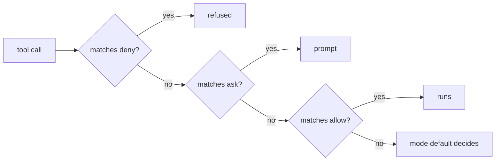
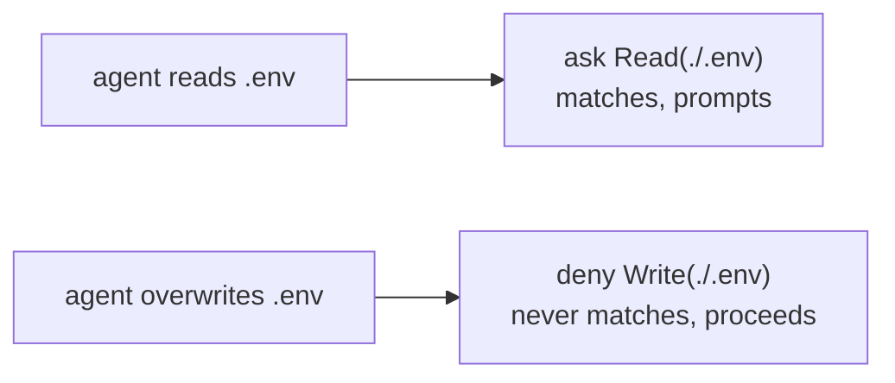

Every tool call Claude Code makes is matched against a flat list of permission rules. A rule is a string shaped `ToolName(argument)`, and it sits in one of three buckets inside a `permissions` object:

```json
{
  "permissions": {
    "deny": ["Bash(sudo *)"],
    "ask": ["Bash(chmod *)"],
    "allow": ["Bash(npm ls:*)"]
  }
}
```

The mechanics look obvious and are not. Three separate traps make rules that read as protective do nothing at all. All three are reproducible, and the recipe for reproducing them is at the bottom.

Verified against Claude Code 2.1.210.

## Scopes and where relative paths point

Rules can come from five sources. They are all merged into one list before matching, so a rule's scope decides two things only: who can override the file, and what a relative path inside it resolves against.

| Scope            | File                                                                        | Base dir for `./x`        |
| ---------------- | --------------------------------------------------------------------------- | ------------------------- |
| policy / managed | pushed by an org-managed channel, lands in `~/.claude/remote-settings.json` | working directory         |
| flag             | whatever you pass to `--settings <file>`                                    | that file's own directory |
| local            | `<repo>/.claude/settings.local.json`                                        | repo root                 |
| project          | `<repo>/.claude/settings.json`                                              | repo root                 |
| user             | `~/.claude/settings.json`                                                   | **`~/.claude`**           |

That last row is the first trap. A rule written `Read(./.env)` in **user** settings guards `~/.claude/.env`, not the `.env` of whatever repo you happen to be in. The same string in **project** settings guards the repo's own `.env`, which is what everyone assumes it does everywhere.

Path prefixes are interpreted like this:

| Written as    | Resolves to                             |
| ------------- | --------------------------------------- |
| `//etc/hosts` | absolute `/etc/hosts`, base dir ignored |
| `/etc/hosts`  | `<base dir>/etc/hosts`                  |
| `./x`, `x`    | relative to the base dir                |
| `~/x`         | home directory                          |

So a rule that must hold in every repo regardless of which settings file carries it has to be written absolute, with the doubled slash and a `**` for depth:

```json
"deny": ["Read(//**/.env)"]
```

That form is verified: a `.env` several directories deep is refused with `File is in a directory that is denied by your permission settings.`

## Precedence: deny, then ask, then allow

Matching walks the buckets in a fixed order and returns on the first hit. Deny wins over everything, ask wins over allow, and allow is only reached when neither of the others matched.



Two consequences worth internalising.

**An ask rule silently kills a broader allow.** A block holding `ask: Read(./.env.*)` alongside `allow: Read(./.env.example)` never reaches the allow, because `.env.*` matches `.env.example` and ask is checked first. Reading the template prompts you, forever, and the allow rule looks fine in the file.

**No allow rule can rescue a deny.** If a deny pattern is broad, narrowing it is the only fix. There is no negation syntax, so `deny: Edit(//**/.env.*)` genuinely does mean the agent can never write a `.env.example` either. Decide which of the two you want before writing the pattern.

## The `Write(...)` trap

This is the expensive one. File permission checks consult `Read(...)` for reads and `Edit(...)` for writes. `Edit(...)` covers **every** file-modifying tool. `Write(...)` is not a rule name the check ever looks at, so any rule written that way is an inert string.

Claude Code says so itself, once per offending rule, at every session start:

```text
Permission deny rule: Write(./.env) is not matched by file permission checks
— only Edit(path) rules are. Use Edit(./.env) instead (Edit rules cover all
file-editing tools).
```

A hardening block that guards reads with `Read(...)` and writes with `Write(...)` therefore protects exactly half of what it looks like it protects:



Both halves of that diagram are verified. With `deny: Edit(//**/.env)` in place the write is refused and the file is left byte-identical; with only the `Write(...)` form, nothing stops it.

## Bash rules are string patterns, not semantics

`Bash(...)` rules match the command string by prefix and wildcard. They do not understand shell. `Bash(rm -rf /)` and `Bash(rm -rf /*)` say nothing about `rm -fr /`, and `Bash(git push --force)` says nothing about `git -c foo=bar push --force`. Treat a Bash deny list as a guardrail against the obvious slip, never as a sandbox.

## The policy scope is not yours to edit

If your Claude account belongs to an org-managed channel, that channel can push permission rules to your machine. They land in `~/.claude/remote-settings.json` and sit at the highest scope, above your own user settings. Their relative paths resolve against the working directory, so unlike user-scope rules the `./`-relative form does work per-repo.

Two things follow. Your own settings cannot loosen them, so there is no point restating them. And a local edit to that file survives only until the next sync, so a defect in a pushed block has to be fixed by whoever administers the channel. What you _can_ do meanwhile is add rules of your own: deny is additive across scopes, so a deny you add in user settings holds regardless of what policy says.

## Reproducing any of this yourself

`--settings <file>` loads a settings file at flag scope without touching your real config, which makes rule behaviour testable in one command. Use a dummy value, never a real secret.

```bash
mkdir -p /tmp/permtest && printf 'DUMMY=pineapple42\n' > /tmp/permtest/.env

cat > /tmp/deny.json <<'JSON'
{ "permissions": { "deny": ["Edit(//**/.env)"] } }
JSON

cd /tmp/permtest
claude -p --settings /tmp/deny.json \
  "Append FOO=bar to .env in the current directory. Report the exact error if it fails."
```

A working deny answers with `File is in a directory that is denied by your permission settings.` and leaves the file unchanged. Swap `Edit` for `Write` in the JSON and the same command edits the file, which is the whole trap in one diff.

## A block that actually fires

Corrected shape for a secrets-hardening block, written absolute so it holds from user scope in every repo including fresh clones:

```json
{
  "permissions": {
    "deny": [
      "Edit(//**/.env)",
      "Edit(//**/.env.*)",
      "Edit(//**/secrets/**)",
      "Edit(//**/.credentials/**)",
      "Edit(//**/keys/**)",
      "Edit(//**/config/credentials.json)",
      "Edit(//**/application-secrets.yml)",
      "Edit(//**/application-secrets.yaml)",
      "Read(//**/secrets/**)",
      "Read(//**/.credentials/**)",
      "Read(//**/keys/**)",
      "Read(//**/config/credentials.json)",
      "Bash(sudo *)",
      "Bash(chown *)"
    ],
    "ask": [
      "Read(//**/.env)",
      "Read(//**/application-secrets.yml)",
      "Read(//**/application-secrets.yaml)",
      "Read(//**/gradle.properties)",
      "Bash(git reset --hard*)",
      "Bash(chmod *)",
      "Bash(curl * | bash*)",
      "Bash(curl * | sh*)",
      "Bash(wget * | bash*)",
      "Bash(wget * | sh*)"
    ]
  }
}
```

Note what is deliberately absent. There are no `allow` entries for `.env.example` and friends: the `Edit(//**/.env.*)` deny above outranks any allow, so those entries would be decoration. If editing templates matters more than blanket coverage, drop the `.env.*` deny and enumerate the real suffixes (`.env.local`, `.env.production`, and so on) instead.

## Caveats

- **Rule counts grow on their own.** Approving a one-off command in a session appends it to `permissions.allow`, so a long-lived user settings file accumulates hundreds of hyper-specific entries. Edit that file surgically; a reformat there is a diff nobody can review.
- **Deny is not a sandbox.** It refuses tool calls. It does not constrain a process that a permitted command starts.
- **The session you edit from does not see the change.** Rules load at session start. Test in a fresh one.

---

Related: [[always-on-output-style|Always-on caveman]] · [[global-agents-md-windows-wsl|Global AGENTS.md across Windows and WSL]] · [[claude-code-environment|Claude Code environment]]
