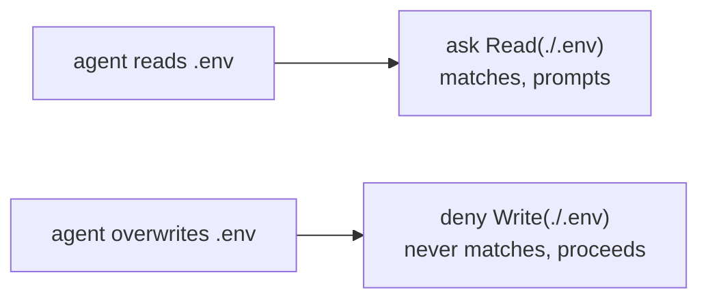

Every tool call Claude Code makes is matched against a flat list of [permission rules](https://code.claude.com/docs/en/permissions). A rule is a string shaped `ToolName(argument)`, and it sits in one of three buckets inside a `permissions` object:

```json
{
  "permissions": {
    "deny": ["Bash(sudo *)"],
    "ask": ["Bash(chmod *)"],
    "allow": ["Bash(npm ls:*)"]
  }
}
```

The mechanics look obvious and are not. The [rule syntax](https://code.claude.com/docs/en/permissions#permission-rule-syntax), the [evaluation order](https://code.claude.com/docs/en/permissions#manage-permissions) and the [path patterns](https://code.claude.com/docs/en/permissions#read-and-edit) are all documented; this page keeps only the traps they add up to, each verified here, and a block that survives them. The recipe for reproducing them is at the bottom.

Verified against Claude Code 2.1.210.

## Trap 1: user-scope paths point into `~/.claude`

A relative path in **user** settings resolves against `~/.claude`, so `Read(/.env)` there guards `~/.claude/.env`, not the `.env` of whatever repo you happen to be in. The same string in **project** settings guards the repo's own `.env`, which is what everyone assumes it does everywhere.

A rule that must hold in every repo regardless of which settings file carries it has to be written absolute, with the doubled slash and a `**` for depth:

```json
"deny": ["Read(//**/.env)"]
```

That form is verified: a `.env` several directories deep is refused with `File is in a directory that is denied by your permission settings.`

## Trap 2: an ask rule kills a broader allow

A block holding `ask: Read(./.env.*)` alongside `allow: Read(./.env.example)` never reaches the allow, because `.env.*` matches `.env.example` and ask is checked first. Reading the template prompts you, forever, and the allow rule looks fine in the file. The same holds one level up: there is no negation syntax, so `deny: Edit(//**/.env.*)` means the agent can never write a `.env.example` either. Decide which of the two you want before writing the pattern.

## Trap 3: `Write(...)` rules are inert

Path rules for `Write(...)` are [accepted but never consulted](https://code.claude.com/docs/en/permissions#read-and-edit); `Edit(...)` is the rule that covers every file-modifying tool. Claude Code warns once per offending rule at every session start:

```text
Permission deny rule: Write(./.env) is not matched by file permission checks
— only Edit(path) rules are. Use Edit(./.env) instead (Edit rules cover all
file-editing tools).
```

A hardening block that guards reads with `Read(...)` and writes with `Write(...)` therefore protects exactly half of what it looks like it protects:


```mermaid
flowchart LR
  R["agent reads .env"] --> RG["ask Read(./.env)<br/>matches, prompts"]
  W["agent overwrites .env"] --> WG["deny Write(./.env)<br/>never matches, proceeds"]
```

Both halves of that diagram are verified. With `deny: Edit(//**/.env)` in place the write is refused and the file is left byte-identical; with only the `Write(...)` form, nothing stops it.

## Bash rules are string patterns, not semantics

`Bash(rm -rf /)` says nothing about `rm -fr /`, and `Bash(git push --force)` says nothing about `git -c foo=bar push --force` - the [Bash rule limits](https://code.claude.com/docs/en/permissions#bash) spell out why. Treat a Bash deny list as a guardrail against the obvious slip, never as a sandbox; the [sandboxed Bash tool](https://code.claude.com/docs/en/sandboxing) is what constrains processes at the OS level.

The two meet at the [unsandboxed retry escape hatch](https://code.claude.com/docs/en/sandboxing#the-unsandboxed-retry-escape-hatch): a retry with `dangerouslyDisableSandbox` lands back in the permission flow, so with the default `allowUnsandboxedCommands: true` the rules above, traps included, are still the last line. Verified on 2.1.267: with `allowUnsandboxedCommands: false`, the tool description itself changes to say the parameter is disabled by policy.

### The `!` prompt is outside all of it

A line typed at the [`!` shell-mode prompt](https://code.claude.com/docs/en/interactive-mode#shell-mode-with-prefix) is not a tool call, so no permission rule is consulted, and in an ordinary interactive session it runs outside the sandbox too - the escape hatch section above lists the sessions where it does not. This is a boundary rather than a gap: the rules and the sandbox constrain the agent, not the person at the keyboard. It is also the practical route for anything the agent is deliberately denied. `Bash(sudo *)` in the deny list plus strict sandbox mode leaves no way for Claude to run an elevated command, and `! sudo …` is how that command gets run anyway - by you, visibly, with the output still landing in the transcript for Claude to read.

## The policy scope is not yours to edit

Rules pushed by an org-managed channel land in `~/.claude/remote-settings.json` and sit in the [managed settings](https://code.claude.com/docs/en/managed-settings) tier, above every scope you control. A local edit to that file survives only until the next sync, so a defect in a pushed block has to be fixed by whoever administers the channel. What you _can_ do meanwhile is add denies of your own, which hold regardless of policy - unless the pushed block carries [`allowManagedPermissionRulesOnly`](https://code.claude.com/docs/en/server-managed-settings).

Deploying your own root-owned `managed-settings.json` does not help on such an account: the remote source wins the managed tier and the file is never read. [[claude-code-environment#When the managed file is skipped|When the managed file is skipped]] has the measurement.

## Reproducing any of this yourself

`--settings <file>` loads a settings file at flag scope without touching your real config, which makes rule behaviour testable in one command. Use a dummy value, never a real secret.

```bash
mkdir -p /tmp/permtest && printf 'DUMMY=pineapple42\n' > /tmp/permtest/.env

cat > /tmp/deny.json <<'JSON'
{ "permissions": { "deny": ["Edit(//**/.env)"] } }
JSON

cd /tmp/permtest
claude -p --settings /tmp/deny.json \
  "Append FOO=bar to .env in the current directory. Report the exact error if it fails."
```

A working deny answers with `File is in a directory that is denied by your permission settings.` and leaves the file unchanged. Swap `Edit` for `Write` in the JSON and the same command edits the file, which is the whole trap in one diff.

## A block that actually fires

Corrected shape for a secrets-hardening block, written absolute so it holds from user scope in every repo including fresh clones:

```json
{
  "permissions": {
    "deny": [
      "Edit(//**/.env)",
      "Edit(//**/.env.*)",
      "Edit(//**/secrets/**)",
      "Edit(//**/.credentials/**)",
      "Edit(//**/keys/**)",
      "Edit(//**/config/credentials.json)",
      "Edit(//**/application-secrets.yml)",
      "Edit(//**/application-secrets.yaml)",
      "Read(//**/secrets/**)",
      "Read(//**/.credentials/**)",
      "Read(//**/keys/**)",
      "Read(//**/config/credentials.json)",
      "Bash(sudo *)",
      "Bash(chown *)"
    ],
    "ask": [
      "Read(//**/.env)",
      "Read(//**/application-secrets.yml)",
      "Read(//**/application-secrets.yaml)",
      "Read(//**/gradle.properties)",
      "Bash(git reset --hard*)",
      "Bash(chmod *)",
      "Bash(curl * | bash*)",
      "Bash(curl * | sh*)",
      "Bash(wget * | bash*)",
      "Bash(wget * | sh*)"
    ]
  }
}
```

Note what is deliberately absent. There are no `allow` entries for `.env.example` and friends: the `Edit(//**/.env.*)` deny above outranks any allow, so those entries would be decoration. If editing templates matters more than blanket coverage, drop the `.env.*` deny and enumerate the real suffixes (`.env.local`, `.env.production`, and so on) instead.

## Caveats

- **Rule counts grow on their own.** Approving a one-off command in a session appends it to `permissions.allow`, so a long-lived user settings file accumulates hundreds of hyper-specific entries. Edit that file surgically; a reformat there is a diff nobody can review.
- **The session you edit from does not see the change.** Rules load at session start. Test in a fresh one.

---

Related: [[always-on-output-style|Always-on caveman]] · [[global-agents-md|Global AGENTS.md]] · [[claude-code-environment|Claude Code environment]]
