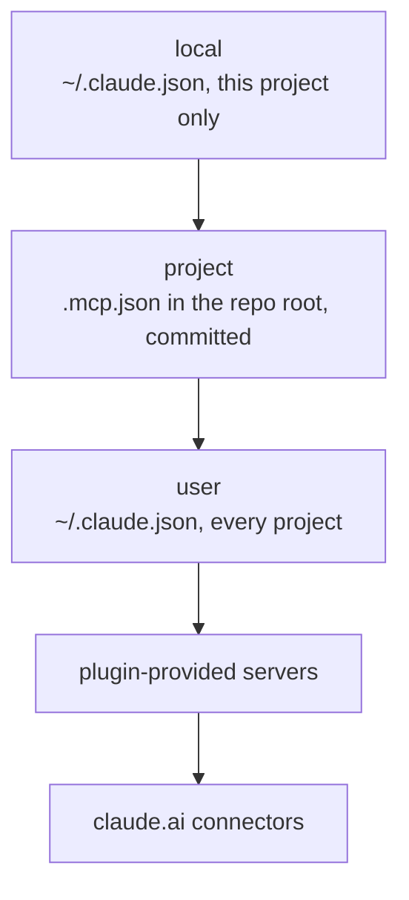

A grab-bag of Claude Code slash commands and one MCP that make day-to-day work less painful.

## Context & history

- `/context` — Shows what's loaded right now: tokens used, files in scope, system reminders. Quickest way to see why a session feels slow.
- `/compact` — Summarises the older half of the conversation to free up context. Use when you want to keep going on a long session without losing thread.
- `/clear` — Resets the conversation. Same effect as restarting; faster than closing the terminal.
- `/rewind` — Steps the conversation back to an earlier turn. Cheap undo for "actually, take that back" — also rolls back file edits made since that turn.
- `/model` — Switches model mid-session. Drop to Haiku for trivial edits, jump to Opus for the gnarly stuff. Probably the highest-leverage habit on this page.
- `/resume` — Reopens a prior session by id. Useful when you closed the terminal mid-task.
- `/init` — Don't. See [below](#init-is-a-bait).

## Reasoning depth

- **Thinking budgets** — Keywords like `think`, `think hard`, `ultrathink` (plus the `/ultrathink` slash command) buy more deliberation. See [[claude-code-thinking-budgets|Claude Code thinking budgets]] for which to reach for when.

## Input & UI

- `/voice` — Talk to Claude Code with your microphone instead of typing.
- `/statusline` — Configures the bottom-of-terminal status line (model, branch, token usage, etc.). The custom one used here is in [[claude-code-environment#Statusline|Claude Code setup]].
- **Inline prefixes.** `@path/to/file` attaches a file, `!cmd` runs a shell command in the session so its output lands in the conversation, `#text` pins a note to memory. Daily-driver shortcuts most people miss.

## Automation

- `/loop <interval> <prompt>` — Runs a prompt on a recurring interval, e.g. `/loop 5m /check-deploys`. Omit the interval to let the model self-pace. Useful for polling CI, watching builds, babysitting long jobs.
- `/schedule` — Cron-style remote runs. Sibling to `/loop`, but unattended — the agent runs on a schedule without your terminal open.
- `/remotecontrol` — Drives the local Claude Code session from another device.

## `/init` is a bait

`/init` scans the repo and writes a long `CLAUDE.md`, which then loads on every request ([the video that makes the case](https://www.youtube.com/watch?v=9tmsq-Gvx6g)).

- **It costs every request.** `CLAUDE.md` is part of the fixed slice of the context window, so it shrinks the room left to explore, implement and test.
- **It distracts.** Models have an instruction budget; irrelevant instructions pull focus before small tasks even start.
- **It rots.** Most of its output (commands, architecture, file references) is discoverable from `package.json` and config files, and goes stale as the code changes.

Instead:

- Don't document what is discoverable. The built-in explore phase builds that context just in time.
- Put steering ("prefer reducers", "use pnpm not npm") in **skills**, which load on demand rather than on every request.
- Document only the genuinely non-discoverable quirks, e.g. "you are on WSL on Windows".

## Context7 MCP

A documentation MCP server from Upstash. It resolves a library name to versioned docs and returns the matching excerpt, so the agent quotes a package's current API instead of the one its training data remembers. It complements library-specific servers such as the Škoda Flow storybook one or `@mui/mcp`, which stay authoritative for their own components.

Its own instructions scope it to "a library, framework, SDK, API, CLI tool, or cloud service - even well-known ones", and not to refactoring, business-logic debugging or general concepts. Keep that boundary: it is a doc lookup, not a second opinion.

### Install

The standard path is the one the [Claude Code setup page](https://context7.com/docs/clients/claude-code) lists first. Run it in an ordinary terminal, not through `!`, because the sign-in is interactive:

```bash
npx ctx7 setup --claude --mcp
```

It signs in with an OAuth device flow (a link plus a short code), generates an API key and writes three things:

| What                 | Path                                     | Loads                           |
| -------------------- | ---------------------------------------- | ------------------------------- |
| MCP server + key     | `~/.claude.json`, user scope             | every session                   |
| Rule                 | `~/.claude/rules/context7.md`            | every session, like `CLAUDE.md` |
| `context7-mcp` skill | `~/.claude/skills/context7-mcp/SKILL.md` | on demand                       |

Per the [ctx7 CLI docs](https://context7.com/docs/clients/cli), `--api-key YOUR_API_KEY` reuses an existing key and skips the sign-in; without it, a second key appears in the [Context7 dashboard](https://context7.com/dashboard). Verify with `claude mcp list`; `resolve-library-id` and `query-docs` appear in the next session, since MCP servers load at startup.

**Why MCP rather than CLI + Skills mode.** `ctx7 setup --cli` installs a `find-docs` skill that runs `npx ctx7@latest library …` and `npx ctx7@latest docs …` instead. Here that routes every lookup through the sandboxed Bash tool, which needs `registry.npmjs.org` and `context7.com` approved per command, and resolves the package again on each call. MCP calls leave from Claude Code itself.

### Why user scope

The same server name in two scopes does not merge. The [MCP documentation](https://code.claude.com/docs/en/mcp) says Claude Code "connects to it once, using the definition from the highest-precedence source. The entire server entry from that source is used; fields are not merged across scopes."



Project scope is wrong for a personal tool: `.mcp.json` is committed and reaches the whole team, and "Claude Code prompts for approval in interactive sessions before using project-scoped servers". Since v2.1.196 a cloned repo cannot approve its own servers either - a committed `enableAllProjectMcpServers` is ignored in an untrusted folder, and the server waits at `⏸ Pending approval` until someone accepts the workspace trust dialog.

### Caveats

- **The key sits in plain text** in the `~/.claude.json` MCP entry. Keep that file out of repos, docs and pastes - it also carries account identifiers.
- **The rule and the skill say the same thing.** The rule loads every session ([user-level rules](https://code.claude.com/docs/en/memory#user-level-rules) apply to every project); the skill is Upstash's bundled fallback. That is the vendor's layout, left as is.
- **The skill bypasses the skills CLI.** `ctx7` writes it straight into `~/.claude/skills/`, so it is absent from `~/.agents/.skill-lock.json` and from `scripts/claude-env.skills.json`. On a new machine `ctx7 setup` restores it, not `npm run env:bootstrap`.
- **A sandboxed session cannot install it.** The sandbox blocks writes to `~/.claude.json` and `~/.claude/`. Run the setup in an ordinary shell.
- **Remove with** `npx ctx7 remove --claude`, which undoes everything `ctx7 setup` wrote.

---

Note: [YT: 32 Tricks to Level Up Claude Code](https://www.youtube.com/watch?v=jqoFP9QapXI)

Related: [[claude-code-environment|Claude Code setup]] · [[skills|SKILLS]]
