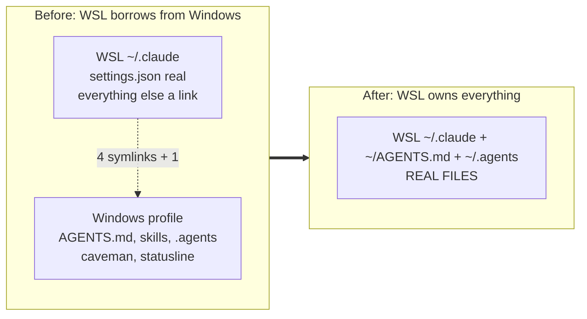
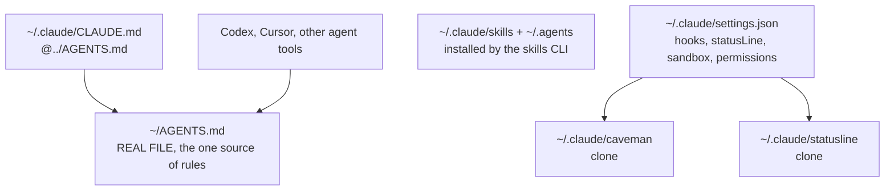

The Windows install is gone: binary, version store, `~/.claude` and the canonical `AGENTS.md` with it. What remains is one config home on ext4, owned by one operating system. This page is the WSL-only replacement for the cross-OS scheme in [[global-agents-md-windows-wsl|Global AGENTS.md across Windows and WSL]], and the part of [[claude-code-environment|Claude Code environment]] that described sharing files between the two sides no longer applies.

## Why WSL only

Three reasons, in order of weight.

**The sandbox does not exist on the Windows side.** The [sandboxing docs](https://code.claude.com/docs/en/sandboxing) put it plainly: "The sandbox is built into Claude Code and runs on macOS, Linux, and WSL2. Native Windows is not supported. On Windows, run Claude Code inside a WSL2 distribution." A Windows session has permission rules and nothing underneath them, so every hour spent there is an hour outside OS-enforced isolation.

The binary is less certain than the page. The settings schema shipped inside 2.1.267 describes native Windows sandbox behaviour in three places - `sandbox.filesystem.disabled` is "Ignored on native Windows, where the sandboxed process runs as a separate user with no inherent rights", `network.tlsTerminate` documents a persistent CA "set up and trusted via `/sandbox install`" for that platform, and `bwrapPath` / `socatPath` are marked Linux and WSL only rather than universal. Either the docs page lags the build or the schema is ahead of what ships. Untested here, and it does not change the decision: WSL is the supported path in both readings.

**Microsoft recommends against the split anyway.** The [working across file systems guide](https://learn.microsoft.com/en-us/windows/wsl/filesystems) says "We recommend against working across operating systems with your files, unless you have a specific reason for doing so", and names the Linux root directory as where WSL project files belong.

**Two config homes drift.** The old scheme fought that with symlinks, and it worked, but it bought consistency with a dependency: every shared file was a real file on the Windows drive and a link from WSL. Delete the Windows profile and the links point at nothing. One home has no such failure mode.

The cost is real and worth naming: a project that must live on the Windows drive no longer has a local CLI. Reaching it through `/mnt/c` is slow, has no inotify, and produces permission noise. Electron repos that keep `node_modules/electron/dist` on the Windows drive are the usual case.

## What the Windows side was holding

Five things pointed across the boundary. Deleting `C:\Users\[USER]\.claude` and `C:\Users\[USER]\AGENTS.md` broke four of them at once, silently, because a dangling symlink is not an error until something reads it.

| WSL path               | Was                              | After the Windows profile is gone                             |
| ---------------------- | -------------------------------- | ------------------------------------------------------------- |
| `~/AGENTS.md`          | symlink to the Windows file      | dangling, so `~/.claude/CLAUDE.md` imports nothing            |
| `~/.claude/skills`     | symlink to the Windows directory | gone, every global skill with it                              |
| `~/.claude/caveman`    | symlink to the Windows clone     | dangling, both hooks fail                                     |
| `~/.claude/statusline` | symlink to the Windows clone     | dangling, `statusLine` fails                                  |
| `~/.agents`            | symlink to the Windows store     | **survived** - `.agents` sits beside `.claude`, not inside it |

The last row is the recovery path worth knowing before starting: `C:\Users\[USER]\.agents` holds `skills/` and `.skill-lock.json`, and nothing in a Claude Code uninstall touches it.



## The new layout

Every path is real, and every path is under `/home/[USER]`. There is nothing to keep in step, so there is no sync mechanism to describe.



`settings.json` stops being a special case. It was the one file the old scheme could not share, because its `statusLine` and hook commands carry absolute paths that differ per OS. With one OS there is one form of every path, and the file is as ordinary as the rest.

## Rebuilding on WSL

Order matters only in that `AGENTS.md` comes first: it is the file every session reads.

**1. Clear the dangling links.** They are links, so `rm` removes the link and not a target that no longer exists.

```bash
rm -f ~/AGENTS.md ~/.claude/caveman ~/.claude/statusline ~/.claude/skills ~/.agents
```

**2. Recreate `~/AGENTS.md` as a real file.** The rules it held are reproduced verbatim in [[global-agents-md-windows-wsl|Global AGENTS.md across Windows and WSL]] under "The rules in that file" - that page is the backup. Drop the three-line preamble naming the Windows canonical path; there is no canonical elsewhere any more.

**3. Leave `~/.claude/CLAUDE.md` as a pointer.** The [memory docs](https://code.claude.com/docs/en/memory) note that Claude Code reads `CLAUDE.md` and not `AGENTS.md`, and that a symlink between them works where the import would. It is tempting on WSL, where symlinks need no privilege. Keep the `@../AGENTS.md` import anyway: the same page records that Cowork sessions on the desktop skip a `~/.claude/CLAUDE.md` that is itself a symlink, and load the import instead.

**4. Reclone the two programs.** Neither is packaged, and neither updates itself - `git pull` in each is the update mechanism.

```bash
git clone https://github.com/JuliusBrussee/caveman ~/.claude/caveman
```

The statusline clone is the deployed copy rather than the development checkout; [[claude-statusline|Claude statusline]] covers the split and which remote each uses.

**5. Restore the skills.** Copy the surviving store first, and delete the link before copying onto it - `cp` into a live symlink writes through it and nests the store inside itself on the far side:

```bash
rm -f ~/.agents
cp -r /mnt/c/Users/[USER]/.agents ~/.agents
```

That restores `.skill-lock.json` but not `~/.claude/skills`, which is what Claude Code actually reads. Reinstall the manifest over the top, which populates both and reconciles the lock:

```bash
npx -y skills add <repo> --skill <name> -g -a claude-code -y </dev/null
```

The `</dev/null` matters in a loop: the CLI reads stdin, so without it the first install swallows the rest of the list and the loop exits after one skill. The node floor that used to make this awkward is no longer a factor - the skills CLI wants node 22.20 or newer, and the WSL side is on 22.23, so the machine that had to borrow an install from the other OS can now do its own.

**6. Prune `settings.json`.** The `statusLine` command and both caveman hook commands already name `/home/[USER]/...` paths, so they need no edit - they were per-OS all along. What does need attention is `permissions.additionalDirectories`, which accumulated `/mnt/c/...` entries pointing into the Windows profile. Those grant access to a tree nothing works in any more.

**7. Verify in a fresh session.** `claude doctor` prints install health and settings validation without starting a session. Inside a new session, `/context` lists the memory files that actually loaded, which is the only proof that the `AGENTS.md` import resolved, and `/sandbox` shows a Dependencies tab if `bubblewrap` or `socat` is missing.

## Emptying the Windows side

The uninstall documented on the [setup page](https://code.claude.com/docs/en/setup) names the binary, the version store, `~/.claude` and `~/.claude.json`. A machine that has been running Claude Code for months holds more than that, and none of the rest is reachable from that list.

| Path                                           | What it is                                            |
| ---------------------------------------------- | ----------------------------------------------------- |
| `%LOCALAPPDATA%\claude-cli-nodejs`             | CLI cache, tens of MB                                 |
| `%LOCALAPPDATA%\Temp\claude`                   | one session temp directory per project ever opened    |
| `~\.cache\claude`                              | staging directory, usually empty                      |
| `~\.agents`                                    | the skills CLI store - **salvage before deleting**    |
| `~\Documents\Claude`                           | scheduled Cowork skills, which are authored content   |
| `C:\ProgramData\Claude`                        | Cowork service logs, and the log can reach tens of MB |
| `~\.vscode\extensions\anthropic.claude-code-*` | around 220 MB per version kept on disk                |

Two of those rows are data rather than leftovers. `~\.agents` holds the lock file that records which skills are installed, and `~\Documents\Claude` holds skills someone wrote by hand. Copy both into WSL before the delete pass, not after.

Uninstalling the VS Code extension does not free its disk immediately: VS Code records the directory in `.vscode\extensions\.obsolete` and removes it on the next restart. Deleting the directory by hand is what reclaims the space in the same sitting.

Windows-side VS Code configuration outlives the extension too. `claudeCode.*` keys in `settings.json` and any keybinding bound to `claude-vscode.terminal.open` keep sitting there, the keybinding now firing a command nothing provides.

## What the bootstrap script needs

`scripts/claude-env.mjs` still implements the old model. On WSL it looks for a Windows profile containing `AGENTS.md`, and creates the four symlinks into it. On a machine with no Windows profile it reports `SKIPPED` for `AGENTS.md` and every shared directory, which is accurate but useless.

The WSL-only version is smaller than the one it replaces: write `~/AGENTS.md` if absent instead of linking it, create `~/.claude/skills` and `~/.agents` as real directories, keep the two clone checks, and delete `findWindowsProfile`, `symlinkIfMissing` and the `--win-user` flag entirely. The per-OS branching in the hook and statusline paths goes with them.

## Sharp edges

- **The Windows VS Code extension is a second config home.** The [setup docs](https://code.claude.com/docs/en/setup) state that the VS Code extension, the JetBrains plugin and the Desktop app all write to `~/.claude/`, and that "If any of them is still installed, the directory is recreated the next time it runs." Keeping the extension on the Windows side means opening a plain Windows window rebuilds a Windows config home from scratch, sharing nothing with WSL. Open folders through Remote-WSL, or uninstall the Windows-side extension - and seed that config home anyway, as the bullet below sets out, so the rebuilt copy is born with a sandbox block instead of empty.
- **The reverse symlink is not the fix.** The obvious repair is to point `C:\Users\[USER]\.claude` at the WSL directory, and there is a [documented recipe](https://github.com/norman-ingal/claude-code-wsl-memory) for it. Its own README calls it "a workaround, not an official solution", needs an admin PowerShell plus a bind mount reapplied after every WSL restart, and breaks SSH-authenticated git from the Windows app. It restores the coupling this migration removed, in the other direction.
- **An empty `C:\Users\[USER]\.claude` reappears while WSL sessions run.** Its only entry is `ide`, and that entry is a character device rather than a directory - what a path masked by the sandbox looks like from inside it. Deleting it again achieves nothing.
- **Give that directory a `settings.json` rather than fighting it.** Since the directory comes back anyway, a three-key sandbox block there - `enabled`, `failIfUnavailable`, `allowUnsandboxedCommands`, the same shape as the WSL one in [[claude-code-environment|Claude Code environment]] - turns any future Windows-side session into either a sandboxed one or a startup error. It is enforcement rather than documentation: the rule "Claude Code runs in WSL only" stops depending on nobody clicking Install on the other side. Config files resolve per `$HOME`, so this file binds Windows sessions and nothing else.
- **A Windows-side install cannot happen by accident.** The thing that reinstalls the extension is a `claude` startup inside a VSCode terminal, and there is no Windows binary left to run one. Only a manual marketplace click puts it back on that side. Blocking it with VSCode's `extensions.allowed` is the wrong instrument: the [enterprise extension guide](https://code.visualstudio.com/docs/enterprise/extensions) calls it "application-wide", so it applies to every window including Remote-WSL and would disable the copy you want.
- **The uninstall has no undo.** PowerShell's `Remove-Item` deletes rather than recycling, so nothing from the Windows profile is in the Recycle Bin. Anything not backed up before the removal is reconstructed from documentation or not at all, which is the argument for this wiki holding the `AGENTS.md` text in the first place.
- **A helper script under `~/.claude/scripts/` is the wrong home for editor automation.** Anything that generates VS Code configuration belongs in an extension that contributes the binding itself, not in a script the config points back at: a script there is per-OS, it dies with the profile it sat in, and a generated `keybindings.json` entry silently shadows the extension's own binding, because user keybindings outrank contributed ones. Moving that logic into the extension removes both the script and the entry it wrote.
- **Pruning the settings first locks you out of the cleanup.** Removing `/mnt/c/...` from `permissions.additionalDirectories` is the right end state, and it takes effect immediately: recursive deletes under `/mnt/c` stop being permitted from inside a session. Finish the Windows delete pass before narrowing the permission surface, or run the deletions from PowerShell.
- **One binary now, not four.** The native installer manages `~/.local/bin/claude` as a symlink into `~/.local/share/claude/versions/`, and native installs "automatically update in the background". A single install means a single update channel and no more guessing which launcher ran which copy.

---

Related: [[claude-code-environment|Claude Code environment]] · [[global-agents-md-windows-wsl|Global AGENTS.md across Windows and WSL]] · [[claude-code-permissions|Claude Code permission rules]] · [[always-on-output-style|Always-on caveman]] · [[claude-statusline|Claude statusline]]
