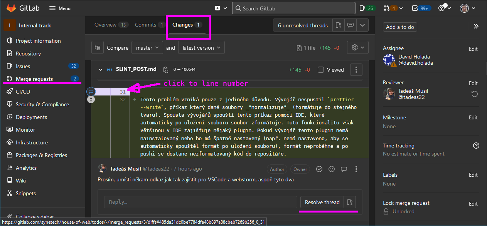
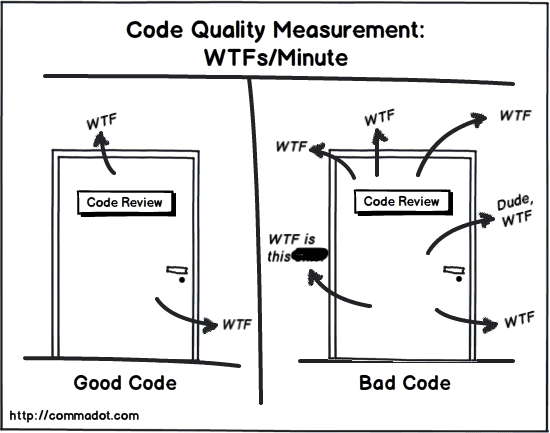

## Code Review Guidelines

1. [Prezentation](https://docs.google.com/presentation/d/1cImWWz03TxVlnU0YEAoGHrSFef7GZ23A/edit#slide=id.p24)
2. Bublina Code reviews
3. GitLab Code Review Guidelines

## How does it work in GitLab

You will receive comments through GitLab’s UI. It is possible to comment specific lines for easier orientation. The “Resolve thread” can use only the person who started the thread. Author of the thread will validate how the comment was fixed before resolving the thread. If some issue persist the thread is used for further discussion. Author can start a thread, write some advice and resolve the thread immediately. These threads do not need any fixes and are used for sharing additional knowledge related to the merge request.

