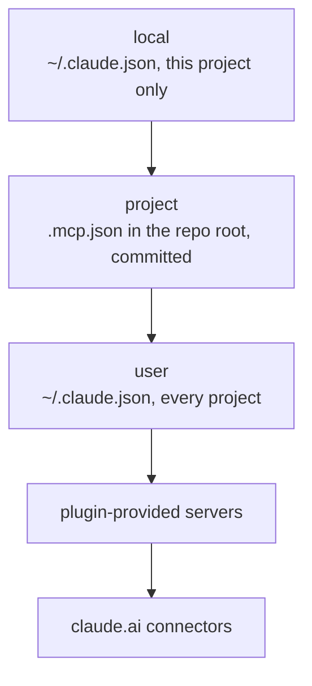

Context7 is a documentation MCP server from Upstash. It resolves a library name to versioned documentation and returns the matching excerpt, so an agent quotes the current API of a package instead of the one its training data remembers. It is the general-purpose complement to library-specific servers such as the Škoda Flow storybook one or `@mui/mcp`, which stay authoritative for their own components.

The server's own instructions say to reach for it whenever the question is about "a library, framework, SDK, API, CLI tool, or cloud service - even well-known ones", and not for refactoring, business-logic debugging or general programming concepts. Worth keeping that boundary: it is a documentation lookup, not a second opinion.

## Install

One command, user scope, remote transport:

```bash
claude mcp add --scope user --transport http context7 https://mcp.context7.com/mcp
```

User scope stores the entry in `~/.claude.json` and makes the server available in every project on the machine while staying private to the account. Verify with `claude mcp list`; the two tools `resolve-library-id` and `query-docs` appear in the next session.

Upstash also ships a one-shot installer, `npx ctx7 setup --claude`, which authenticates over OAuth and generates a key on the way. The explicit `claude mcp add` is the smaller move - it adds one server and nothing else.

## Scopes, and why user scope here

A server can be defined in three places, and the same name in two of them does not merge. The [MCP documentation](https://code.claude.com/docs/en/mcp) states that Claude Code "connects to it once, using the definition from the highest-precedence source. The entire server entry from that source is used; fields are not merged across scopes."



Project scope is the wrong home for a personal lookup tool. A `.mcp.json` entry is checked into the repository and reaches the whole team, and the same page notes that "Claude Code prompts for approval in interactive sessions before using project-scoped servers". Since v2.1.196 a cloned repository cannot approve its own servers either - `enableAllProjectMcpServers` committed to the project is ignored in an untrusted folder, and the server sits at `⏸ Pending approval` until someone runs `claude` there and accepts the workspace trust dialog.

## The API key is optional

The remote endpoint answers anonymous requests. Upstash's [Claude Code setup page](https://context7.com/docs/clients/claude-code) puts the trade plainly: without a key "requests just go through the anonymous tier, which has lower rate limits". A free key from the [Context7 sign-up](https://context7.com/dashboard) lists "Higher rate limits" as its first benefit and travels as a header:

```bash
claude mcp add --scope user --header "Authorization: Bearer YOUR_API_KEY" --transport http context7 https://mcp.context7.com/mcp
```

Start without the key and add it when the anonymous limit actually bites, so no secret sits in the config until it earns its place.

A local stdio variant exists, and there the key is required - the [client list](https://context7.com/docs/resources/all-clients) gives it as `claude mcp add --scope user context7 -- npx -y @upstash/context7-mcp --api-key YOUR_API_KEY`. It costs a node process per session and buys nothing over the remote endpoint unless the network path is the problem.

## Caveats

**A sandboxed agent session cannot install it.** Under the Claude Code sandbox `~/.claude.json` is bind-mounted to `/dev/null`, so `claude mcp add --scope user` writes nothing and still exits clean. Run the command in an ordinary shell, or with the `!` prefix from the session prompt.

**Removing it** is `claude mcp remove --scope user context7`. The scope flag matters; without it the wrong entry can be targeted when the same name exists in more than one scope.

Related: [[claude-code-environment]], [[claude-code-permissions]], [[skills]]
