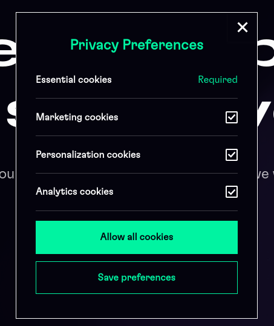

Although is cool to have non-invasive cookie bar, the result is that majority of users will don’t allow cookies in this case and hence the website tracking isn’t possible.

That’s why we should follow the pattern from [megumethod.com](http://megumethod.com) cookie bar.

This solution “force” users to accept cookies, unless they uncheck the proper checkbox.
