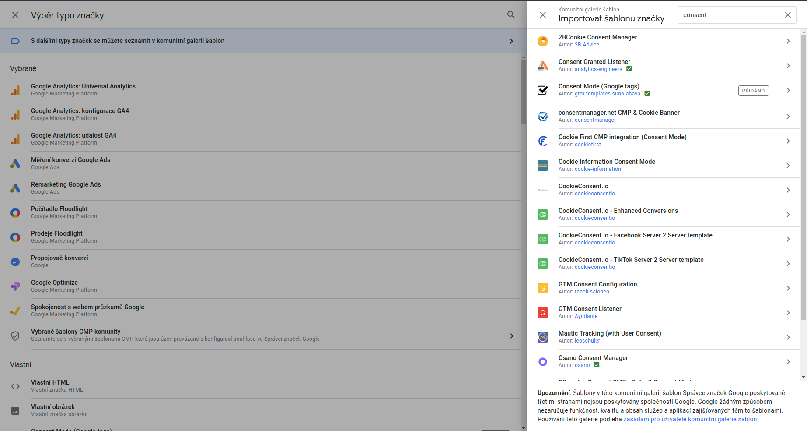
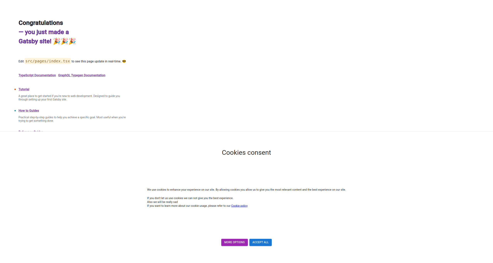
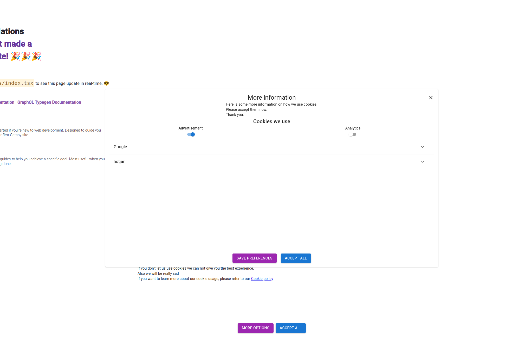
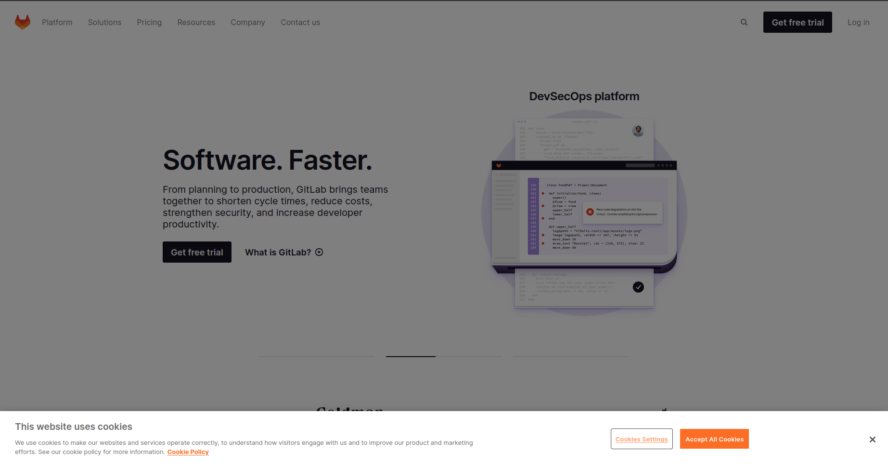
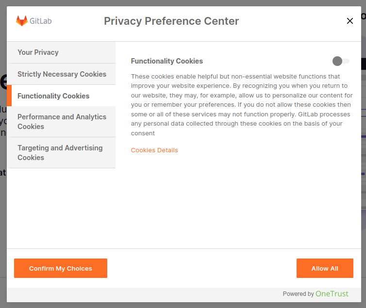

[https://www.focus-age.cz/m-journal/praxe/legislativa/analyza--zmena-cookie-listy-muze-firmam-vratit-40---ztracenych-dat__s353x16868.html](https://www.focus-age.cz/m-journal/praxe/legislativa/analyza--zmena-cookie-listy-muze-firmam-vratit-40---ztracenych-dat__s353x16868.html)

---

## Prerequisities

GTM: [https://tagmanager.google.com/#/container/accounts/6065380823/containers/98307546/workspaces/3/tags](https://tagmanager.google.com/#/container/accounts/6065380823/containers/98307546/workspaces/3/tags)
GA (setup info): [https://analytics.google.com/analytics/web/#/a251122392p345205860/admin/streams/table/4337028709](https://analytics.google.com/analytics/web/#/a251122392p345205860/admin/streams/table/4337028709)

GA (check): [https://analytics.google.com/analytics/web/#/p345205860/realtime/overview?params=_u..nav%3Dmaui&collectionId=life-cycle](https://analytics.google.com/analytics/web/#/p345205860/realtime/overview?params=_u..nav%3Dmaui&collectionId=life-cycle)

## Zvolená lišta

Podle dat z [focus-age.cz](http://focus-age.cz) byla zvolena lišta “pop-up banner bez tlačítka odmítnout”.
Vzhledem k našemu používání google-tag manager, ale nemáme moc možností co nechat uživatele nastavit a změnit, takže v druhé části této lišty, kde by mělo být hodně klikání, toho nakonec není moc.

Nakonec jsem zvolil přístup s výpisem informací o cookies a proč jaké používáme.

Vyzoušené pluginy:

`gatsby-plugin-gdpr-cookies` - plugin který dodržuje GDPR a nespouští žádné scripty dokud není udán souhlas. To znamená že není GTM stáhnut dokud se neudělí souhlas. Takže nelze spouštět nic s GTM spojené.

`gatsby-plugin-google-gtag-optin` má stejný problém jako plagin gdpr-cookies. Tedy že nenačte žádný skript dokud se neodsouhlasí použití.

`gatsby-plugin-google-gtag` je základ pro předchozí plugin, ale narozdíl od něj nemá problém s načítáním GTM před souhlasem uživatele. Jeví se tedy jako super kandidát pro základ pluginu. Problém tohoto pluginu je však to, že má problém s jinými pluginy v GTM než je google analytics. Takže třeba hotjar jsem s tímto pluginem nedokázal vůbec detekovat na stránce.

`gatsby-plugin-google-tagmanager` je plugin pro pracování s tag managerem, podařilo se mi ho najít až později a na první pohled vypadá velice podobně jako `google-gtag` plugin. Ale narozdíl od něj nemá problém s tím, aby načítal jiné nastavené věci v GTM. Jelikož také využívá gtag.js, tak je to ideální kandidát pro práci s GTM.

`react-cookie` je plugin pro pracování s cookies v reactu, využívající hooky.

Zdroje pro nastavení GTM pro GDPR

- [https://developers.google.com/tag-platform/devguides/consent](https://developers.google.com/tag-platform/devguides/consent)
- [https://developers.google.com/tag-platform/devguides/privacy](https://developers.google.com/tag-platform/devguides/privacy)
- [https://developers.google.com/tag-platform/tag-manager/templates/consent-apis](https://developers.google.com/tag-platform/tag-manager/templates/consent-apis)

Tutoriál, sice pro nextJS, ale princip je podobný

- [https://javascript.plainenglish.io/manage-cookie-consent-in-next-js-with-google-tag-manager-4d58818266ea](https://javascript.plainenglish.io/manage-cookie-consent-in-next-js-with-google-tag-manager-4d58818266ea)

Tutoriál pro gatsby využívajíci Partytown

- [https://www.gatsbyjs.com/blog/how-to-add-google-analytics-gtag-to-gatsby-using-partytown/](https://www.gatsbyjs.com/blog/how-to-add-google-analytics-gtag-to-gatsby-using-partytown/)

Další tutoriály a návody

- [https://stackoverflow.com/questions/65669179/google-consent-mode-from-gtm](https://stackoverflow.com/questions/65669179/google-consent-mode-from-gtm)
- [https://www.simoahava.com/analytics/consent-settings-google-tag-manager/](https://www.simoahava.com/analytics/consent-settings-google-tag-manager/)
- [https://www.simoahava.com/analytics/consent-settings-google-tag-manager/](https://www.simoahava.com/analytics/consent-settings-google-tag-manager/)

### Implmentace

**GTM**

Začněme nastavením Google Tag Manageru (GTM).

Ve značkách (Tags) přidáme novou značku, bude to značka ze šablony která za nás udělá základní inicializaci souhlasu. Tím že použijeme šablonu, se vyvarujeme nutnosti si psát vlastní šablonu značky, což je také možnost. V Kofiguraci značky zvolíme možnost jít do komunitních značek a tam vyhledáme slovo `consent`. Vyběhně na nás spousta značek, my chceme `Consent Mode (Google tags)`.



V `Default Consent Settings` nastavíme základní typy souhlasu v nastavení značky na takové jaké potřebujem. To nejspíše bude tak, že Advertising a Analytics budou vypnuté a zbytek zapnutý. Pokud bychom chtěli nějaké specifické chování pro jiné regiony tak je zde možnost je zvolit. Pro více informací k tomu, jak se regiony chovají doporučuji přečíst [tento článek](https://developers.google.com/tag-platform/tag-manager/templates/consent-apis) o tom, jak se chová specifikování regionů. TLDR, více specifický region má přednost.

Další nastavení které chceme udělat je v rozšířeném nastavení dát prioritu spuštění značky na 1, aby to byla první značka která se spouští na stránce. Dále pak v nastavení souhlasu explicitně říct, že tato značka nepožaduje žádný další souhlas.

Spouštění značky nastavíme na `Consent Initialization - All Pages` aby se spustila jako první věc před vším ostatním (viz. chování různých spouštěcích pravidel v [tomto článku](https://www.simoahava.com/analytics/consent-settings-google-tag-manager/)).

Pak tuto značku jenom pojmenujem a uložíme a máme vytvořené prvotní nastavení souhlasu po spuštění stránky.

Toto nastavení ale musíme také aktualizovat pokud je na stránce již uloženo nějaké nastavení. Toto nastavení nejspíše bude uloženo v cookies (v tomto případě určitě). Takže si vytvoříme vlastní konfiguraci značky, která toto bude dělat. Marketplace jsem prohledával a bohužel nenašel nic generického, pokud by se našlo něco, co by to udělalo za nás, tak by to bylo jednodušší.

Přejdeme do šablony (Templates) a vytvoříme novou šablonu značky. Do jejího kódu vložíme následující

```jsx
const getCookieValues = require("getCookieValues");
const updateConsentState = require('updateConsentState');
const fromBase64 = require('fromBase64');
const JSON = require('JSON');

const consent = getCookieValues("consent");

if (consent !== undefined && consent.length > 0) {
  updateConsentState(JSON.parse(fromBase64(consent[0])));
}

// Vyvolat příkaz data.gtmOnSuccess, když je dokončeno spuštění značky.
data.gtmOnSuccess();
```

Tento kód importuje 4 funckionality a následně je využívá k získání cookie a jeho dekódování. Když to rozebereme více do podrobna:

- Získáme si cookie s názvem consent
- Pokud je toto cookie definováno, tak ho dekódujem (`getCookieValues` vrací pole) a parsneme ho do JSON objektu, který předáme do `updateConsentState`.

Další nutná věc, je nastavení opravnění. Tato šablona vyžaduje oprávnění `Přístupu ke stavu souhlasu` a `Čtení hodnoty souborů cookie`.

V `Přístup ke stavu souhlasu` nastavíme všechny souhlasy, které naše stránka používá, a přidáme možnost do nich zapisovat (čtení není nutné).

Ve `Čtení hodnot souborů cookie` vybereme možnost konkrétního cookie a tam zadáme název cookie které čteme. V našem případě to je `consent`.

Tuto šablonu pak již jenom zkusíme spustit (možnost `Spustit kód` pod Uložením), pokud jsou nějaké chyby, tak je opravíme a poté jenom pojmenujem šablonu a uloží me.

Právě vytvořenou šablonu přidáme na stránku jakožto další značku. Přejdeme do značek, tam vytvoříme novou značku, zvolíme konfiguraci značky, tam přejedeme na sekci `vlastní` a zvolíme naši šablonu. V rozšířeném nastavení zvolíme prioritu spuštění značky jakožto 1, a v nastavení souhlasu zaškrtneme, že nepotřebujem žádný další souhlas.

**Spouštění této značky je** **`Initialization - All Pages`**, což je důležité, protože jinak se bude spouštět moc pozdě, nebo naopak moc brzo.

Všem ostatním značkám by měl stačit `All Pages` trigger.

Tímto jsme dokončili část nastavení v GTM.

**Frontend**

Dále se přesuneme do části HTML a JS na naší stránce.

Abychom mohli začít, tak nastavíme plugin `gatsby-plugin-google-tagmanager` v `gatsby-config.js`.

Žádné prvotní nastavení na frontendu nepotřebujeme, jelikož jsme vše udělali v GTM. Takže zde jen vytvoříme lištu, kde budeme moci upravovat storage a jejich povolení. V tomto případě třeba jenom `analytics_storage`, `ads_storage` a `personalization_storage`. Kde `analytics_storage` bude odpovídat analytics cookies, `ads_storage` advertisement cookies a `personalization_storage` bude pouze pro ukázku toho, jak udělat cusotm storage. Uživatel bude moct zaškrtnout zda souhlasí nebo ne s jednotlivým typem cookies. Tyto souhlasy se budou udržovat v jednom našem cookie, které bude base64 encoded.

Toto nastavení souhlasu se může aktualizovat i během běhu stránku, a některé služby (třbea Google Analytics) budou bežet i bez přenačtení stránky.

Pokud uživatel klikne na “Accept All” tlačítko, tak se automaticky dovolí všechna povolení a nastaví se cookies která si toto zapamatují.

Na následujícím obrázku je vidět jak lišta vypadá po načtení stránky bez žádné interakce.



Zde je vidět jak vypadá otevírací okénko po kliknutí na “More options”.



Po kliknutí na more options má uživatel možnost si rozkliknout jednotlivé typy cookies (zde Advertisement a Analytics) a případně dát souhlas nebo nesouhlas. Po kliknutí na jeden typ, se v části pod typy zobrazí provideři, kteří tento typ cookies používají. Pokud uživatel klikne na “Save Preferences”, tak se uloží nastavení do cookies a zavolá se consent update v gtag s přidanými právy a povoleními.

Tato část je asi nejdůležitější pro naše účely a vlastně proč děláme tuhle lištu.

Pokud uživatel klikne na uložení změn, tak se zavolají funkce, které uloží cookie s aktuálním povolením (base64 encoded) a poté zavolají funkci `fireGtagConsentUpdate`. Ta zavolá window.gtag (ta existuje díky `gatsby-plugin-google-tagmanager`) a na něm zavolá consent update s aktuálním nastavením. A poté zavolá znova `gtm.start` event pro znovu zapnutí triggeru.

```jsx
const fireGtagConsentUpdate = async () => {
    // check if gtag is present.
		// If not try to wait few ms because it might have just been fresh reload
    if (typeof window.gtag !== "function") await setTimeout(() => {}, 500);
    if (typeof window.gtag !== "function") return;
    // update consent
    window.gtag("consent", "update", storagePerms);
    window.dataLayer.push({ 'gtm.start': new Date().getTime(), 'event': 'gtm.js' });
  }
```

`storagePerms` je objekt jehož interface je následující.

```jsx
interface IPermsFromUSer {
  [key: string]: string;
  ad_storage: "denied"|"granted";
  analytics_storage: "denied"|"granted";
  personalization_storage: "denied"|"granted";
}
```

A případně další storage se tam mohou dodat.

Nemusíme řešit v našem kódu nic po načtení stránky, protože všechna nastavení jsou již hotova pokud je naše cookie již vytvořeno (update v GTM). Jediné co musíme řešit, je zobrazení nebo zavření lišty. To uděláme přes kontrolu toho, zda je nastaveno cookie s nastavením. Pokud ano, tak lištu nezobrazujem, jinak ji zobrazíme.

## GTM trigerry

V GTM jdou pro značky (tagy) nastavit různé typy spouštění (triggery) které se spouští v různých chvílích. Avšak pokud zvolíme třeba All Pages pro věc jako Google Analytics, tak zjistíme že to nemá vliv na to, jak se chovají, a pokud je prostě v dataLayeru nastaveno nějaké potřebné storage jako vypnuté, tak se nezapnou.

---

# Shrnutí článku

Tato část se věnuje shrnutí článku z focus-age tak, jak jsem to pochopil. Takže i důvody proč jsem zvolil takovou lištu, jakou jsem zvolil.

## Typy cookie lišty

Existují dva hlavní typy cookie lišty. Ty se pak dají rozdělit a různě kombinovat mezi sebou a vznikají nám různé další kombinace.

Především se zajímáme o následující 4 rozšířené přístupy.

- klasickou malou cookie lištu
    - nejvíce podle legislativy
- Klasickou malou cookie lištu s rozšířenými možnostmi
    - je to kombinace pop-up a cookie lišty
    - implementace například na gitlab.com
- pop-up okénko
    - s možností souhlasit a rozšířeného nastavení kde je možnost nesouhlasu
- pop-up okénko
    - s možností souhlasit a rozšířeného nastavení. Musí se odklikávat jednotlivé souhlasy pro služby
    - toto je na hraně legislativy - “nesouhlas by měl být stejně jednoduchý jako souhlas”, přičemž zde to není z daleka tak jednoduché.
- velká cookie-lišta “pop-up lišta”
    - je kombinací cookie lišty a pop-up okénka
    - má možnost souhlasu a rozšířeného nastavení, kde se může odkliknout s nesouhlas

U každého z předchozích přístupů je vždy povinost, aby se data nesbírala před tím, než uživatel udělí souhlas, tzv opt-in politika. Pokud by toto nebylo splněno, tak by se nedodržovala aktuální platná legislativa. Výjimku mají cookies která potřebujeme, aby stránka fungovala.

### Malá cookie lišta

Malá cookie lišta je nejvíce v souladu s legislativou. Moc nebrání uživateli v prohlížení webu, a pokud nebude ani jedno tlačítko zvýrazněno, tak ani nenabádá uživatele k jednomu, či onému rozhodnutí.

To, že nebrání uživateli v používání webu však znamená, že uživatel si ji nemusí všímat a tak díky opt-in politice nemáme žádná data od uživatele.

Toto vede k tomu, že je toto jedna z nejméně efektivních možností jak uživatele donutit k souhlasu, jelikož s ní nemusí ani inteakovat.

Ztráta dat podle [focus-age.cz](http://focus-age.cz/) je cirka 67%.

### Malá cookie lišta s rozšířenými možnostmi

Tato lišta kombinuje možnost malé cookie lišty, ale nemá možnost odmítnou hned v prvním kroku. Místo ní má možnost prokliknout se dál, kde může třeba vyskočit pop-up okno ve kterém se uživatel rozhoduje co chce a nechce povolit.

Ukázkou takovéhoto přístupu je třeba gitlab.com kde je toto implementováno.

Tento způsob je efektivnější než klasická cookie lišta a pokud má “pop-up efekt” tzn, že třeba stmavý pozadí, tak je velice ještě víc ůčinější.

Výsledky, pokud nějak neblokuje pozadí, jsou cirka 38% ztráty dat podle webu [focus-age.cz](http://focus-age.cz/).



### Pop-up okénko (s možností odklikání jednotlivých nesouhlasů)

Pop-up okénko dává lepší výsledky jak cookie lišta. Především toho dosahuje tím, že nutí uživatele k interakci aby si mohli dále prohlížet web.

Jelikož většina webů používá podobný design a dosti z nich i stejné služby pro spravování cookies, tak je cesta k odmítnutí vždy velice podobná.

Uživatel pro souhlas má tlačítko připravené hned na úvodní straně. Pro možnost odmítnutí musí zajít do rozšířených možností, kde může teprve odmítnout různé služby nebo poskytovatele cookies.

Zde se rozchází různé implementace, kde některé tam přímo vyjmenují jednotlivé poskytovatele cookies, a možnost zamítnutí nebo potvrzení pro ně. Nebo tam mohou být sekce které si uživatel může potvrdit / zamítnout (viz gitlab.com třeba)

Souhlas nesmí být předem zaškrtnut u žádných nepoviných cookies.

Tato metoda se může zprvu zdát jako velice efektivní, avšak může některé lidi odradit od návštěvy webu. A tak je nakonec stejně efektivní jako když tam je možnost “odmítnout vše”.

Navíc je to nejvíce kontroverzní způsob jak dát uživateli možnost s nesouhlasem, a nejméně následuje legislativu ze všech uvedených možností.

Zde jsou 3 různé způsoby jak mohou vypadat takovéto po-up okna.

Rozdíl dat podle [focus-age.cz](http://focus-age.cz/) je cirka 26%.

](Untitled-4.png)

Source: [https://www.delftstack.com/](https://www.delftstack.com/)

](Untitled-5.png)

Source: [https://www.delftstack.com/](https://www.delftstack.com/)

Ukázka druhého typu, kde člověk musí zaškrtávat všechny poskytovatele samostatně, protože zde není tlačítko pro odmítnutí všech. A není zde ani možnost odškrtnout různé typy preferencí ve skupině. Respektive je, ale neovlivňuje to volbu jednotivých poskytovatelů.

](Untitled-6.png)

Source: [https://www.w3docs.com](https://www.w3docs.com/)

Ukázka kde nejsou zaškrtnuty žádné možnosti předem a člověk má možnost hned uložit.



### Pop-up okénko s možností “Odmítnout vše”

Tento baner je méně kontroverzní než předchozí možnost a je také stejně efektivní.

Rozdíl dat podle [focus-age.cz](http://focus-age.cz/) byl pořád 26% nebo minimální rozdíl oproti předchozí variantě, která neměla možnost odmítnout vše.

Způsob je prakticky stejný, jenom uživatel má možnost odmítnout vše, nebo rovnou ze začátku nemá žádnou možnost zaškrtnutou ani jako “legitemate interest”.

Příklad použití je například [seznam.cz](http://seznam.cz) který toto má implementované.

](Untitled-8.png)

Source: [https://seznam.cz](https://seznam.cz)

### Velká cookie lišta

Cookie lišta která zakrývá výraznou část webu se zdá jako nejlepší řešení, protože uživatele nutí k interakci. Proč je výrazně lepší než pop-up okénka není objasněno, ale podle webu [focus-age](https://www.focus-age.cz/) je lepší. A to o několik %, přesněji zaznamenává cirka 15% ztrátu dat.

Mezi takové weby patří například [irozhlas.cz](http://irozhlas.cz), který má velice podobnou lištu jako gitlab, ale je daleko větší a tak neumožňuje uživateli oužívat takovou část webu jakou by si přál.

Nakonec pak uživateli dává možnost odmítnout vše nebo si zaškrtat jednotlivé typy cookies v pop-up okénku.

](Untitled-9.png)

Source: [https://www.irozhlas.cz/](https://www.irozhlas.cz/)

](Untitled-10.png)

Source: [https://www.irozhlas.cz/](https://www.irozhlas.cz/)

## Zvolení vhodného baneru

Podle předchozího shrnutí vidíme, že malá cookie lišta není optimální řešení pokud chceme sbírat data od uživatelů co nejvíce.

Ale zajít k praktikám které uživateli co nejvíce stíží vyjádření nesouhlasu může odradit některé uživatele a pak nám snížit celkovou návštěvnost.

Nakonec se jako nejlepší řešení ukazuje donutit uživatele se rozhodnout zda chce nebo nechce souhlasit s cookies. A jelikož většina uživatelů s to nebude řešit, tak budou souhlasit. A zase ten kdo nechce souhlasit by to neměl mít zas tak těžké udělit nesouhlas.

Takže nejlepší volba byl buď baner s rozšířenými možnostmi, nebo “pop-up lišta” zakrývající velkou část webu s pop-up banerem.

### Menší dodatek nakonec

Ad blockery se již snaží řešit i automatické odmítání cookie lišty, takže lze očekávat že lidé budou dávat odmítnutí i když o tom nebudou ani vědět.

Například pro pořízení těchto snímků jsem si musel vypnout adblocker, protože mi automaticky odmítal většinu cookie-lišt a nemohl jsem je vyfotit.
