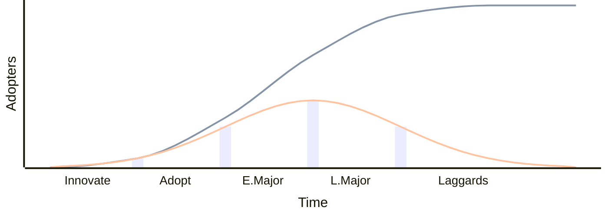

Change adoption (organizational, technology) typically follows normal distribution, often called the **Diffusion Curve**. A population's readiness to adopt is classified into five groups.

- **Innovators (2.5%)** — risk-takers and tech enthusiasts who embrace new ideas first.
- **Early Adopters (13.5%)** — opinion leaders who adopt early and help drive adoption.
- **Early Majority (34%)** — pragmatists who adopt before the average person.
- **Late Majority (34%)** — skeptics who adopt only after the majority has tried it.
- **Laggards (16%)** — tradition-bound individuals who resist change until it's unavoidable.

The chart shows the *frequency* of adoption at each stage.

When you instead track adoption **cumulatively over time**, the same numbers trace an **S-shaped curve** (`2.5% → 16% → 50% → 84% → 100%`) indicating market penetration.

## References

- [The S-Shaped Adoption Curve (ResearchGate)](https://www.researchgate.net/figure/S-Shaped-Adoption-Curve_fig1_37257037)
- [How to measure change adoption (The Change Compass)](https://thechangecompass.com/how-to-measure-change-adoption-within-the-change-management-curve/)
