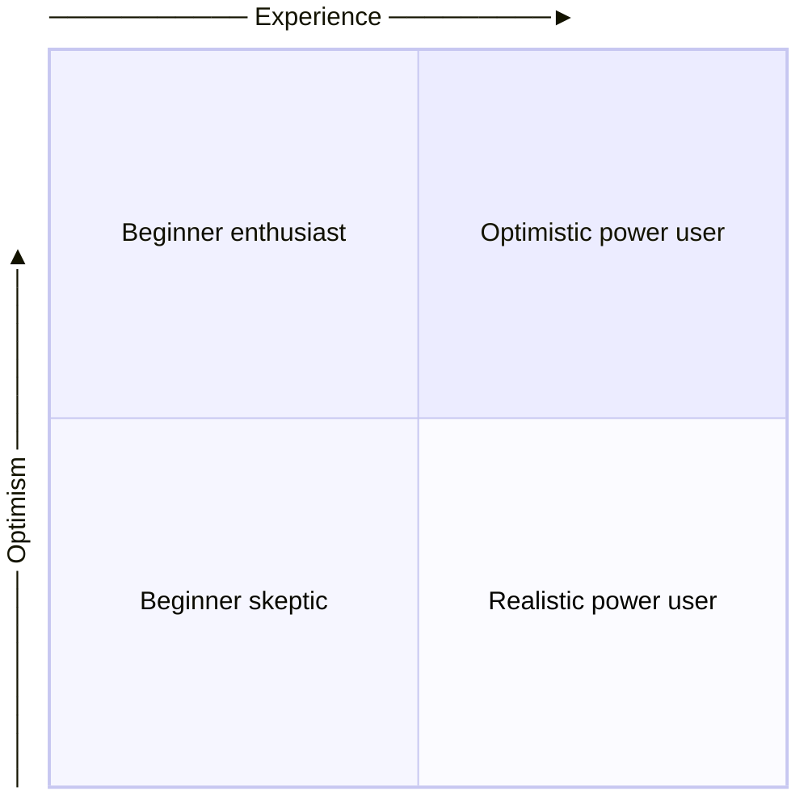

Anonymous ~3-minute questionnaire — tells you where you are on the AI map.

```mermaid
quadrantChart
    x-axis "─────────── Experience ─────────►"
    y-axis "──────────── Optimism ──────────►"
    quadrant-1 "Optimistic power user"
    quadrant-2 "Beginner enthusiast"
    quadrant-3 "Beginner skeptic"
    quadrant-4 "Realistic power user"
```
