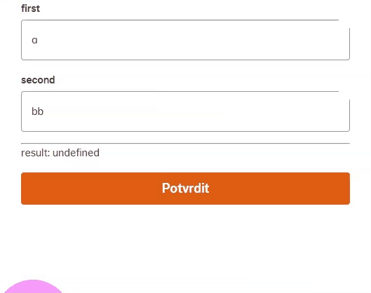
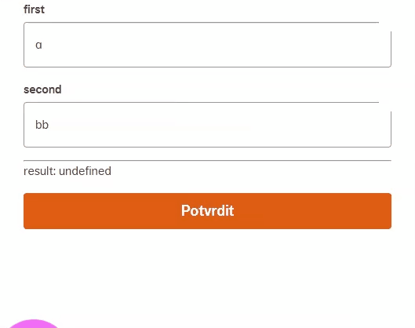
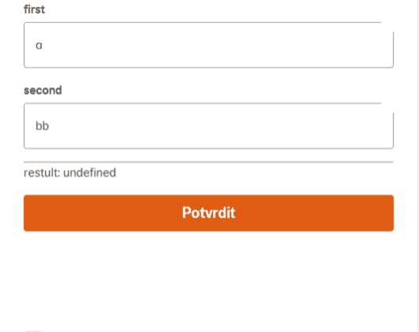
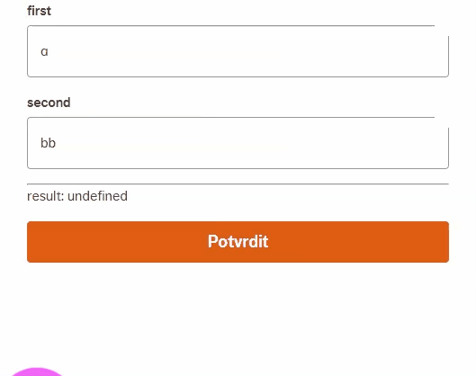
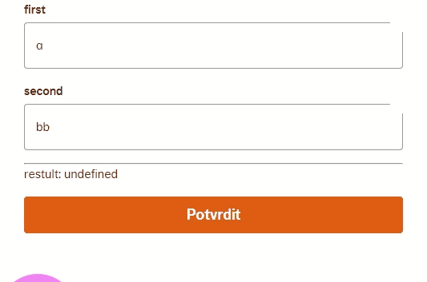
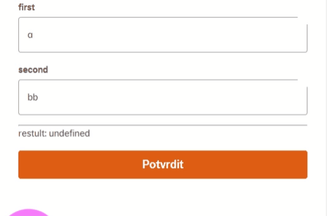

## What we need (and Formik does not do it)

> If there are no changes the form won't be submitted and an error occurs.

<aside>
💡 **Why?** Submitting may trigger a manual action on client's side — for example an employee reviewing the received data.

</aside>

## Few bad ideas (and why they are bad)

### Initially disabled submit button

The user sees a disabled button but no message why. It's confusing because the user has no idea what is wrong (can not press submit = can not display error message). The user can make changes which result in the same state as the initial state (you can not just enable the submit button on field value change/blur).

**REWRITE WITH INITIAL VALUE (this must be handled)**



<aside>
💡 The user can make changes which result in the same state as the initial state.

</aside>

### Prop `dirty`

Formik can check changes via the `dirty` prop. This solution is not flexible enough. **We want to include the check in the validation schema** — that's the only way we can be 100% sure the validation is the same every time (using `useFormikContext().validateForm()`).

<aside>
💡 The `useFormikContext().validateForm()` must do the same every time.

</aside>

## Better idea (not great, not terrible)

### Compare each field with initial values manually in the validation schema

If the form contains more fields it can be submitted with just one changed value. It means each field with an initial value can or cannot be valid — depending on the other fields' values. This makes the validation schema more complex, with some quirks:

**ONLY SUBMIT (one error, multiple messages)**



**VISIT, CHANGE AND SUBMIT (a change in one field can solve an error in another field — a bit counterintuitive)**



**CHANGE ONE VALUE (this seems to be fine)**


**VISIT ONE VALUE (after the user "visits" the first field there is a false impression that they must edit the first value)**



<aside>
💡 We need the validation only on submit, not during user interactions (otherwise we can confuse the user).

</aside>

<aside>
💡 We need one error message for the whole form, not for each field.

</aside>

## The good idea — invisible validation field

Create a hidden field (no UI component) that validates whether the form has changes overall. The initial value for this field must be `undefined`, otherwise a false change is detected (a non-existing field returns `undefined` during validation).





### 1) Add the invisible field to initial values

```jsx
const initialValues = {
	first: "a",
	second: "bb",
	valuesChanged: undefined, // MUST be undefined!
};
```

### 2) Add the invisible field to the validation schema

```jsx
const validationSchema = object().shape({
	first: string().length(1, `neplatná délka, je potřeba ${1}`),
	second: string().length(2, `neplatná délka, je potřeba ${2}`),
	valuesChanged: string().parentHasChanges({
		doesEmployerContribute,
	}),
});
```

### 3) Implement `parentHasChanges` (Yup `addMethod`)

Compare initial values to current `parent` values via `JSON.stringify`. The field has no input so the test only fires on validate / submit.

```jsx
addMethod(MixedSchema, "parentHasChanges", function (initialValues) {
	return this.test(
		"has-changes",
		cs.errorMessages.makeChanges,
		(_, { parent }) => {
			return JSON.stringify(initialValues) !== JSON.stringify(parent);
		}
	);
});
```

### 4) Render the error

```jsx
<ErrorMessage
	name="valuesChanged"
	render={(msg) => (
		<FormErrorMessage name="valuesChanged">{msg}</FormErrorMessage>
	)}
/>
```
