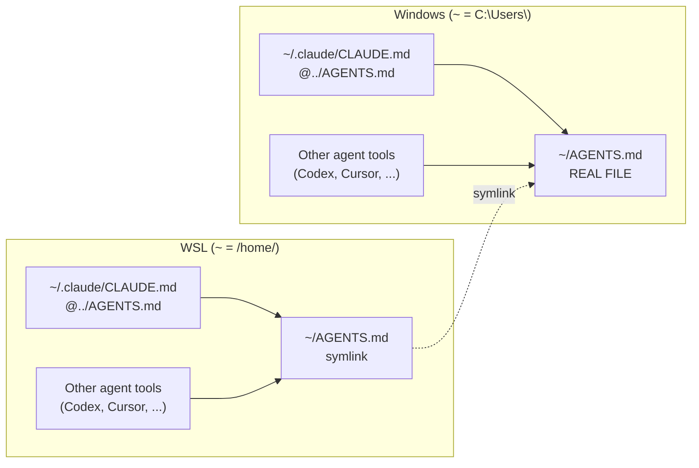

One global `AGENTS.md` holds the rules every agent tool reads, on both Windows and WSL.

## Canonical file and pointers

Edit only canonical file: `C:\Users\[USER]\AGENTS.md`. Everything else points at it:

- Windows `~/.claude/CLAUDE.md` → `@../AGENTS.md`
- WSL `~/.claude/CLAUDE.md` → `@../AGENTS.md`
- WSL `~/AGENTS.md` → (symlink) `/mnt/c/Users/[USER]/AGENTS.md`.

## Layout



## How resolution works

- Claude auto-loads `~/.claude/CLAUDE.md` every session.
- `@../AGENTS.md` line imports file one dir up: `~/AGENTS.md`.
- Windows: real file. WSL: symlink, reads same `/mnt/c` file.
- Other agent tools read `~/AGENTS.md` directly. No import step.

## The rules in that file

```text

# Global preferences

Canonical file: `C:\Users\[USER]\AGENTS.md` (edit only here).

- Windows `~/.claude/CLAUDE.md` → `@../AGENTS.md`
- WSL `~/.claude/CLAUDE.md` → `@../AGENTS.md`
- WSL `~/AGENTS.md` → (symlink) `/mnt/c/Users/[USER]/AGENTS.md`.

## Git

- Read-only git (status/diff/log/show/blame/branch --list/remote -v) may be run freely, anywhere.
- "Inside a worktree" = a linked git worktree (`git rev-parse --git-dir` differs from `--git-common-dir`); they live under `.claude/worktrees/<flat>/`. The main checkout ("root") is NOT a worktree.
- **Outside a worktree (root):** state-changing git (add/commit/push/pull/fetch/reset/rebase/merge/restore/checkout/stash/tag/config) MUST NOT run unless I explicitly ask for it in the current turn. Ambient phrases ("ship it", "we're done") do not count.
- **Inside a worktree:** `git add`, `git commit`, and `git push` of the worktree's own current branch may run without asking. Everything else (reset/rebase/merge/restore/checkout/stash/tag/config/pull/fetch), plus any force-push or pushing/deleting a branch that isn't this worktree's own, still needs an explicit ask.
- When writing commit messages, NEVER auto-add your agent name as co-author (anywhere).

## Writing

- Never publish PII (names/phones/emails of me or anyone) or development secrets (API keys, tokens, passwords, connection strings, private keys). If found while editing, pause and ask - never silently redact.
- Keep personal identifiers (name, username, email, IDs) and secrets out of docs/READMEs; use generic examples or env-var references.
- Say each idea exactly once; cut restated content.
- Never use em dash "—", use dash "-" instead
- Use Mermaid charts to explain complex ideas in md files.
- Prepend a human emoji 🙋 to anything that needs my attention after you act: decisions to make, caveats to know, or follow-up questions (e.g. "Want me to tweak those?", "One thing to decide", "One caveat worth knowing").
- Never remark on actions you took or withheld solely to comply with these AGENTS.md rules

```

Related: [[claude-code-environment|Claude Code environment]] · [[claude-code-permissions|Claude Code permission rules]] · [[always-on-output-style|Always-on output style]]
