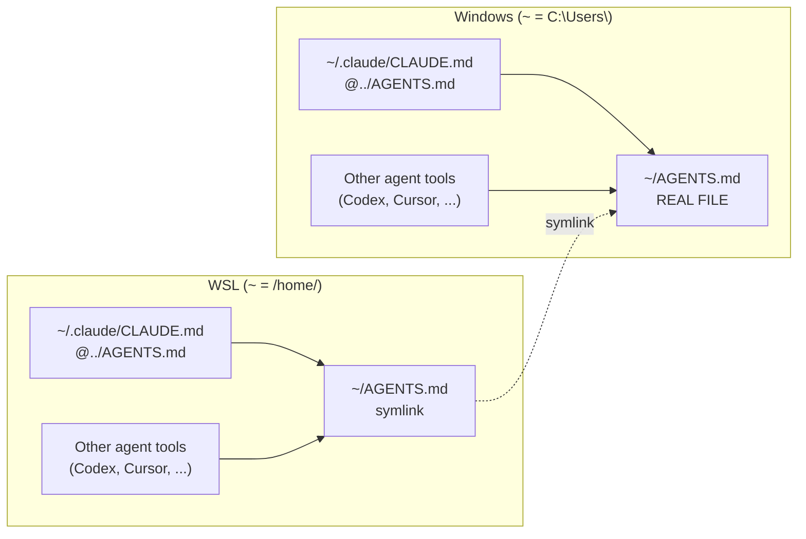

## Canonical file and pointers

Edit only canonical file: `C:\Users\[USER]\AGENTS.md`. Everything else points at it:

- Windows `~/.claude/CLAUDE.md` → `@../AGENTS.md`
- WSL `~/.claude/CLAUDE.md` → `@../AGENTS.md`
- WSL `~/AGENTS.md` → (symlink) `/mnt/c/Users/[USER]/AGENTS.md`.

## Layout

## How resolution works

- Claude auto-loads `~/.claude/CLAUDE.md` every session.
- `@../AGENTS.md` line imports file one dir up: `~/AGENTS.md`.
- Windows: real file. WSL: symlink, reads same `/mnt/c` file.
- Other agent tools read `~/AGENTS.md` directly. No import step.

Rules in that file: [[global-agent-preferences|Global agent preferences]].
