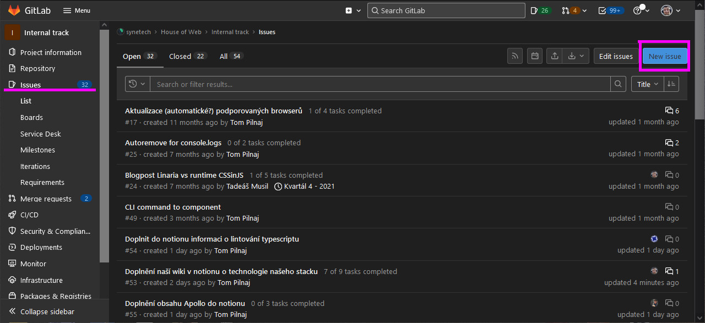
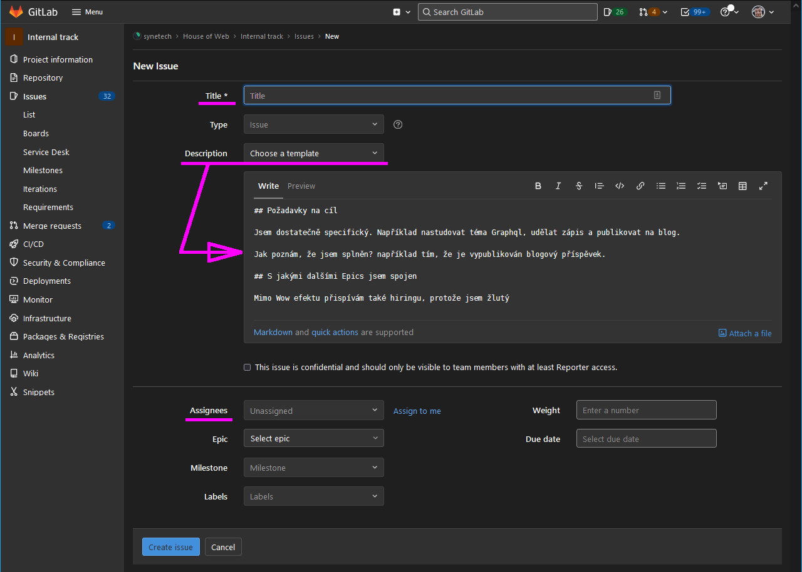
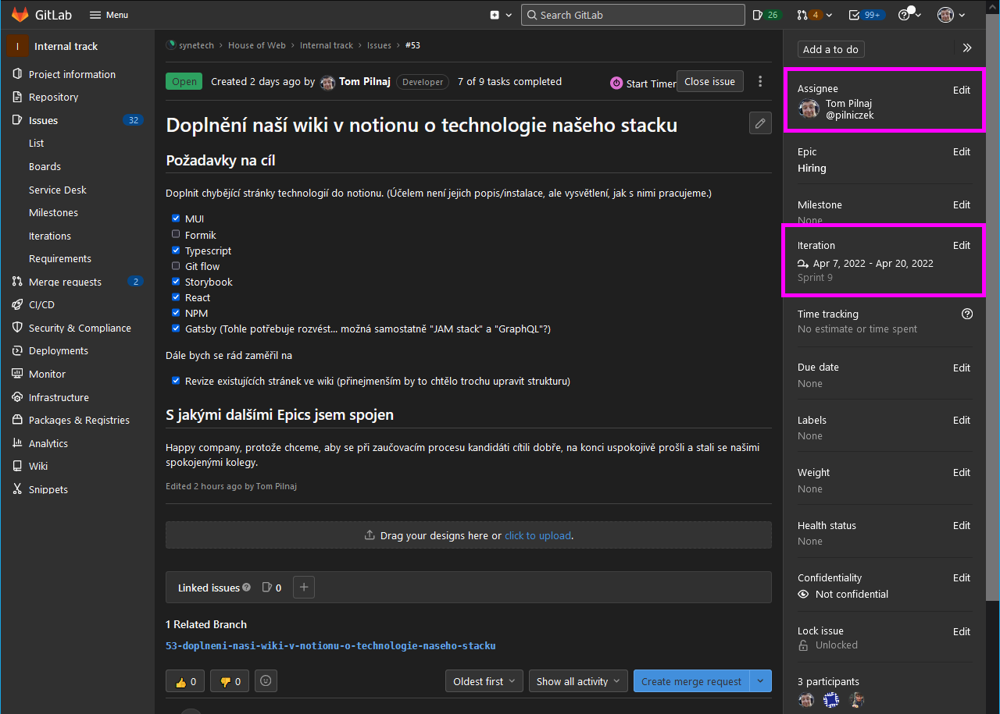
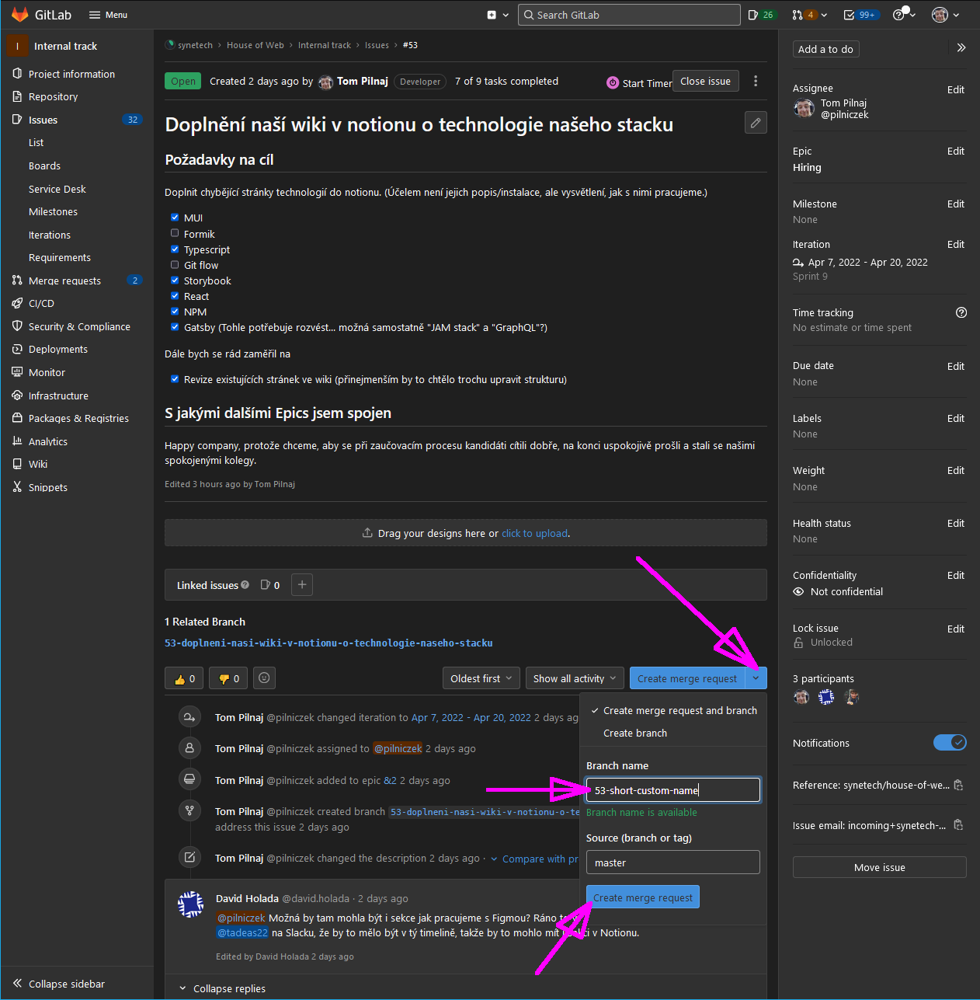
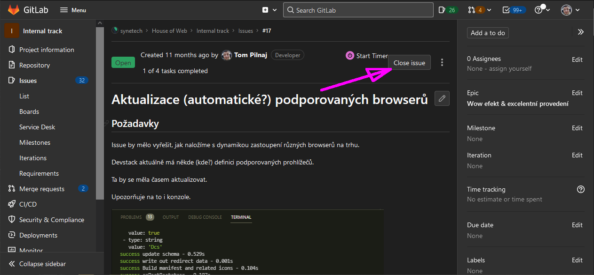

Every task should be tracked as issue in GitLab. Creating an issue is the very start of a successfully managed work.

We expect a title, description (you can select from predefined templates), assignee and iteration (if iteration is known).

> **Iteration** makes the issue visible in [**board**](../board-iteration/index.md).
> 

> **Epics** are currently used only in internal track issues.
> 

## Create Merge Request from Issue

An issue can be resolved with one or more [Merge Requests](../merge-request/index.md).

You can prepare a [Merge Request](../merge-request/index.md) (and related branch) in the issue.

Related branch should have a short and descriptive name.

## The End of an Issue

After all related merge requests are successfully merged, issue can be closed in the issue UI or via a [merge request](../merge-request/index.md).

> **But beware:** maybe a tester or PM should test it before closing it!
> 

