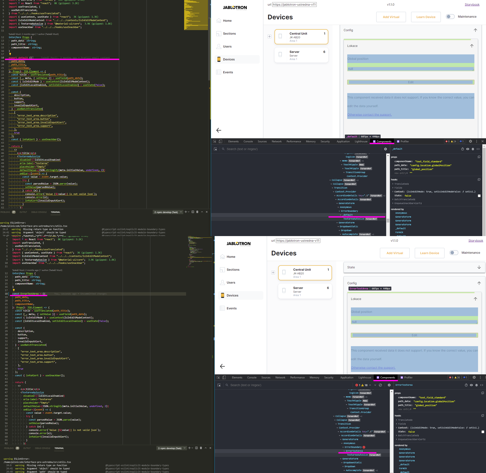

## Number formatting

Always use `Intl.NumberFormat` - [https://developer.mozilla.org/en-US/docs/Web/JavaScript/Reference/Global_Objects/Intl/NumberFormat](https://developer.mozilla.org/en-US/docs/Web/JavaScript/Reference/Global_Objects/Intl/NumberFormat)

It is posible to format kilobytes, minutes, days, meters, curencies, other physical units,

It is posible format date times ([DateTimeFormat](https://developer.mozilla.org/en-US/docs/Web/JavaScript/Reference/Global_Objects/Intl/DateTimeFormat))

Translate number to word [PrularRules](https://developer.mozilla.org/en-US/docs/Web/JavaScript/Reference/Global_Objects/Intl/PluralRules)

Relativ times [https://developer.mozilla.org/en-US/docs/Web/JavaScript/Reference/Global_Objects/Intl/DateTimeFormat](https://developer.mozilla.org/en-US/docs/Web/JavaScript/Reference/Global_Objects/Intl/DateTimeFormat)

Separate list of words [https://developer.mozilla.org/en-US/docs/Web/JavaScript/Reference/Global_Objects/Intl/ListFormat](https://developer.mozilla.org/en-US/docs/Web/JavaScript/Reference/Global_Objects/Intl/ListFormat)

## Exporting

Always export named functions

