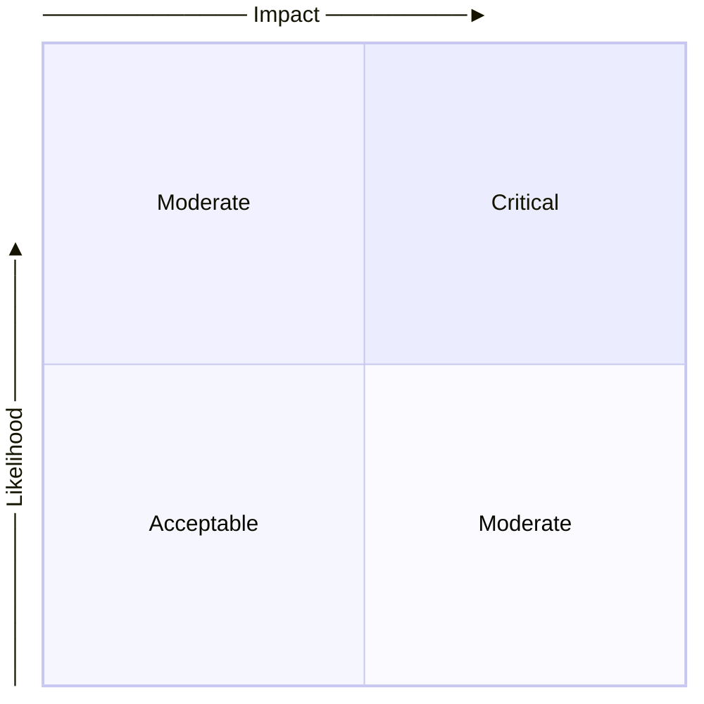

```mermaid
quadrantChart
    x-axis "───────────── Impact ─────────►"
    y-axis "─────────── Likelihood ─────────►"
    quadrant-1 "Critical"
    quadrant-2 "Moderate"
    quadrant-3 "Acceptable"
    quadrant-4 "Moderate"
```
