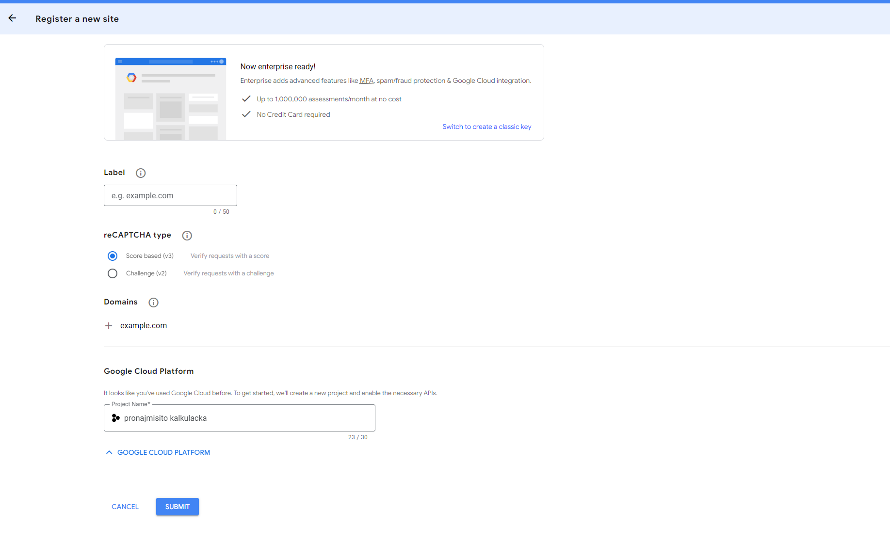

reCAPTCHA je způsob jak zjistit zda náhodou nemluvíme s robotem 🤖. Hodí se pokud chceme zajistit, že nějakou akci opravdu dělá člověk a ne bot, napříkald při vyplňování formuláře, který pak posílá emaily.

Na výběr jsou 2 verze, v2 a v3, které se liší v tom, jak se prezentují uživateli a co po něm chtějí.

V2 každý zná, je to klasické klikátko “zaškrtni všechny semafory”. V3 je více sofistikovaná, a nevyžaduje po uživateli takovouto složitou úlohu. Pouze se zaškrtne tlačítko “nejsem robot” a ona na pozadí ověří podle statistiky zda se opravdu jedná o bota nebo o člověka, pokud si není jistá, tak se může rozhodnout jít tarou cestou a zobrazit obrázek, nebo dát poslechnout text.

Pro integraci reCAPTCHA musíme následovat tyto kroky:

1. otevřít google cloud console [https://console.cloud.google.com/](https://console.cloud.google.com/).
2. Pokud projekt existuje tak ho vybereme, jinak vytvoříme nový projekt pod naší organizací.
3. Zajdeme na stránku [https://www.google.com/recaptcha/admin/enterprise](https://www.google.com/recaptcha/admin/enterprise) a vybereme náš projekt. Případně v cloud console vyhledáme “reCAPTCHA Enterprise”.
4. Vyplníme formulář, **pokud jsme nešli přes cloud console, tak nezapomeneme vyplnit projekt pod záložkou “Google Cloud Platform”!!**

1. Zkopírujeme klíče a integrujeme reCAPTCHA na frontendu a backendu.

### Integrace na FE

1. nainstalujeme react-google-recaptcha nebo react-google-recaptcha-v3 podle toho jakou verzi reCAPTCHA jsme zvolili při vytváření v Google Cloud Console.
2. Přidáme potřebné komponenty na správná místa.
3. Při posílání dotazu na backend, kam jsme dali druhý klíč, přidáme získanou hodnotu z reCAPTCHA.
