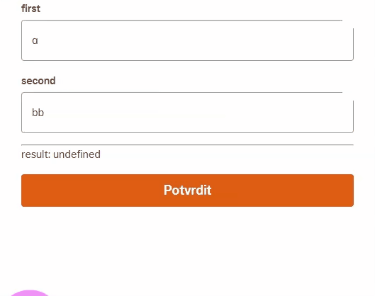

Tools useful for capturing and annotating bug reports / demos.

- **Generate gif from web UI** (Chrome extension): [Capture to a GIF](https://chrome.google.com/webstore/detail/capture-to-a-gif/eapecadlmfblmnfnojebefkbginhggeh)
- **Highlight cursor** (Chrome extension): [Cursor Highlighter](https://chrome.google.com/webstore/detail/cursor-highlighter/echjgnggfpiohepohkpfknhjbnccdjlo)

**Example gif**

