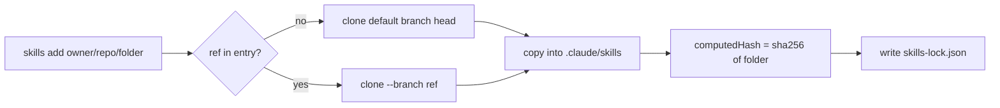

Project-level skills installed by the `skills` CLI are recorded in `skills-lock.json` at the repo root, with `.claude/skills/` gitignored - the lock file is the thing under review, not the skill content. The name says lock, but the default entry pins nothing: it records what the content looked like at install time and re-resolves the branch head on the next install. This page is about that gap and how to close it. The catalogue of which skills are installed where is in [[skills|SKILLS]]; the machine-wide picture is in [[claude-code-environment|Claude Code environment]].

Observed with `skills` 1.5.23 (`node_modules/skills/dist/cli.mjs`), the CLI that `npx skills` runs. Its [README](https://github.com/vercel-labs/skills) documents `add`, `use`, `list`, `find`, `remove`, `update` and `init` and mentions neither `skills-lock.json` nor `experimental_install`, so everything below comes from the shipped `cli.mjs` rather than from documentation.

## What an entry holds

```json
"playwright-cli": {
  "source": "microsoft/playwright-cli",
  "ref": "roll_163_2026_08_05",
  "sourceType": "github",
  "skillPath": "skills/playwright-cli/SKILL.md",
  "computedHash": "f602822b51bcb6d033749c60731b8f1e80f308222fcb2e4af551905a817c6e08"
}
```

- `source` + `skillPath` say which folder of which repo the skill came from.
- `ref` is optional and is the only pin (see below).
- `computedHash` is a content digest of the installed folder, written after the install.

## computedHash is a content digest, not a commit

`computeSkillFolderHash` walks the installed skill folder, skips `.git` and `node_modules`, sorts the files by relative path, and feeds each file's path and then its bytes into one SHA-256:

```js
const hash = createHash('sha256');
for (const file of files) {
  hash.update(file.relativePath);
  hash.update(file.content);
}
```

Two consequences:

- **It is reproducible offline.** Re-running that walk over `.claude/skills/<name>` gives back exactly the value in the lock file, so a suspicious entry can be checked without the network - and a candidate upstream commit can be identified by fetching its skill folder and hashing it the same way.
- **It is not a version.** Nothing in the digest says which commit produced it, and it cannot be turned back into one. A changed hash in a diff means "upstream content differs from what was installed last time", nothing more.

The hash is also not a guard on restore. `experimental_install` re-runs `add` for every entry and overwrites whatever is on disk; the equality check against `computedHash` exists only in the `node_modules` sync path, where it skips already-current skills.

## Why the hash changes on its own

Without `ref`, `source: "owner/repo"` resolves to the default branch head at install time. Any upstream edit to the skill folder - a docs tweak, a new command in `SKILL.md` - produces a different digest on the next install, and the lock file shows a one-line hash change with no clue what moved. Diffing the upstream folder between the old and the new commit is what tells you whether the change matters.



## Pinning: `ref`, branch or tag only

`ref` is honored on restore - the entry is turned back into `owner/repo/folder#<ref>` before `add` runs - and on the command line the same fragment syntax works directly:

```bash
npx skills add 'owner/repo/skills/<name>#<branch-or-tag>' -s <name> -a claude-code -y
```

The fragment also accepts `#<ref>@<skill>` to select one skill from a multi-skill repo.

**A commit SHA does not work.** The ref is passed to `git clone --depth 1 --branch <ref>`, and [`git clone`](https://git-scm.com/docs/git-clone) documents `--branch` as taking a branch name or a tag - a hexadecimal object name needs the separate `--revision` option, which the CLI never passes:

```text
fatal: Remote branch 72735e57… not found in upstream origin
```

So recovering a specific past state means finding a *named* ref whose skill folder still has the content you want:

1. Recompute the old hash from candidate commits: list each one's files with [`GET /repos/{owner}/{repo}/git/trees/{tree_sha}`](https://docs.github.com/en/rest/git/trees) and `recursive=1`, pull the bytes from `raw.githubusercontent.com`, and stop when one matches the value in the lock file - that identifies the commit.
2. Hash the skill folder on every branch and tag of the repo and look for the same match. Upstream release branches and stale roll branches often still carry it; the `playwright-cli` skill, for instance, was recoverable from a leftover `roll_163_…` branch.
3. If no named ref carries it, mirror the folder into a repo of your own and point `source` there. That also survives upstream deleting the branch - which is the standing risk of pinning to someone else's throwaway branch.

`skills update` moves a pin off again, so treat it as a deliberate act on a pinned entry.

## If the repo wraps the CLI

A repo that restores skills with its own script instead of `experimental_install` (to force `-a claude-code`, say) builds the source string itself, and such a script will typically not know about `ref`. Then the pin in the lock file does nothing until the script appends the fragment:

```js
const folder = `${entry.source}/${entry.skillPath.replace(/\/?SKILL\.md$/, '')}`;
const source = entry.ref ? `${folder}#${entry.ref}` : folder;
```
