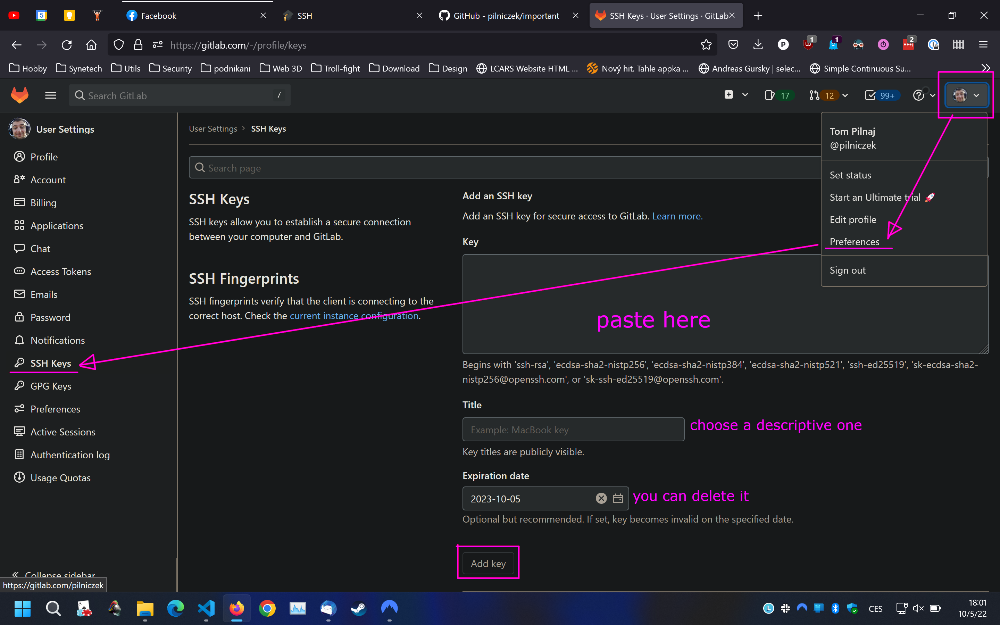

## Klíč

Vygenerování  klíče:

```jsx
ssh-keygen -t rsa -C "your.email@example.com" -b 4096
```

vytvoří adresář:

```jsx
C:\Users\[user_name]\.ssh
```

s privátním (nesdílet!) a veřejným (.pub) klíčem.

---

## Upload do Gitlabu



A teď už by měl fungovat clone/push/etc. přes **ssh**.
