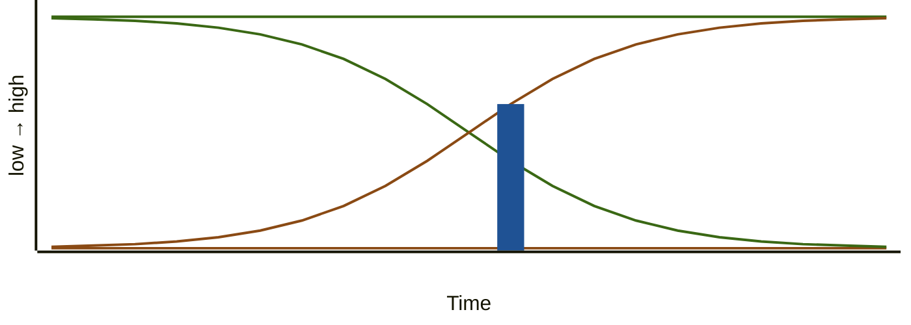

**Technical debt** is the accumulated cost of the shortcuts, skipped refactors, improper reviews and so on.

The clearest way to see it is to plot two things against time:

1. How **responsive** the system is to change (green, you want it _high_).
2. The **cost of change** (orange, you want it _low_).

|  |  |
| --- | --- |
| 🟩 **Responsiveness** | reality - decays as debt builds (Optimal responsiveness dashed) |
| 🟧 **Cost of change** | reality - climbs as debt builds (Optimal cost of change dashed) |
| 🟦 **Technical-debt** | one moment in time - the gap represents the debt |

**The crossover** - where the two bold lines meet, cost of change overtakes responsiveness. The system fights you more than it helps.

**The takeaway** - debt compounds, it doesn't grow steadily, it accelerates: each shortcut makes the next change harder, which invites more shortcuts.
