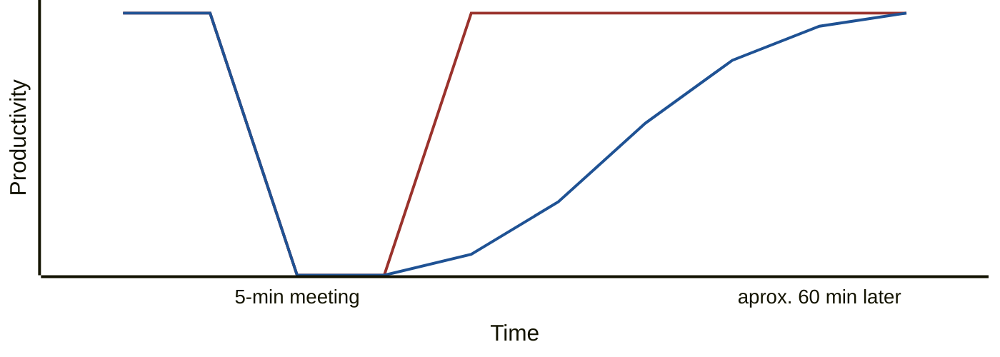

The hidden cost of "quick" interruption - getting back into flow takes far more than the 5 minutes of a meeting.

```mermaid
%%{init: {"themeVariables": {"xyChart": {"backgroundColor": "transparent", "plotColorPalette": "#9a322c, #1f5294"}}, "xyChart": {"height": 250, "xAxis": {"showTick": false}, "yAxis": {"showLabel": false, "showTick": false}}}}%%
xychart-beta
    x-axis "Time" [ "​​", "​​​", "5-min meeting", "​​​​", "​​​​​", "​​​​​​", "​​​​​​​", "​​​​​​​​", "aprox. 60 min later", " "]
    y-axis "Productivity" 0 --> 105
    line [100, 100, 0, 0, 100, 100, 100, 100, 100, 100]
    line [100, 100, 0, 0, 8, 28, 58, 82, 95, 100]
```

🟥 what non-dev see

🟦 how it actually works.
