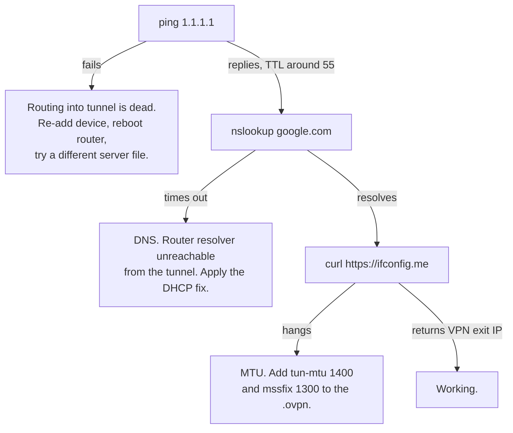

Running NordVPN on an Archer AX5400 through the router's built-in OpenVPN client, so selected LAN devices are tunnelled without installing anything on them. Written after a session where the status sat on `Connecting` for an hour and then, once connected, the tunnelled machine had routing but no name resolution.

## Setup

TP-Link's own [OpenVPN setup guide](https://www.tp-link.com/us/support/faq/3788/) covers the happy path: Advanced → VPN Client, enable the toggle, Server List → Add → Set up manually, pick OpenVPN, fill in description and credentials, import the `.ovpn` file.

Two details that guide does not spell out and that cause most failures:

- **Credentials are service credentials, not the Nord account login.** NordVPN's [login change notice](https://support.nordvpn.com/hc/en-us/articles/19685514639633-Changes-to-the-login-process-on-third-party-apps-and-routers) states that "from June 14, 2023, you will no longer be able to use your NordVPN email/username and password to authenticate your connection" on routers and third-party apps. Generate them at Nord Account → NordVPN → Set up NordVPN manually → Service credentials.
- **Download a single-server config**, UDP or TCP, from Nord's OpenVPN configuration file list. On a mobile or CGNAT uplink the TCP 443 file gets through filtering that drops UDP 1194.

## Failure mode 1: router clock behind NTP

If the router boots and starts the VPN client before NTP sync, the certificate validity check fails and the status parks on `Connecting` forever. It does not retry once the clock corrects itself.

Recognise it in the system log: boot lines carry a date months in the past (or `1970-01-01`), with `Time Settings INFO Service restart` appearing much later. Fix is to toggle the VPN Client off, wait, and toggle it back on once the clock is right.

## Failure mode 2: the log is empty

This firmware writes no VPN or OpenVPN lines to the system log at all, at any severity. There is nothing to read, so the log is not a diagnostic path here. Move straight to testing from a client machine.

The decisive test is running the same `.ovpn` and the same service credentials in OpenVPN GUI on a LAN PC. That splits three causes apart in one step: if the PC connects, the file and credentials and the ISP path are all fine and the fault is the router; if the PC also hangs, it is credentials or ISP blocking. A TP-Link moderator gives the [same advice](https://community.tp-link.com/en/home/forum/topic/714074) on a thread where an Archer AX73 showed `Connected` while every Wi-Fi client reported "Connected without Internet".

## Failure mode 3: connected, but the tunnelled device has no internet

The one that actually bit. Status reads `Connected`, devices outside the VPN Device List work normally, devices inside it cannot browse.

Run three commands on the affected machine, in a native shell rather than WSL, since WSL adds its own NAT layer and hides the result:

```
ping 1.1.1.1
nslookup google.com
curl https://ifconfig.me
```



A reply with TTL around 55 proves routing works; the packet is going through the tunnel and coming back.

## The DNS fix

Clients get the router itself as their resolver by default. The router forwards to the ISP resolver, and on a CGNAT uplink that resolver refuses queries arriving from a VPN exit IP. Non-tunnelled devices keep working, tunnelled ones lose DNS only, which is why ping succeeds and every browser request fails.

Confirm with `nslookup google.com 1.1.1.1`. If the public resolver answers and the router does not, this is it.

Fix in two places:

- Advanced → Network → DHCP Server → Primary DNS `1.1.1.1`, Secondary DNS `8.8.8.8`. **These fields are blank by default**, and blank means the router hands out its own address.
- Advanced → Network → Internet → Advanced → Use the following DNS Server, same pair. This covers the router's own lookups, including resolving the Nord hostname when the tunnel starts.

Then renew the lease on each client (`ipconfig /release`, `ipconfig /renew`, `ipconfig /flushdns` on Windows) and check `ipconfig /all` reports `1.1.1.1` rather than the router address. Verify the tunnel end to end with `curl https://ifconfig.me`, which must return a VPN exit IP.

Do not point the router at Nord's own resolvers here. They answer only from inside the tunnel, so every non-tunnelled device would lose DNS whenever the VPN drops. TP-Link's [Archer VPN troubleshooting guide](https://community.tp-link.com/us/home/kb/detail/412900) makes the same general point, that DNS servers must be "properly assigned, either from the VPN provider or manually configured".

## Limits of the built-in VPN client

- **No route-everything option.** The Device List is an allowlist keyed by MAC. An empty list means nothing is tunnelled, and new devices are never added automatically. True default-on with policy routing needs different firmware, OpenWrt or ASUS Merlin.
- **No kill switch.** If the tunnel drops, listed devices fall back to the plain WAN silently. The status page is the only indicator.
- **Randomised MAC addresses break entries.** A phone using a private Wi-Fi address gets a locally administered MAC that changes, and the Device List entry goes dead without warning. Set the network to use the device MAC on each phone first.
- **IPv4 only.** IPv6 traffic routes around the tunnel, so disable IPv6 at Advanced → IPv6 if that matters.

Related: [[independent-vpn]]
