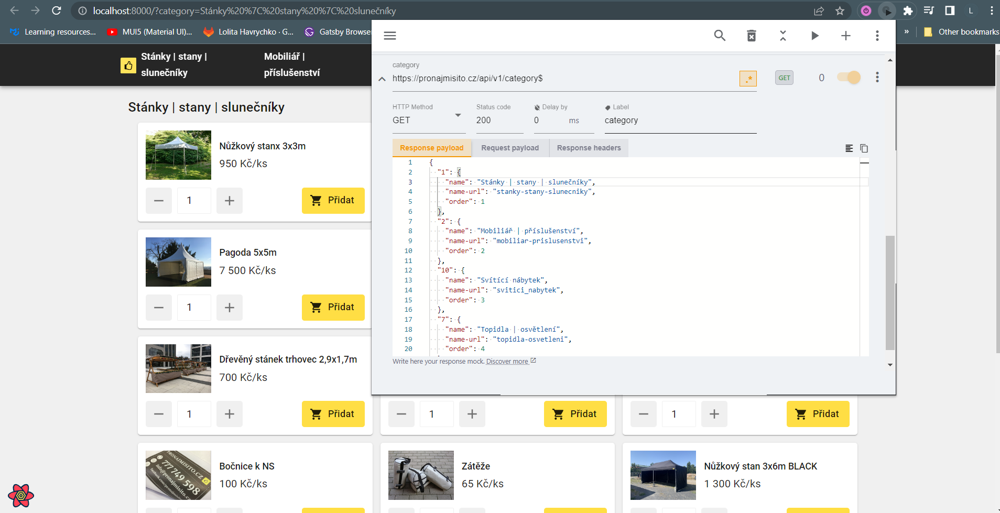
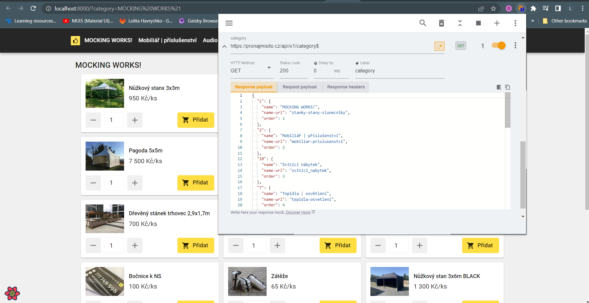
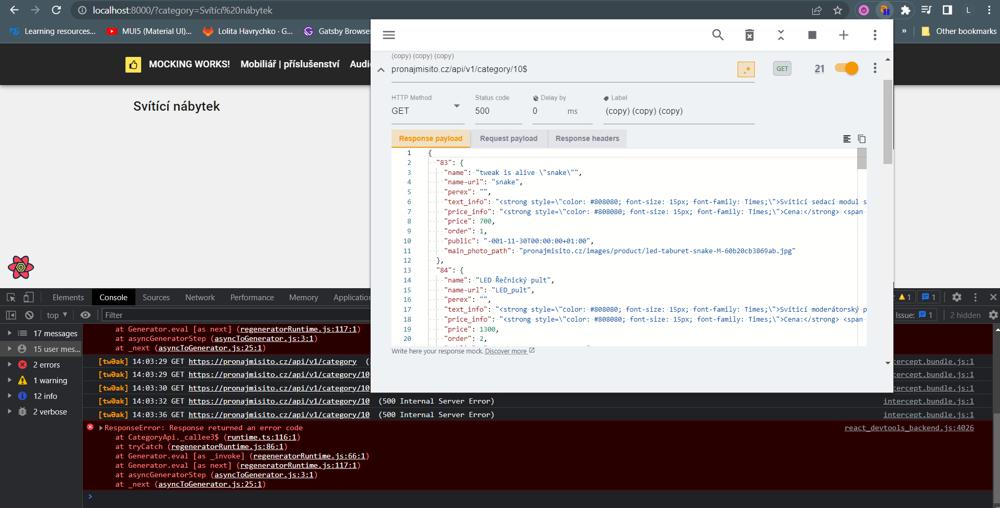
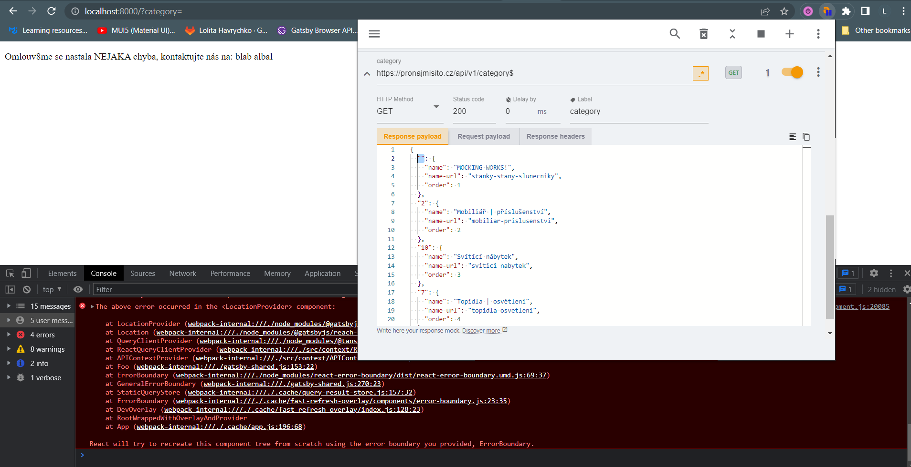
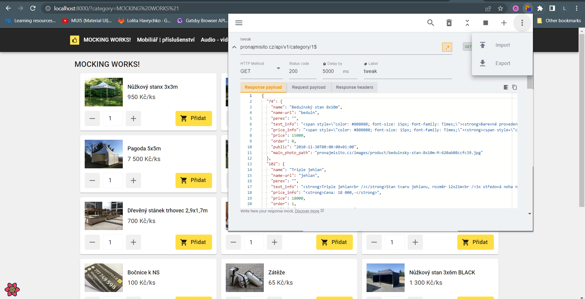
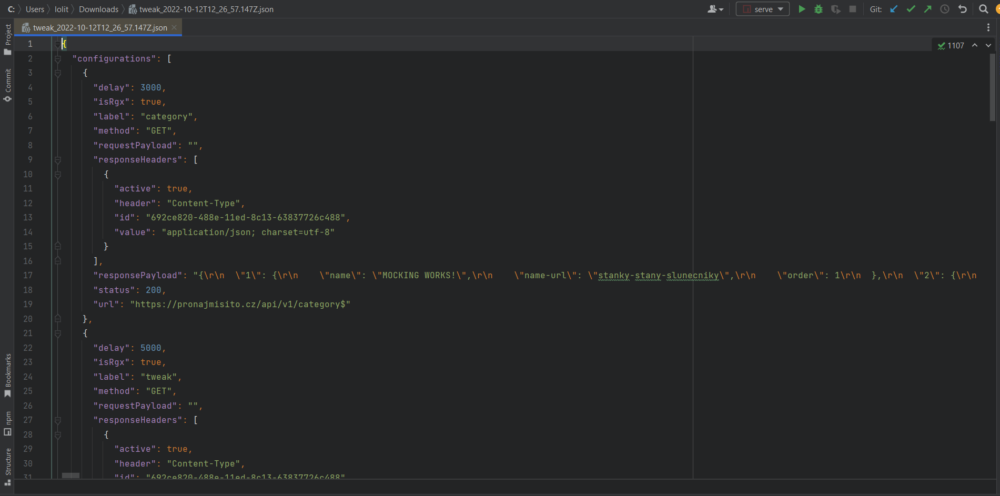
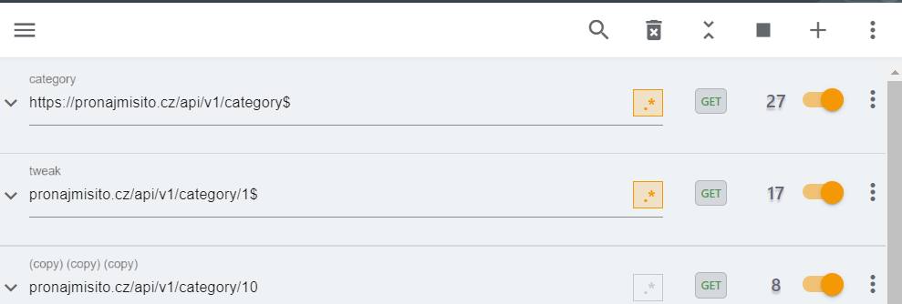
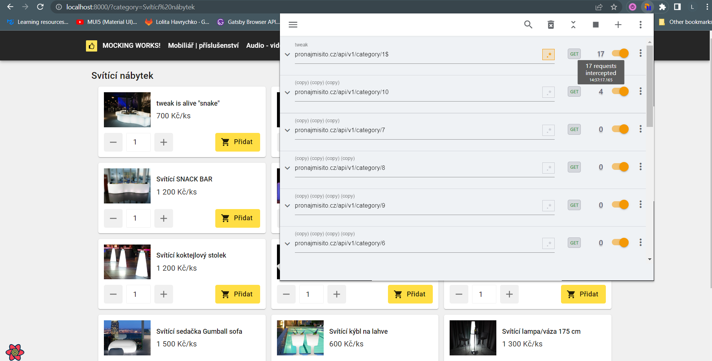

## Tweak Mock API

Modifikování response ze serveru

[https://chrome.google.com/webstore/detail/tweak-mock-api-calls/feahianecghpnipmhphmfgmpdodhcapi](https://chrome.google.com/webstore/detail/tweak-mock-api-calls/feahianecghpnipmhphmfgmpdodhcapi)

## Mocking HTTP requests

1.1 Before mocking 

1.2 After mocking

## 2.It is also possible to simulate errors

2.1 Error from status code 

2.2 Error in response

### 3.Import/Export

3.1 Export example

### 4.URL

1. **String partial matching (default)** is applied by default, meaning that if you type `/v1/user` in the URL field, and the following HTTP requests take place: `//api.com/v1/user/123`, `//api.com/v1/user/456`, **both requests are matched**. For example `//api.com/v2/user/123` **would not match**.
2. **Regular expression** toggle, when enable at the rule level, the extension considers the input of the URL a [regular expression](https://developer.mozilla.org/en-US/docs/Web/JavaScript/Guide/Regular_Expressions), meaning that if you type `.*\/v1\/user\/[1]\d\d$` in the URL field, the following HTTP requests `//api.com/v1/user/123`, `//api.com/v1/user/173`, **are matched**.

^ from [tweak docs](https://tweak-extension.com/docs/intro)

**!!! There exist nothing like partial match option in Tweak, that's why you need to enforce partial match via regexp ending with “$”.**

Example 

### 5.Number of requests

5.1The number of requests intercepted by a given row are reflected in the counter near the activation toggle. This serves only as an indicator, it can also help you understand how many times that request was triggered by the page

5.2

USE THE COUNTER TO DEBUG

If you're seeing the `0` value after trying to intercept a request it means that you might have a mismatch on your rule. Double check the request URL and the selected HTTP method to ensure everything is ok.

^ from [tweak docs](https://tweak-extension.com/docs/intro)

### 6.Simulate Delays

[https://tweak-extension.com/blog/how-to-simulate-delay-http-request](https://tweak-extension.com/blog/how-to-simulate-delay-http-request)

Docs:

[https://tweak-extension.com/docs/intro](https://tweak-extension.com/docs/intro)

[https://www.youtube.com/channel/UCRCdRZzz6TTsNx67m9JFV](https://www.youtube.com/channel/UCRCdRZzz6TTsNx67m9JFV)
