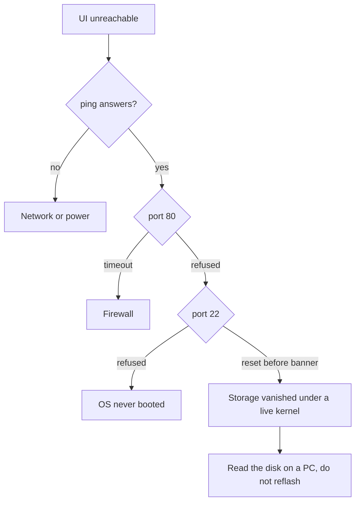

What to do when the Umbrel node answers ping but serves nothing. Written after a Pi 4B that had run for months stopped responding: the web UI refused connections, SSH reset before its banner, and the disk turned out to be perfectly healthy. The cause was the boot layout, not the hardware, and the fix was a rebuild rather than a repair.

The short version: **on a Pi 4 the OS boots from microSD and the SSD holds data only.** Booting umbrelOS from USB works right up until it doesn't.

## Recognising this failure

The fingerprint is a kernel that is alive while every service is dead.

| Check          | Result                                                        | What it means                               |
| -------------- | ------------------------------------------------------------- | ------------------------------------------- |
| `ping <pi-ip>` | replies                                                       | kernel and network stack running            |
| `ip neigh`     | `REACHABLE`                                                   | link layer fine                             |
| port 80        | `Connection refused`                                          | nothing listening - `umbreld` never started |
| port 22        | `kex_exchange_identification: read: Connection reset by peer` | `sshd` accepts TCP, cannot fork a session   |

Refused is not the same as timed out. A firewall drops and you wait; refused means the port is genuinely closed. And an SSH connection that dies _before_ the version banner never reached authentication - the daemon could not read from disk.

Together that says: the root filesystem went away underneath a running kernel.



## Why it broke

The Pi 4 bootloader will happily boot from USB - the default `BOOT_ORDER` is `0xf41`, meaning SD card first and USB second, so with no card inserted it falls through to the SSD. umbrelOS does not support that arrangement. USB and NVMe boot are a Pi 5 capability; on a Pi 4 the OS boots from the card or not at all.

The Pi 4 itself is supported. Umbrel's [downloads page](https://umbrel.com/downloads) lists it alongside the Pi 5 and ships a dedicated Pi 4 build, while recommending the Pi 5 as "the one to get". What is not supported is skipping the card.

The card is therefore the only boot medium available here, and Umbrel is candid about the cost: "microSD works, but cards wear out fast. We don't recommend it." On a Pi 5 the answer is to install straight onto NVMe or USB; on a Pi 4 there is no such option, so the card is a consumable and the backup below is what makes that acceptable.

A USB-SATA bridge that drops off the bus mid-run produces exactly the symptom table above. Notably it leaves **no trace in the journal** - if the storage disappears, the kernel cannot write the message saying so. Absence of disk errors is not evidence of a healthy setup.

## Know the partition layout before touching anything

umbrelOS builds on [Rugix](https://rugix.org/docs/ctrl), which uses "a read-only system partition layered with a writable overlay that resets on reboot, selective persistence for state that must survive updates". On disk that becomes seven partitions:

| Partition | Label                  | Role                                               |
| --------- | ---------------------- | -------------------------------------------------- |
| 1         | `CONFIG`               | vfat, the one Windows will mount                   |
| 2, 3      | `BOOT-A`, `BOOT-B`     | vfat boot slots                                    |
| 4         | -                      | extended container, 1 KB, no filesystem            |
| 5, 6      | `system-a`, `system-b` | ext4 A/B root slots, read-only in normal operation |
| 7         | `data`                 | ext4, everything that persists                     |

Two consequences that save time later:

- **The system partitions being read-only is by design**, not a fault. A `Filesystem state: clean` on all of them is the normal reading, and it rules out corruption immediately.
- **Nothing lives where you expect.** The real root sits under `state/default/persist/data/umbrel-os/` on partition 7, so app data is at `state/default/persist/data/umbrel-os/home/umbrel/umbrel/app-data/`, and the system journal at `state/default/persist/data/umbrel-os/var/log/journal` - not at `/var/log/journal` relative to the mount point.

## Reading the disk from a PC

Attach the SSD over SATA if possible. It sidesteps the USB bridge entirely and makes SMART readable.

From Windows, hand the whole disk to WSL. Find the disk number first, then attach it bare:

```powershell
Get-CimInstance -ClassName Win32_DiskDrive | Select-Object DeviceID,Model,Size,InterfaceType
wsl --mount \\.\PHYSICALDRIVE1 --bare
```

If that fails with `0x8007006c`, Windows is holding a partition - the vfat `CONFIG` partition gets a drive letter automatically. Remove the letter and retry:

```powershell
Get-Partition -DiskNumber 1 | Select-Object PartitionNumber,DriveLetter,Size
Remove-PartitionAccessPath -DiskNumber 1 -PartitionNumber 1 -AccessPath "E:\"
```

Then, as root in WSL, check health without mounting anything:

```bash
lsblk -o NAME,FSTYPE,LABEL,SIZE,FSUSE%,FSAVAIL,PARTUUID
for p in /dev/sdX5 /dev/sdX7; do dumpe2fs -h $p 2>&1 | grep -Ei 'state|error count|block count|free blocks'; done
smartctl -d sat -T permissive -a /dev/sdX | head -40
```

`dumpe2fs` reads the superblock directly, so `Filesystem state` and the free-block count come back with nothing mounted. `smartctl` needs `-d sat` because WSL presents the disk as SCSI.

## Backing up

Mount read-only and take three things: the app data, the boot partitions, and enough metadata to reconstruct the layout.

```bash
DEST=/home/<user>/umbrel-backup
mkdir -p "$DEST/_meta"
sfdisk -d /dev/sdX > "$DEST/_meta/partition-table.sfdisk"
dd if=/dev/sdX of="$DEST/_meta/first-1MiB.img" bs=1M count=1

for spec in 1:CONFIG 2:BOOT-A 3:BOOT-B; do
  n=${spec%%:*}; name=${spec##*:}
  mkdir -p "$DEST/sd$n-$name"
  dd if=/dev/sdX$n of="$DEST/sd$n-$name/sd$n.img" bs=4M status=progress
done

for spec in 5:system-a 6:system-b 7:data; do
  n=${spec%%:*}; name=${spec##*:}
  mkdir -p /mnt/p$n "$DEST/sd$n-$name"
  mount -o ro /dev/sdX$n /mnt/p$n && rsync -aHAX --info=progress2 \
    --exclude='*/app-data/bitcoin/***' --exclude='*/app-data/electrs/***' \
    /mnt/p$n/ "$DEST/sd$n-$name/"
  umount /mnt/p$n
done
```

The two excludes are the whole reason this fits. A synced Bitcoin node is several hundred gigabytes and an Electrs index tens more, and both rebuild themselves from the network. Everything actually irreplaceable - app config, `secrets`, Tor keys, the app list - is measured in gigabytes.

Verify before going further. On a data partition of a couple of terabytes the backup should land around 20 GB, and the wallet files must be present in it.

## Traps worth knowing

- **`~` under `sudo su` is `/root`.** A backup written to `~/umbrel-backup` lands somewhere you cannot reach from `\\wsl.localhost\...\home\<user>\`. Use absolute paths in anything run as root.
- **`tar -czf` truncates its output before reading its input.** Re-running a backup command whose source is no longer mounted destroys the good archive and leaves a 20-byte file. Write to a temp name and rename on success.
- **Device letters are not stable.** A disk that was `/dev/sde` comes back as `/dev/sdf` after a `wsl --unmount` cycle. Re-run `lsblk` after every reattach; a mount command with a stale letter fails with `special device ... does not exist`.
- **The Pi has no RTC.** Journal timestamps before NTP sync are a fallback date, not a real one. Use `journalctl --list-boots` and trust the boot with a plausible _last_ entry, not the first.
- **The browser upgrades a bare IP to HTTPS.** Umbrel serves plain HTTP, so `https://<pi-ip>` fails with a connection error that looks exactly like a dead node. Type `http://` explicitly, or turn off Firefox's HTTPS-Only Mode at `about:preferences#privacy`.
- **A fresh install takes a new DHCP lease.** The rebuilt node will not be at the old address. Find it in the router's client list by MAC, or use `http://umbrel.local`.

## Rebuilding

Order matters, and the SSD stays unplugged until the card is proven.

1. **Flash the card.** Raspberry Pi Imager, Device = Raspberry Pi 4, OS = _Use custom_ pointed at the umbrelOS `.img.xz` (leave it compressed), Storage = the card. Decline OS customisation; umbrelOS runs its own setup.
2. **First boot with no SSD.** Card, ethernet, official power supply. Give it ten minutes, then open `http://umbrel.local`. Proving SD boot works before adding storage saves a confusing debug session later.
3. **Attach the SSD and give it a filesystem.** This is the step that is not obvious - see below.
4. **Reboot.** umbrelOS claims the drive on boot.

### Getting a shell, and finding the version

There is no SSH toggle in the settings. The shell is at **Settings → Advanced settings → Terminal**, choosing umbrelOS rather than an app container. Browser terminals often refuse a normal paste - `Ctrl+Shift+V` usually works, otherwise keep commands short enough to type, or enable SSH from that terminal with `sudo systemctl enable --now ssh` and work from a real client.

Reading the version is oddly awkward. `umbreld --version` throws `ArgError: unknown or unexpected option`, there is no `/etc/umbrel-version`, and `/etc/os-release` reports only the Debian base underneath. The value lives in the package manifest:

```bash
grep -m1 '"version"' /opt/umbreld/package.json
```

`rugix-ctrl system info` looks like the right tool for slot and partition state, but on a Pi 4 install it exits with `unable to determine slots: no table` after failing to run `sfdisk`. Not an indication of a damaged system - but since `rugix-ctrl` is what selects the A/B slot during an update, confirm `which sfdisk` returns a path before relying on over-the-air updates.

### Making umbrelOS accept the SSD

A drive carrying the old seven-partition layout is invisible in the UI, and so is a drive with no filesystem at all. Umbrel's [external storage docs](https://umbrel.com/support/storage/external-storage) describe formatting through the Files sidebar, but that entry only appears for a drive it already recognises - which the old layout is not.

Clearing the partition table alone is not enough. Give it a single ext4 partition, from the Pi's own terminal (Settings → Advanced → Terminal):

```bash
sudo wipefs -a /dev/sda
sudo parted -s /dev/sda mklabel gpt mkpart primary ext4 0% 100%
sudo mkfs.ext4 -L umbrel /dev/sda1
sudo reboot
```

ext4 specifically - exFAT cannot host apps. After the reboot, umbrelOS adopts the disk as its **data volume**, not as external storage:

```
/var/lib/docker
/home/umbrel/umbrel
/swap
```

That is the outcome to aim for. It means no per-app "move to drive" step, and anything installed afterwards lands on the SSD automatically. Confirm with:

```bash
findmnt -no SOURCE / ; findmnt -no SOURCE /home/umbrel/umbrel
```

The card for `/`, the SSD for app data. The dashboard's storage figure now reports the SSD, so read the card separately with `df -h | grep mmcblk`.

While the disk is still empty, reclaim the ext4 root reserve - 5% of a multi-terabyte drive is a lot of unusable space on a data-only volume:

```bash
sudo tune2fs -m 0 /dev/sda1
```

The terminal warns that changes to umbrelOS "will not be persisted between software updates", which is the read-only-system design from earlier. It does not apply to any of the commands above: they write partition tables and filesystem metadata on the data disk, not system files, so they survive updates. Treat that warning as a rule against installing software or editing system config here, not against disk work.

## Restoring apps

Reinstall from the app store rather than restoring system state; only app data is worth carrying over.

- **Bitcoin** resyncs from the network. Leave pruning off if Electrs is wanted - it needs the full chain to build its index. Budget several days on a Pi 4.
- **Lightning**, if the node had no open channels, is cleanest restored from its 24-word seed. Restoring an _old_ `channel.db` onto a node whose peers hold newer state is the one genuinely dangerous move in this whole process, because the peers can then publish a penalty transaction. Whole-directory migration of a cleanly stopped node is safe; cherry-picking a stale database file is not.
- **Tor keys** from the backup's `app-data/.../tor/` preserve the previous `.onion` address.
- **[[adguard-home-umbrel|AdGuard Home]]** is worth installing first, before the multi-day chain sync, since it is independent of it.

Note that apps hosted on an external drive are excluded from umbrelOS's own backups - relevant if the drive is ever used as external storage rather than as the data volume.

## Watch the first hour

If the USB-SATA bridge is going to fail, sustained write load is when it shows:

```bash
dmesg | tail -30
```

USB resets or `sda` I/O errors here mean replace the enclosure rather than fight it. Umbrel's storage guide is blunt about the related cause - on a Pi, "always use the official power supply so the drive gets enough power". A 2.5" SSD drawing through a bus-powered enclosure is a real load, and a phone charger will brown out under it.

Checking `usb-storage.quirks` in `/proc/cmdline` is worthwhile too. umbrelOS ships quirks that disable UAS for several known-flaky JMicron bridges; if the enclosure's USB ID appears there, the safer transfer mode is already active.

Related: [[nas]], [[hdd-tips]], [[mdns]]
